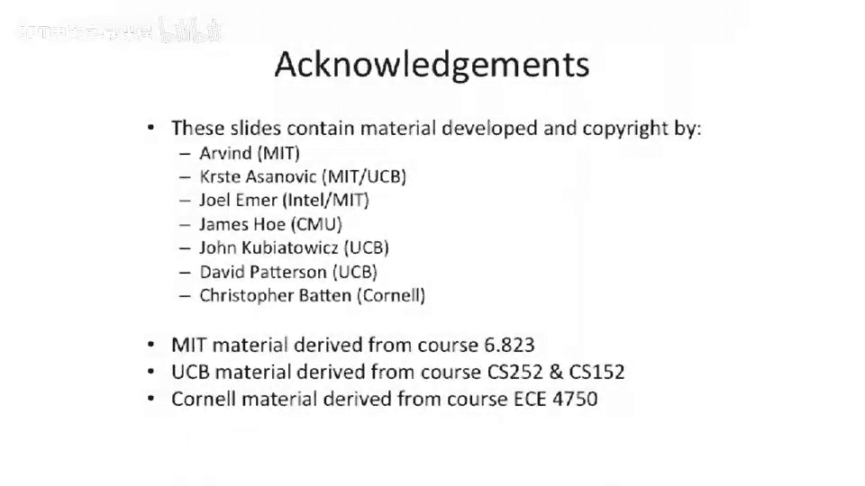

# 026：乱序处理器入门


在本节课中，我们将要学习乱序处理器的基础知识。我们将从简单的顺序执行处理器出发，逐步引入乱序执行的概念，并介绍一系列新的硬件结构，如记分牌、重排序缓冲区和发射队列等。这些结构对于理解现代高性能处理器的设计至关重要。

---

## 概述：从顺序到乱序

到目前为止，我们讨论的都是简单的顺序执行处理器。我们曾暗示过乱序执行的可能性，但现在我们将正式开始研究真正的乱序处理器。我们将引入一系列你可能尚未接触过的新结构，并探讨流水线中哪些部分可以是顺序的，哪些可以是乱序的。

## 流水线阶段的顺序与乱序

以下是流水线中不同阶段在顺序与乱序设计中的分类。

*   **前端**：前端指指令取指和解码阶段。这个阶段很难做到乱序，因为除非能预测未来，否则很难知道接下来要取哪条指令。因此，我们研究的大多数机器的前端都是顺序的。
*   **发射**：发射阶段决定指令的操作数是否已就绪，可以开始执行。这个阶段可以是顺序的，但如果尝试乱序发射，可能会获得更高的性能。
*   **写回**：写回阶段将结果写入类似寄存器文件的结构，但此时指令可能尚未到达处理器的提交点。这意味着数据可能还在旁路网络中，尚未提交到寄存器文件。这个阶段可以选择顺序或乱序。
*   **提交**：提交阶段确认指令确实可以提交。在此点之后，机器状态将无法回滚到之前的状态。我们将研究提交阶段既可以是顺序的，也可以是乱序的机器。

## 乱序执行简介

本节是对乱序执行的温和介绍。我们将构建几种不同的架构。这里提到的名称只是作为乱序入门而引入的五种架构的命名方式。

*   **I4**：表示顺序、顺序、顺序、顺序。
*   **I2O2**：表示顺序、顺序、乱序、乱序。
*   **IO2I**：表示顺序、乱序、乱序、顺序。

命名中的数字仅表示连续多少个阶段与前面的字母相同。

## 关键结构与术语

在深入之前，我们先简要介绍一些术语。除非你提前阅读了相关材料，否则可能还不熟悉这些概念。

*   **记分牌**：这是一个用于记录哪些指令已准备好执行的结构。
*   **重排序缓冲区**：当指令乱序执行时，ROB 是一个可以重新排序指令以便按顺序提交的地方。它解决了所有依赖关系，因此我们实际上不会乱序提交。
*   **存储缓冲区**：这是一个在提交点之前暂存存储操作的结构。我们不希望过早写入内存，因为那实际上就等于提交了。关于提交点的一个重要概念是：任何无法回滚的状态改变都算作提交。向主存进行存储操作就是提交，这很难回滚。
*   **发射队列**：如果你进行乱序发射，发射队列就是一个决定何时可以安全发射指令的结构。它的重要作用是管理所有读后写、写后写、写后读依赖关系。

今天我们将研究其中的一些结构。

## 动机：为何需要乱序执行

让我们来看一个简单的代码序列，作为乱序执行的动机。

```
指令 0: 写寄存器 1
指令 1: 写寄存器 11
指令 2: 读寄存器 1， 写寄存器 5
指令 3: 读寄存器 5
指令 4: 读寄存器 11， 写寄存器 12
指令 5: 读寄存器 12
指令 6: 读寄存器 12
```

让我们分析一下其中的读后写依赖关系。

*   指令 0 写入寄存器 1，指令 2 读取寄存器 1。因此存在一条依赖弧。
*   指令 2 写入寄存器 5，指令 3 读取寄存器 5。这是另一条依赖弧。
*   指令 1 写入寄存器 11，指令 4 读取寄存器 11。因此指令 4 依赖于指令 1。
*   指令 4 写入寄存器 12，指令 5 和 6 都读取寄存器 12。因此它们都依赖于指令 4。

有趣的是，指令 1 并不依赖于指令 0，而指令 2 和 3 也不依赖于指令 1。这意味着如果我们有一个乱序处理器，我们可以选择指令的执行顺序。如果我们有一个多发射或超标量乱序处理器，我们甚至可以同时执行这些完全独立的指令，从而从顺序执行流中发现并行性，提升性能。

一个重要的问题是：为什么程序中会出现这种非依赖的指令序列？这是一个哲学问题。顺序指令语义强制你为指令指定某种线性顺序。在顺序计算机的指令集架构中，指令默认是串行化的，这是一个限制。没有办法表达“这两条指令可以同时执行”，除非你像这样画出依赖图。你可以设想一种非顺序的、用图来表示依赖关系的指令集架构，这就是数据流机器。但在顺序处理器中，编译器即使知道两条指令可以同时执行，也无法表达这一点。超长指令字机器允许你一定程度地指定同时执行，但仍有局限。数据流机器则允许更复杂的指令图。因此，顺序机器过度约束了我们的设计。

## 分析第一个架构：I4（全顺序）

现在，让我们开始评估我们的第一个“乱序-顺序”机器。实际上，I4 是一个顺序机器，但我们将把它作为一个引子来分析，并逐步滑向真正的乱序机器。

我们有一个取指、解码、执行、访存、写回的五级流水线。为了简化，我们使用了一些与实验课中类似的命名（例如执行阶段用 X 表示）。这是一个真实流水线的简化模型。

假设我们想在这个处理器中实现超标量。我们将相同的处理器流水线拆分，得到两条流水线：一条访存流水线和一条执行流水线。这类似于我们的 A 和 B 超标量设计。但今天，我们专注于一个顺序、顺序、顺序、顺序的机器，这两条流水线不能在同一个周期处于流水线的同一阶段。我们将其视为一个单发射处理器。作为引子，我们先理解单发射变体，这样在构建更复杂的乱序结构时，理解起来会轻松一些。

## 引入更复杂的流水线

事情会变得更复杂一些。让我们采用之前的流水线，并加入一个四级乘法器。

现在我们有一个执行阶段（内含 ALU），一个访存阶段（分为地址计算和实际访存两个阶段），以及一个需要四个周期的乘法阶段。最后是写回阶段。这让我们开始思考这些结构内部是怎样的。

第一个问题是：我们是否需要旁路？需要多少旁路？在这个顺序流水线中，有三个功能单元。我们可能仍然需要旁路。我们能从这里（乘法器中间阶段）旁路吗？乘法直到最后阶段才完成，所以从中间旁路没有意义。我们需要从这里（访存阶段）旁路吗？从这里（执行阶段）呢？可以看到，在这种流水线中，旁路路径的数量会迅速爆炸式增长。如果不进行旁路，就必须等待所有指令都到达流水线末端，那么每指令周期数就会变差，这很不理想。

## 引入新结构：架构寄存器文件与记分牌

现在，我们将开始引入一些额外的结构，以便在拥有多条流水线和复杂操作时，让设计变得更简单。

首先要介绍的是**架构寄存器文件**。ARF 是保存已提交的机器规范状态的地方。因此，它被称为架构寄存器文件。我们把它画在流水线的末端，因为写操作发生在这里。我们尝试在流水线的发射阶段或寄存器读取阶段读取它。注意，我们在这里增加了一个额外的阶段，变成了六级流水线，因为我们假设需要进行旁路，并且需要一点额外时间。在更复杂的流水线中，我们会在解码阶段之前放入更多东西。目前，解码阶段进行解码，发射阶段负责将指令引导到相应的功能单元。

接下来是**记分牌**。记分牌的作用是什么？我们将展示一些记分牌的图示。目前，记分牌是一个方便的辅助结构，用于跟踪不同值在这些流水线中的“在途”状态。在早期的流水线中，这些数据存在于流水线各阶段的指令寄存器中。记分牌是将所有这些信息集中存储在一个地方的便捷方式。当我们开始乱序执行时，我们实际上会在记分牌中存储一些很难从流水线其他位置提取的信息。

记分牌如何读写？我们读取它以确定旁路信息来自哪里。当我们发射指令时，需要写入（更新）它。当指令到达流水线末端时，如果指令提交，我们也需要在记分牌中做一些操作。如果指令未提交或发生异常，我们同样需要在流水线末端清理记分牌。

## 深入观察记分牌

让我们来看一个基本的记分牌。这是针对我们刚才看到的带长乘法流水线的设计。

我们为每个实际寄存器（MIPS 中 R0 是恒零寄存器，不考虑）跟踪以下信息：

*   **P（挂起）**：一个比特位，表示是否有对该寄存器的写操作挂起。
*   **F（功能单元）**：记录应该从三个功能单元中的哪一个去获取值。这在计算旁路时很重要。
*   **数据可用性移位寄存器**：一个为每个寄存器设置的移位寄存器（概念上），我们每周期将比特位向前移动。这告诉我们去哪里获取值。它告诉我们查看三个流水线中的哪一个，而数据可用字段则告诉我们该流水线的哪个阶段可以获取数据。

每个周期，逻辑上这些比特位向右移动。例如，如果这里（某个位置）是 1，意味着寄存器 1 的数据将在 4 个周期后可用。你需要使用功能单元字段和数据可用字段来确定何时以及从哪里进行旁路。如果挂起位是 0，意味着去架构寄存器文件中查找，而不是从旁路网络获取。

## 示例分析：使用记分牌跟踪依赖

现在，我们来看一个有趣的示例，也就是课程开始时看到的那个动机代码序列。

我们知道，可以尝试同时或乱序执行其中的一些指令。但目前，我们有一个全顺序的机器。让我们看看记分牌对此有何说明。

在图表底部，我们用红色表示值已就绪。

*   在周期 3，指令 0（乘法）进入解码阶段，然后进入发射阶段，接着被放入记分牌。它被记录在寄存器 1 的记分牌条目中，并且每个周期向右移动。通过查看功能单元（乘法）和它在流水线中的位置，我们可以知道值何时就绪。
*   下一条指令是指令 1（加法）。它向下流动，并且几乎总是就绪的，因为可以从执行单元旁路出来。这就是为什么它一路都是红色的。
*   我们可以看到寄存器 1 和寄存器 11 的记分牌条目在何时有效。

现在，看我们的第一个真正的读后写依赖。这里有一个依赖于 R1 的乘法（指令 2）。如图所示，该指令将停留在发射阶段，直到周期 3 的值被旁路到这里，然后该指令才能发射。如果我们查看记分牌，这对应于某个条目变红。然后我们可以发射指令 2，并且基本上旁路了那个值。指令 2 的目的地寄存器 5 变为有效。

这是一个相对简单的流水线设计，也是一个简单的处理器。但好处在于，你可以使用记分牌来跟踪值何时就绪，而无需去查看流水线中间位，也无需知道该查看哪条流水线。当我们转向乱序机器时，这一点将变得更加重要。

## 关于记分牌的深入讨论

在继续之前，确保每个人都理解如何查看这些图表，因为在本课程后面你需要绘制它们。

一个关键问题是：每个寄存器在记分牌中只有一个条目。如果两个不同的功能单元（具有不同的延迟）向同一个目的寄存器发射指令，会发生什么？从旁路的角度来看，你只需要知道最新的值。因此，记分牌中会填入最新发射指令的功能单元信息。我们不需要知道程序中更早的值。

但我们需要确保没有写后写冒险。这意味着在流水线中，较晚的写操作发生在较早的写操作之后。在当前流水线中不会发生，因为我们总是向前推进。但在下一个我们将要研究的流水线中，确实存在写后写冒险，这将要求我们对记分牌进行更深入的思考。

严格来说，对于今天讨论的内容，你甚至不需要多个比特位来跟踪对同一寄存器的多次写操作，因为你只需要知道最近的一次写操作。有些人设计记分牌时，不是用移位寄存器，而是用一个对数编码或二进制编码来表示在流水线的哪个位置查找最新值，然后每周期递增或递减它。对于更复杂的流水线，我们需要同时跟踪功能单元和它在流水线中的阶段。

另一个细微之处是：如何知道值在 4 个周期后才就绪？如果你知道功能单元的延迟，你只需查表即可。你不需要在表中跟踪这些信息。这可以是解码单元或发射逻辑中组合逻辑的一部分。例如，在这个例子中，我们有一个写 R1 的乘法，和一个需要读 R1 的指令。我们知道必须等待乘法到达某个阶段才能旁路。如果它是 ALU 操作，则可以更早旁路。因此，我们不一定需要编码这些信息。这就是为什么在图示中，有些条目比其他条目更早变红，是功能单元信息编码了这一点。

## 总结与展望

本节课，我们简要介绍了记分牌。下节课，我们将讨论顺序前端、乱序发射、乱序写回和顺序提交的流水线。它们看起来与今天的很相似，只是去掉了一些流水线阶段。这将促使我们更深入地思考何时读取记分牌。我们将使用解码阶段来处理记分牌的一些操作。

然后，我们将开始讨论真正的乱序机器，其中包含重排序缓冲区和存储缓冲区等更复杂的结构。




本节课中，我们一起学习了乱序处理器的基础概念，包括流水线阶段的顺序与乱序分类，以及记分牌这一关键辅助结构的工作原理。我们通过示例分析了如何利用记分牌管理数据依赖和旁路，为理解更复杂的乱序执行机制打下了基础。