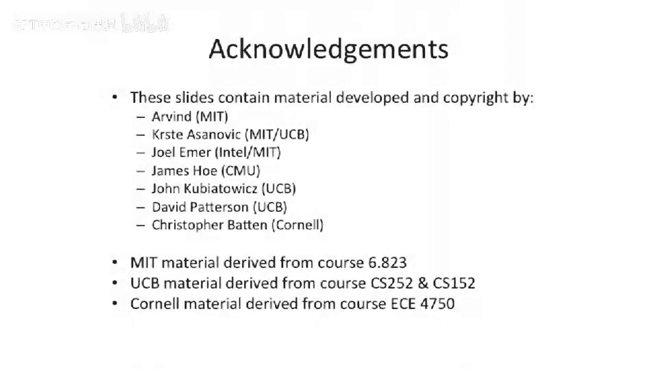

# 028：乱序执行与乱序提交处理器


在本节课中，我们将学习一种新的处理器设计：**顺序发射、乱序执行、乱序写回、乱序提交**的处理器。我们将探讨其基本结构、工作原理，以及它如何处理数据依赖和结构冲突，同时也会分析这种设计带来的挑战，特别是关于精确异常处理的问题。

## 处理器结构概述

上一节我们介绍了顺序处理器，本节中我们来看看一种更复杂的流水线设计。该处理器包含三条主要流水线：
*   一条**长流水线**（例如用于乘法运算）。
*   一条**内存访问流水线**（假设需要两个周期）。
*   一条**短ALU流水线**（位于顶部）。

与之前类似，处理器中有一个**记分牌**，用于追踪数据在流水线中的可用位置。架构寄存器文件位于流水线末端，接收写回的数据。

这个结构看起来与顺序发射、顺序提交的处理器相似，但存在一些关键差异。对比两种设计图，你会发现我们移除了许多流水线级。这很巧妙，我们不再需要复杂的旁路网络，可以直接将数据写入架构寄存器文件。只要我们保持**写后读**和**写后写**依赖的正确性，处理器就能正常工作。

## 记分牌与依赖处理

记分牌在这类处理器中的作用与在顺序机器中非常相似。我们可以用它来追踪**写回端口的结构冲突**，这一点非常重要。

例如，假设一条乘法指令后面紧跟着一条加法指令。如果流水线设计不当，它们可能同时需要使用写回端口，从而引发结构冲突。我们将在后续的流水线图中展示这种情况。

目前，我们仍然不需要一个更复杂的记分牌。有人在上节课提问：记分牌是否需要追踪每个值具体在哪条功能单元流水线中？对于这个相对简单的流水线，我们仍然不需要这样做，因为对于**写后写依赖**，我们的基本策略是**停顿**。如果你想打破这个限制，就需要在记分牌中追踪更复杂的信息，甚至可能需要引入**寄存器重命名**技术（我们将在下节课讨论），这允许处理器动态地打破写后写依赖。

由于现在各流水线的长度不同，记分牌中的条目需要以不同速度推进。例如，一条长指令（如乘法）进入记分牌后，每个周期向下移动一格，追踪其在流水线中的位置。而一条短指令（如加法）不需要等待四个周期才写入寄存器文件，我们可以在记分牌中合适的位置插入标记“1”，然后它只需走完剩余的流水线阶段。

这里的关键点是，因为我们不允许发生针对同一寄存器的**写后写冲突**，所以你永远不会在记分牌的同一行看到多个乱序的“1”标记。如果出现那种情况，就需要一个更高级的记分牌，我们会在本节课稍后展示其示意图。

## 流水线执行示例分析

现在，让我们通过一个例子来学习如何使用记分牌，并逐步分析这种“顺序发射、乱序执行与写回、乱序提交”处理器的工作过程。

我们使用与之前例子相同的代码序列：
```
指令0: MUL R1, R2, R3
指令1: ADD R4, R1, R5  // 读取R1
指令2: ADD R6, R7, R8
指令3: MUL R9, R10, R11
指令4: ADD R12, R11, R13 // 读取R11
指令5: ADD R14, R12, R15 // 读取R12
```

首先，观察一些**写后读依赖**及其处理方式。
*   指令1需要读取R1，而R1由指令0（乘法）产生。因此，指令1必须等待，直到可以从指令0的流水线阶段获得旁路数据。如图所示，指令1在发射阶段被**停顿**。由于是顺序发射，后续指令也无法被发射。在本节课后面，我们将讨论支持**乱序发射**的流水线，那样就可以在指令1等待时，发射后续不依赖于它的指令，从而通过重排指令来更充分地利用功能单元，提升性能。
*   另一个写后读依赖涉及R11（由指令3写入，被指令4读取）。当指令4尝试读取时，R11的数据已经存在于架构寄存器文件中，因此不需要任何特殊的旁路操作。

此外，图中还有几个要点值得指出：
1.  **乱序写回**：由于流水线长度不同，你可以看到这里的ADD指令（指令1）在程序顺序中位于它之前的指令（指令0，MUL）之前写回了架构寄存器文件。这带来了重要影响，特别是关于**异常处理**。假设这条先于ADD完成的MUL指令发生了某种错误或异常，此时架构寄存器文件已经被后面的指令修改，而前面的指令却未完成，这会导致状态不一致。
2.  **结构冲突实例**：图中有一个非常有趣的情况。指令5（ADD R14, R12, R15）依赖于R12。R12由指令4产生，并在其流水线阶段末尾准备好用于旁路。指令5直到其流水线的某个阶段才会尝试从旁路读取，此时值已就绪。然而，这条指令却**停顿**了。原因是它所有的输入都已就绪，但检查发现它将与另一条指令同时使用寄存器文件的**写端口**，因此发生了**结构冲突**，必须停顿。

## 记分牌中的冲突检测

让我们看看上述结构冲突如何在记分牌中体现。

记分牌表格的顶部横轴是周期（0-18）。纵轴是指令和寄存器。

当指令1（ADD）处于发射阶段时，它需要检查是否会在写端口上与之前的MUL指令冲突。在这个具体时刻，冲突并未发生。

但当指令1在记分牌中向下移动时，情况就不同了。对于短流水线的ADD指令，它不会在记分牌第四格开始标记，而是会在距离写回还有两个周期的地方开始标记。它需要检查：对于它要写入的寄存器，是否有其他指令已经计划在两个周期后的同一时刻进行写回？记分牌可以回答这个问题。如果对应位置有“1”，就表示存在冲突。

对于最后一条指令（指令5，ADD），我们可以看到冲突的发生。在某个周期，指令6（应为指令5，原文笔误）本应处于发射阶段并准备前进，但它检查记分牌中“距离写回还有两个周期”的位置，发现那里有一个“1”（来自其他指令），这意味着它不能发射，必须停顿。图中用多个垂直的小方框表示了该指令在后续周期连续检查并发现冲突，从而导致停顿的状态。

记分牌中的其他条目则表示了其他ADD和MUL指令的进行状态。你可以看到R1被写入，并在流水线中有较长的存活时间，而其他由ADD指令写入的寄存器在记分牌中的存活时间则较短。

## 可变延迟与异常处理挑战

上述讨论假设每条指令或每个功能单元的延迟是固定的。但实际上，功能单元可能有**可变延迟**。例如：
*   **除法单元**：有时设计为持续运算直到完成，延迟可变。
*   **加载指令**：如果缓存未命中，在乱序处理器中必须等待数据返回。

在记分牌中处理可变延迟的常见方法是：为每个目的寄存器设置一个特殊的标志位。当一条指令进入可变延迟流水线（如除法或缓存未命中的加载）时，就设置这个位，表示“该寄存器数据未就绪”。任何试图读取该寄存器的指令都会因此停顿。这是一种以性能为代价的简单处理方式。

回到我们的乱序提交处理器。它支持乱序写回和乱序提交。由于我们保持了写后写依赖，架构寄存器文件的状态不会因此出错。但一个严重的问题是：**如何处理异常？**

假设在我们的指令序列中，某条指令（比如一条MUL）在流水线末尾的提交阶段被检测出发生了异常。这条指令必须作废，所有后续指令也必须作废。但问题是，**在它之后发射的指令可能已经写回了架构寄存器文件**（例如图中指令1的ADD写回了R4）。当处理器进入异常处理程序时，寄存器R4中的值就是错误的，破坏了**精确异常**的要求。

这就是人们通常避免构建乱序提交处理器的主要原因之一，因为它使得实现精确异常变得棘手。当然，也有一些方法可以尝试：
1.  **限制指令类型/提前提交点**：如果你有一个顺序发射、乱序写回、乱序提交的处理器，你可以将**提交点**提前到流水线中更早的位置（例如内存访问的第一级或乘法的第一级）。在这个点之前，还没有任何状态被错误地写回，因此仍然可以安全地清除所有后续指令。但缺点是，发生在提交点之后的异常就无法被精确处理了。
2.  **滑动提交点**：一些处理器设计有滑动提交点。它们尝试尽早提交指令，但对于某些特定类型的指令，可以将提交点向后移动。然而，这很复杂，因为它意味着某些类型的指令不能在另一些指令之后执行，否则会违反滑动提交点的规则。

在本课程中，我们将主要讨论具有**单一固定提交点**的设计。我们规定流水线中有一个规范位置，经过该点的所有数据都已被执行并提交，不可回退。

## 总结




本节课我们一起学习了一种**顺序发射、乱序执行与写回、乱序提交**的处理器设计。我们分析了其利用不同长度流水线提升效率的潜力，以及通过记分牌管理数据依赖和结构冲突的方法。同时，我们也重点探讨了这种设计面临的核心挑战——**在乱序写回背景下实现精确异常**的困难，并简要了解了一些高级的解决思路，如限制指令类型或使用滑动提交点。理解这些权衡是深入掌握现代高性能处理器设计的关键。