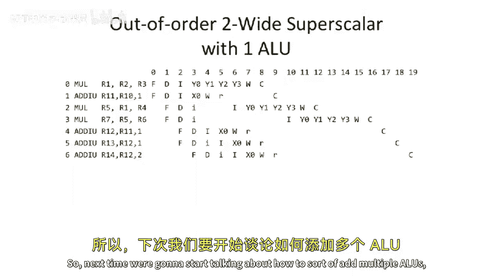

# 031：乱序执行处理器详解

在本节课中，我们将深入探讨现代处理器中的乱序执行技术。我们将学习指令流水线中“顺序取指、乱序发射、乱序执行、顺序提交”的核心概念，并分析其对处理器性能的影响。

## 概述

上一节我们介绍了处理器流水线的基本结构。本节中，我们来看看一种更复杂的处理器设计：乱序执行处理器。这种设计旨在通过允许指令在满足依赖关系的前提下提前执行，来挖掘指令级并行性，从而提高性能。

## 核心概念与结构

乱序执行处理器的核心工作流程可以概括为：**顺序取指 (In-order Fetch)**，**乱序发射 (Out-of-order Issue)**，**乱序执行 (Out-of-order Execute)**，**顺序提交 (In-order Commit)**。这意味着流水线的中间阶段是完全乱序的。

为了实现这一流程，处理器需要集成多种关键结构。以下是这些组件的简要介绍：

*   **发射队列 (Issue Queue)**：用于存放已解码但尚未发射执行的指令。
*   **加载/存储缓冲区 (Load/Store Buffer)**：管理内存访问操作，处理内存依赖。
*   **重排序缓冲区 (Reorder Buffer, ROB)**：跟踪所有正在执行中的指令，确保它们能按原始程序顺序提交。
*   **物理寄存器文件 (Physical Register File)** 与 **记分牌 (Scoreboard)**：共同管理寄存器重命名和指令间的数据依赖关系。
*   **架构寄存器文件 (Architectural Register File)**：保存程序可见的最终寄存器状态。

## 性能分析与挑战

现在，我们来看看这种设计对性能的具体影响。通过分析指令执行时序图，我们可以观察到一些有趣的现象。

首先，乱序发射允许不相关的指令提前执行。例如，一条加法指令可能比它后面的一条乘法指令更早发射，这非常有利于性能。

然而，乱序执行处理器依然面临挑战。一个典型问题是写后写冲突。即使指令可以乱序发射，如果两条指令要写回同一个架构寄存器，它们仍然必须按顺序写回，这可能导致流水线停顿。

有趣的是，尽管乱序执行增加了复杂性，但其性能提升有时并不如预期显著。原因之一在于“顺序提交”的要求。即使指令很早就执行完毕，它也必须等待所有前面的指令都提交后，才能提交自己的结果，这可能会将整个提交阶段推迟。

## 多发射与资源瓶颈

为了进一步提升性能，我们可以考虑引入多发射能力，即每个周期发射多条指令。

假设我们拥有双发射能力（每个周期解码并送入发射队列两条指令），但执行后端资源（如ALU）仍然是单份。这会使指令更早进入发射队列，可能缓解一些由取指/解码阶段带来的瓶颈。

但正如时序图所示，这并不总能大幅提升性能。因为最终我们可能受限于执行资源。如果多条指令都需要使用同一个功能单元（如乘法器），它们仍然需要串行执行。

因此，更理想的设计是“乱序多发射超标量处理器”，即同时具备多发射能力和多个执行单元。这样，我们可以在每个周期取指、解码、发射多条指令，并且如果有足够的、不相关的执行单元，让它们真正并行执行。这能有效解决资源瓶颈问题。

例如，那些完全不依赖于前面乘法指令的加法指令，就可以在乘法指令执行的同时被发射并执行，这能显著提高效率。

## 总结

本节课中，我们一起学习了现代乱序执行处理器的核心原理。我们明确了“顺序取指、乱序发射、乱序执行、顺序提交”的流程，并认识了实现这一流程所需的各个硬件结构。我们分析了乱序执行带来的性能优势，同时也指出了顺序提交和资源瓶颈可能带来的限制。最后，我们探讨了通过结合多发射与多执行单元来构建更强大的超标量处理器，以更好地挖掘程序中的指令级并行性。下一讲，我们将继续深入，探讨如何增加更多的执行单元以及处理更复杂的依赖关系。