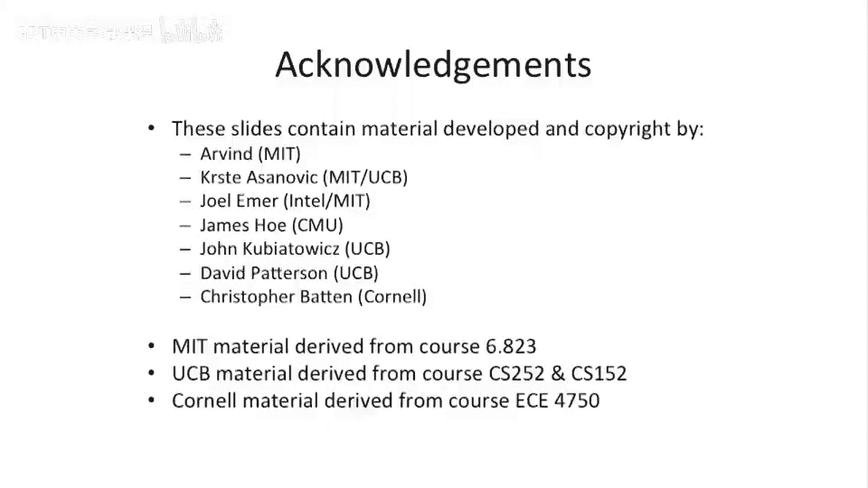

# 033：寄存器重命名简介 🧠


在本节课中，我们将要学习一个提升处理器性能的关键技术——**寄存器重命名**。我们将探讨为什么现代处理器需要它，以及它是如何通过消除“伪依赖”来让指令更高效地并行执行的。

---

## 性能瓶颈与依赖关系

上一节我们介绍了乱序执行流水线。本节中我们来看看限制这些流水线性能的因素。

限制我们目前讨论的乱序流水线性能的主要是两种依赖关系：**写后写**依赖和**读后写**依赖。

*   **写后写依赖**：连续两条指令写入同一个寄存器。在我们目前讨论的流水线中，为了避免冲突，通常需要等待第一条指令的写入提交后才能执行第二条，这会导致流水线停顿。
*   **读后写依赖**：一条指令读取某个寄存器后，另一条指令写入同一个寄存器。在乱序执行时，如果处理不当，也可能出现问题。

需要注意的是，**写后读**依赖是**真依赖**，因为后续指令确实需要前一条指令的计算结果，这种依赖通常无法被打破。

我们将写后写和读后写依赖称为**名字依赖**，因为它们是由于寄存器名字（地址）的重复使用引起的，而非真正的数据流动需求。

---

## 忽略名字依赖会怎样？

以下是忽略所有名字依赖可能引发的问题。

让我们看一段示例代码，分析如果简单地在乱序处理器中忽略名字依赖会发生什么。

我们有以下代码序列：
```assembly
MUL R1, R2, R3
MUL R4, R1, R5
ADDI R4, R4, #1
ADDI R1, R4, R6
```

首先，识别其中的**真依赖**（写后读）：
1.  第一条`MUL`写入`R1`，第二条`MUL`读取`R1`。
2.  第二条`MUL`写入`R4`，第一条`ADDI`读取`R4`。

这些是真依赖，难以打破。

现在，看看**名字依赖**：
1.  **写后写依赖**：第二条`MUL`写入`R4`，紧接着第一条`ADDI`也写入`R4`。
2.  **读后写依赖**：第一条`ADDI`读取`R4`，紧接着第二条`ADDI`写入`R4`。

在乱序执行中，如果我们试图打破这些依赖（即不因此停顿），可能会发生以下情况：
*   由于没有停顿，第二条`ADDI`（写入`R4`）可能先于第一条`ADDI`（也写入`R4`）执行完毕，导致`R4`最终被写入错误的值。
*   同样，第二条`ADDI`（写入`R4`）可能先于第一条`ADDI`（读取`R4`）执行，导致第一条`ADDI`读取到错误（过时）的值。
*   由于提交是按顺序的，错误的寄存器状态会被最终提交到架构寄存器文件中。

因此，我们不能简单地忽略或打破名字依赖，需要更巧妙的解决方案。

---

## 解决方案的思路：使用更多寄存器

解决名字依赖的一个直观想法是使用更多的寄存器。

比较两种执行方式：
*   **保守停顿的流水线**：在遇到名字依赖时保守地停顿，等待相关指令提交。这保证了正确性，但性能较差。
*   **理想情况**：假设没有名字依赖，指令可以充分并行，性能最佳。

如果我们能修改代码，将产生名字依赖的指令改用不同的寄存器，就能自动达到理想性能。例如，将示例中第一条`ADDI`的目标寄存器从`R4`改为`R8`，就消除了所有相关的名字依赖。

然而，我们无法无限增加架构寄存器数量，因为这会增加指令编码的位数（例如，32个寄存器需5位，128个寄存器需7位）。

---

## 硬件解决方案：寄存器重命名

本节的核心是介绍如何在硬件层面实现寄存器重命名。

关键思想是：**在物理上拥有比架构寄存器更多的寄存器，但在指令集层面（软件视角）仍然使用原有的有限寄存器名**。硬件动态地将架构寄存器名映射到不同的物理寄存器上，从而消除名字依赖。

我们定义**寄存器重命名**为：**在硬件层面改变寄存器的命名，以消除写后写和读后写这类名字依赖**。

---

## 两种主要的实现方案

我们将讨论两种主要的寄存器重命名方案，它们在逻辑上是对偶的，硬件需求略有不同，但能达到相同的性能。

以下是两种方案的简要对比：


1.  **指针方案**：在指令队列和重排序缓冲区中存储指向物理寄存器的**指针**，而非直接存储架构寄存器名或数据值。这种方案与我们上节课讨论的乱序执行设计有较好的延续性。
2.  **值方案**（如Tomasulo算法）：直接在指令队列和重排序缓冲区中存储**数据值**本身。

本节课我们将从**指针方案**开始讲解，主要因为它能更自然地衔接我们已有的设计（按序取指、乱序发射、乱序执行写回、按序提交）。

---

## 总结

本节课中我们一起学习了：
1.  **名字依赖**（写后写、读后写）是限制乱序流水线性能的重要因素，但它们不是真依赖。
2.  简单地忽略名字依赖会导致执行结果错误。
3.  **寄存器重命名**是关键的硬件技术，它通过动态地将架构寄存器映射到更多的物理寄存器上来消除名字依赖。
4.  寄存器重命名主要有两种实现思路：**存储指针**或**存储数据值**，接下来我们将深入探讨第一种方案。




下一节，我们将详细剖析基于指针的寄存器重命名是如何在处理器流水线中具体实现的。