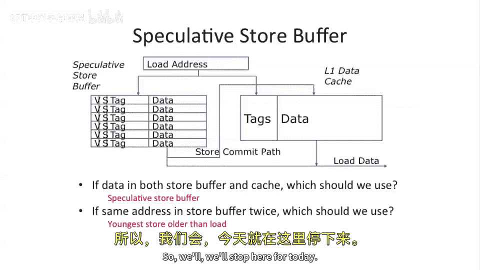

# 036：内存歧义消除 🧠

在本节课中，我们将要学习处理器中的一个重要概念：内存歧义消除。这是处理内存访问顺序问题，特别是“写后读”冒险的关键技术。我们将探讨为何需要它、保守的解决方案、以及更先进的推测执行方法。

---

## 内存歧义消除问题

上一节我们介绍了指令级并行中的冒险问题。本节中我们来看看一个特殊类型：通过内存系统发生的“写后读”冒险。

我们有一个基本的指令序列：一个存储指令后跟着一个加载指令。我们何时可以执行这个加载指令？如果加载指令不依赖于存储指令，我们可以在乱序执行机器中，甚至在存储指令之前执行加载指令。然而，如果加载指令依赖于存储指令（例如，它们的地址寄存器相同），我们就会遇到问题。

---

## 保守的解决方案：顺序内存访问

在此之前，我们的流水线采用了一种简单的解决方案：让加载和存储指令按顺序执行。这可以解决所有问题。我们允许其他指令围绕内存指令乱序执行，但内存指令本身保持顺序。这保证了不会出现问题，但牺牲了性能。

---

## 提升性能：推测执行

为了追求更高性能，我们希望能乱序执行加载和存储指令，前提是它们的地址不同。但这需要额外的硬件结构来支持。

以下是保守的乱序加载执行方案：
1.  将存储指令拆分为两个部分：地址计算和实际数据写入。
2.  通过提前计算存储地址，我们可以判断后续的加载指令是否与其地址冲突。
3.  如果地址不同，我们就可以在存储指令之前执行加载指令。

然而，这种方法仍然需要将每个加载指令与所有先前未提交的存储指令进行地址比对，这需要复杂的硬件结构。并且，如果我们不知道前面存储指令的地址，就无法安全地执行任何加载指令。

---

## 更优方案：内存依赖预测

我们能否做得更好？答案是进行推测。我们可以猜测地址不相等，并提前执行加载指令。然后，我们暂缓提交加载和存储指令，并按顺序提交它们。如果猜测错误（地址实际相等），我们必须回滚所有相关指令。

这种回滚的代价很高。因此，一种启发式方法被提出，称为**内存依赖预测**。其核心思想是：
*   我们仍然猜测加载和存储不冲突。
*   但如果发现它们冲突并导致回滚，我们会对这个特定的加载指令做一个特殊标记。
*   当下次遇到相同的加载指令时，预测器会“记住”它可能依赖于前面的存储，从而强制它等待所有前面的存储完成，避免再次回滚。

这类似于分支预测，是一种基于历史行为的启发式优化，可以减少因错误推测而导致的整体流水线刷新。

---

## 推测执行的支持结构：存储缓冲区

为了实现推测性的加载和存储，我们需要引入一个**存储缓冲区**来保存推测状态。

让我们快速看一下存储缓冲区的结构：
*   所有发往L1数据缓存的地址也会被发送到这个缓冲区。
*   缓冲区内部有标志位，指示条目是否有效，以及数据是否已就绪。
*   当加载指令乱序执行时，它首先检查存储缓冲区。如果命中且数据有效，它可以从缓冲区读取最新值，而无需访问缓存。
*   如果推测的存储指令后来被取消（例如，位于错误的分支路径上），只需将其从缓冲区中移除即可。
*   一个重要的问题是：如果数据同时存在于缓冲区和缓存中，以缓冲区中的新值为准。
*   另一个复杂性是：缓冲区中可能有多个对同一地址的存储。读取时必须按程序顺序找到最新的（最年轻的）值。

---

## 总结

本节课中我们一起学习了内存歧义消除技术。我们从保守的顺序执行内存访问开始，了解了其可靠性但性能受限。接着，我们探讨了通过拆分存储指令和地址比对来实现有限的乱序执行。然后，我们介绍了更先进的**内存依赖预测**技术，它通过历史学习来减少错误推测的代价。最后，我们了解了支持这些推测机制的关键硬件结构——**存储缓冲区**，它临时保存推测的存储结果，使乱序的加载指令能访问到最新数据。这些技术是现代高性能处理器实现指令级并行的重要组成部分。