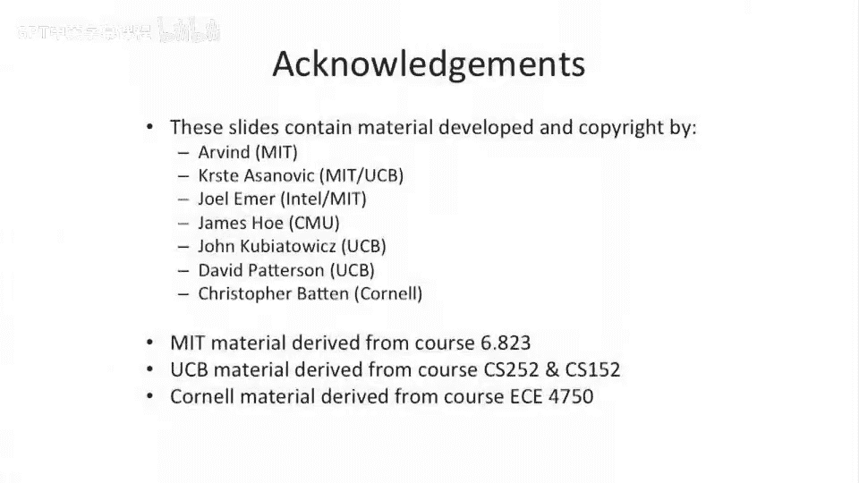

# 037：VLIW处理器与乱序设计的复杂性限制 🚀

在本节课中，我们将要学习**VLIW（超长指令字）处理器**。这是一种利用处理器中指令级并行性的替代方法。与我们在乱序处理器和超标量处理器中讨论的动态调度不同，VLIW通过编译器进行静态调度，并由相应的体系结构来利用这种调度。但在深入VLIW之前，我们需要先理解传统超标量乱序处理器设计的复杂性及其限制。

## 乱序处理器的复杂性来源 🔍

上一节我们介绍了超标量处理器的基本概念，本节中我们来看看其内部，特别是乱序执行部分，为何会变得如此复杂。

这里有一张描述超标量处理器中指令生命周期的示意图。处理器的发射宽度表示为 **W**，指令的生命周期长度表示为 **L**。这形成了一个处理器中“在途”指令的矩阵。这些指令可能位于指令队列中。当我们尝试发射一条指令时，需要检查它与指令窗口中所有其他指令以及所有寄存器的依赖关系。

我们构建了一些结构来避免全对全（all-to-all）的检查，以降低复杂度。例如，记分牌（scoreboard）通过跟踪每个寄存器最近一次写入的位置和延迟，将全对全比较转化为基于寄存器的索引查找，这简化了操作。

然而，在指令发射队列（issue queue）中，当一个指令退休时，它仍然需要广播其完成的寄存器，唤醒指令队列中所有等待该寄存器的指令，并检查哪些指令已就绪可以发射。这个过程大致按 **W * L** 的规模扩展，因为每个周期可能退休多条指令，并且需要检查队列中的所有指令。随着处理器宽度（W）的增加，这变得非常复杂。

以下是乱序控制逻辑复杂性的几个关键点：

*   **唤醒与选择逻辑**：一个主要挑战是，单个周期内可能有过多指令被同时唤醒。例如，如果指令队列中所有指令都在等待寄存器5，那么当一条指令写入寄存器5时，所有这些指令都需要被唤醒。然后，硬件必须从中选择恰好符合功能单元混合要求（例如，2个加法、2个乘法、1个加载/存储）的指令进行发射。这变成了一个巨大的组合逻辑难题。
*   **电路级实现**：为了应对这个挑战，全定制处理器设计会使用称为“选择器（pickers）”的电路。这不是纯粹的组合逻辑，而是更接近模拟电路或类CAM（内容可寻址存储器）的结构，它能根据某种启发式方法（通常是选择最旧的指令以防止死锁）快速选择就绪指令。
*   **宽度与深度的权衡**：增加处理器宽度（W）通常也需要增大指令窗口的深度（L），以找到足够的并行性来喂饱所有功能单元。这导致控制逻辑的复杂度大致在 **W² 到 W³** 之间增长，使得前端设计（指令获取、解码、发射）的流水线级数越来越多，设计极具挑战性。

## 现实案例：MIPS R10000处理器 🖥️

为了具体理解这种复杂性，让我们看一个真实处理器的例子：MIPS R10000。

这是一款用于SGI工作站的乱序超标量处理器。从其芯片显微照片中，我们可以清晰地看到控制逻辑所占用的面积相当可观。数据通路（整数单元、浮点单元等）本身相对适中，而指令缓存、数据缓存等大型结构也很显眼。

然而，芯片中间区域的大量面积被控制逻辑占据：
*   寄存器重命名逻辑和空闲寄存器列表。
*   分布式的指令队列（或保留站），分别用于地址计算、整数和浮点指令。
*   各种调度和控制电路。

与执行单元相比，所有这些用于实现乱序调度的“开销”硬件占据了芯片面积的很大一部分。这直观地说明了乱序设计在硬件复杂度上的代价。

## 指令集表达的局限性 🤔

乱序超标量处理器还存在另一个根本性问题：如何表达并行性。

让我们看看顺序代码在乱序超标量处理器上的执行流程：
1.  一段C代码被送入先进的编译器。
2.  编译器分析代码，生成数据流图和控制流图，它清楚地知道指令间的所有依赖关系和可用的并行性。
3.  **然而**，由于传统指令集架构（ISA）是顺序的，编译器必须强行生成一个**顺序的指令序列**，即使这个顺序可能并非最优，甚至不必要地约束了问题。
4.  这个顺序指令序列被交给处理器。
5.  处理器的前端硬件（取指、解码、重命名）必须**重新解析**这个顺序序列，通过复杂的硬件逻辑（如保留站、唤醒逻辑）尝试找出并行性，并动态地重新调度指令。
6.  最终，硬件生成一个实际的执行调度，在保持读写依赖的前提下尽可能高效地执行。

这个过程存在一个明显的**信息断层**：编译器早已知道的并行性信息，在编译后的二进制代码中丢失了。处理器不得不耗费大量的硬件资源、功耗和设计努力，去重新发现编译器已经知道的信息。

## 寻找更好的方法 💡

综上所述，传统的乱序超标量设计面临着硬件复杂度高、控制逻辑开销大以及编译器与处理器间存在信息鸿沟等问题。那么，是否存在更好的方法？

**答案是肯定的**。一种思路是将调度并行性的责任从运行时硬件转移到编译时软件。如果编译器能将多个可以并行执行的操作打包到一条很长的指令中，由硬件直接执行，不就需要复杂的动态调度逻辑了。这正是**VLIW（超长指令字）处理器**的核心思想。

本节课中我们一起学习了乱序超标量处理器设计复杂性的来源，包括其控制逻辑的规模、在真实芯片中的面积体现，以及因顺序指令集导致的信息效率低下问题。认识到这些限制，为我们接下来探索一种不同的设计哲学——VLIW架构——奠定了重要的基础。