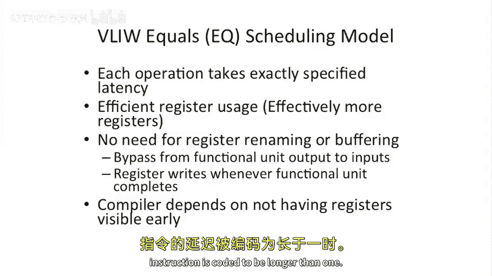
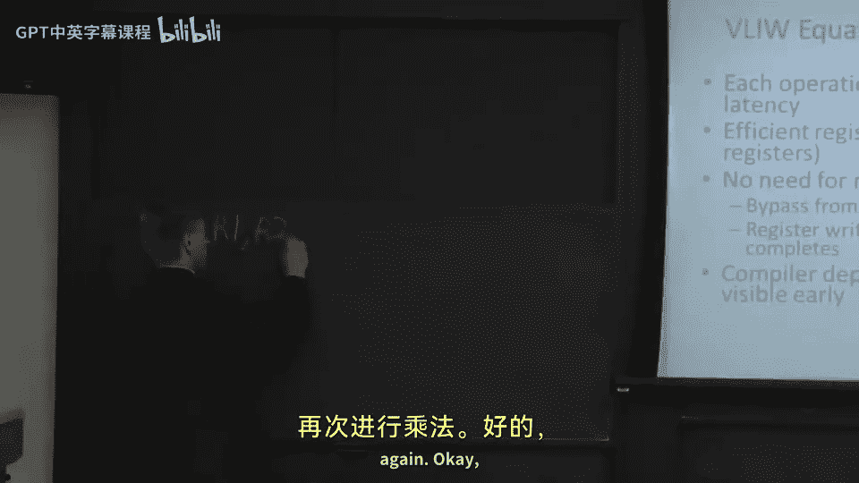

# 038：超长指令字处理器简介 🚀


在本节课中，我们将要学习一种称为超长指令字处理器的架构。这种架构试图通过改变指令的编码和执行方式，来简化硬件设计并提升性能。我们将探讨其基本概念、工作原理、两种主要的调度模型，并简要回顾其发展历史。

## 概述

上一节我们介绍了超标量和乱序执行处理器中复杂的硬件依赖检测机制。本节中我们来看看一种不同的思路：超长指令字处理器。这种架构将多个独立操作打包在一个指令束中，并将依赖检测的工作从硬件转移到了编译器。

## 超长指令字的基本概念

超长指令字处理器，简称VLIW，其核心思想是将多个可以并行执行的操作编码在一个很长的指令字中。一个VLIW指令，或称指令束，内部包含多个独立的操作。

以下是VLIW指令的一个示例格式：
```
[ 整数操作1; 整数操作2 | 内存操作1; 内存操作2 | 浮点操作1; 浮点操作2 ]
```
在这个例子中，一个指令束内可以包含两个整数操作、两个内存操作和两个浮点操作。程序在内存中仍然是一个顺序的指令束序列，但每个指令束内部编码了多个可以并行执行的操作。

## VLIW的执行语义

在VLIW架构中，位于同一个指令束内的所有操作被视为可以并行执行，编译器负责保证它们的独立性。硬件不进行依赖检查。

考虑以下代码序列：
```
[ MUL R3, R1, R2; ADD R4, R5, R6 ]
[ SUB R7, R3, R8 ]
```
在这个例子中，第一条指令束包含一个乘法（MUL）和一个加法（ADD）。尽管乘法会写入寄存器R3，而第二条指令束中的减法（SUB）会读取R3，但位于**同一个指令束内**的MUL和ADD之间没有依赖关系。硬件不检查它们是否访问了相同的寄存器。依赖关系只存在于**不同指令束**的操作之间。

这种设计的优点是显著的：我们移除了用于动态调度、依赖检测（记分牌）、重排序缓冲区和寄存器重命名的大量复杂硬件。编译器在编译时完成了这些分析工作。

## VLIW的挑战与调度模型



然而，VLIW架构也面临挑战，主要是难以应对运行时动态事件，如缓存缺失和分支预测错误，因为它缺乏动态调度硬件。此外，编译器必须精确知道每个操作的执行延迟。



这就引出了VLIW中关于操作延迟和寄存器值读取的关键问题：当一个操作写入寄存器，但其结果需要多个周期才能就绪时，后续操作应该读取旧值还是新值？

以下是两种主要的调度模型：

### 1. 等于调度模型

在等于调度模型中，一个操作的结果严格在其指定的延迟周期结束时生效。在此之前，任何读取该寄存器的操作都将获得旧值。

例如，假设一个乘法操作需要4个周期完成，其目标寄存器是R1。如果一个在乘法发射后1个周期执行的AND操作试图读取R1，那么它将获得R1在乘法执行前的旧值。编译器必须了解这一规则并进行相应的指令调度。

这种模型的优点是可以减少寄存器压力，因为寄存器在结果实际生效前并未“失效”。但它有一个严重问题：在处理中断时可能引发状态不一致。如果乘法完成后、AND执行前发生中断，中断处理程序看到的R1是新值，但AND恢复执行后却会读取旧值，导致错误。

### 2. 小于等于调度模型

在小于等于调度模型中，一个操作的结果可以在其发射后到指定延迟结束前的**任何时间点**生效。编译器仍然不能假设结果会提前就绪（因此不能提前调度依赖该结果的操作），但它保证了结果的生效时间不会晚于指定延迟。

这种模型的好处是支持精确中断，并且当处理器升级、操作延迟缩短时，能保持二进制代码的兼容性。即使乘法从4周期加速到3周期，原有代码仍能正确执行。

## VLIW架构简史

VLIW的研究相对较新，始于20世纪80年代末。
*   **FPS处理器**：最早的LIW处理器之一，是VAX机器的浮点协处理器，没有互锁机制，也不处理中断。
*   **Multiflow Trace处理器**：由耶鲁大学Josh Fisher的研究衍生而来，采用非常长的指令字（最长1024位），每个指令可包含7、14或28个操作，通过编译器配置支持不同宽度的机器型号。
*   **Cydrome Cydra 5**：由Bob Rau开发，采用了一种创新的“旋转寄存器文件”设计来替代寄存器重命名，用于高效处理函数调用和循环。

近期（过去5-10年）的研究致力于结合VLIW的静态调度优势和超标量的动态调度能力，例如研究在多核上进行调度，或设计兼具静态和动态特性的“超级VLIW”架构。

## 总结


本节课中我们一起学习了超长指令字处理器。VLIW通过将多个操作打包进一个长指令字，并将依赖检测任务交给编译器，从而大幅简化了处理器硬件。我们探讨了其基本执行语义，分析了它无需复杂动态调度硬件的优点，以及难以应对运行时不确定性的缺点。最后，我们详细介绍了**等于**和**小于等于**两种关键的调度模型，并简要回顾了VLIW架构的发展历程。理解VLIW有助于我们思考编译器与硬件之间职责划分的不同设计哲学。