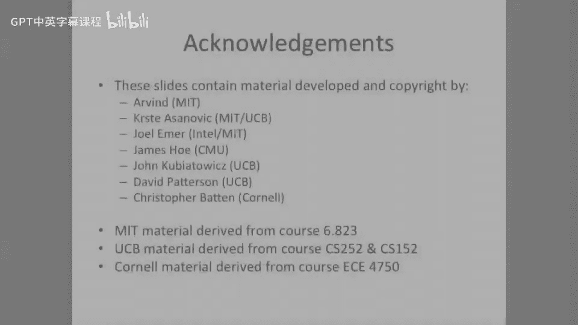

# 039：VLIW编译器优化 🚀


在本节课中，我们将要学习超长指令字（VLIW）架构中，编译器如何通过一系列优化技术来弥补硬件简化带来的性能挑战。我们将重点探讨循环展开、软件流水线和踪迹调度等核心编译优化方法。

---

## 编译器在VLIW架构中的核心作用 🧠

上一节我们介绍了VLIW处理器的基本概念。本节中我们来看看，当我们将超标量处理器中的复杂硬件（如动态调度和依赖检查逻辑）移除后，性能责任如何转移。

VLIW处理器依然追求高性能。既然我们移除了超标量设计中的大量硬件，就必须有东西来弥补这个空缺。这个弥补者就是一个非常、非常、非常智能的编译器。因此，在这类架构中，我们非常强调编译器的作用。

编译器必须承担起调度的责任。它需要完成所有的依赖检查，并可能必须避免各种数据冒险。这仅仅是个开始。我们将在后续课程中主要讨论编译器可以进行的各种优化，以尝试近似实现动态超标量处理器所能做到的事情，但它是通过静态方式完成的。

这是一个相当巧妙的技巧。如果你把所有那些硬件功能放到编译器中，只需运行一次编译过程。然后，每次执行代码时，你都不需要重新计算所有的依赖关系。

---

## 基础循环代码的执行与性能分析 🔄

让我们看看如何在这里执行一些代码，以及在VLIW处理器上执行循环代码的性能方面是怎样的。

这里有一个非常基础的数组递增操作。我们将取数组的每个元素，将其增加一个值 `C`。代码进入我们的编译器，这里是一个顺序的代码序列。这段代码尚未为VLIW架构进行调度。

以下是顺序代码：
```assembly
LOAD   F0, 0(R1)      ; 从内存加载数组元素到F0
ADDI   R2, R2, #1     ; 递增计数器
ADDF   F2, F0, F4     ; 浮点加法：F2 = F0 + C (F4中存有C)
STORE  F2, 0(R1)      ; 将结果存回内存
ADDI   R1, R1, #4     ; 递增数组索引（假设每个元素4字节）
BLT    R2, R3, LOOP   ; 如果R2 < R3，跳回循环开始
```

由于架构和编译器了解指令延迟，假设这里的加载指令有几周期的延迟。因此，编译器实际上可以稍后调度这个加法指令。而加法是浮点加法，它也有几个周期的延迟。所以，编译器将那个结果的消费者（即 `F2` 的使用）调度到更后面。同时，编译器可以将数组索引和计数器的递增操作安排在空闲的槽位中，比如可能与加载和存储指令同时调度。

这很酷。我们实际上在这里实现了两路并行执行。我们不需要超标量处理器中所有的额外开销。

第一个问题是：我们每个周期执行多少次浮点操作？看起来情况不太好。我们这里只有一个浮点操作（就是这个加法）。而我们总共有7个周期。所以，我们每周期只有大约0.125次浮点操作。这并不理想。我们确实有一些并行性，执行了三条指令，比没有好，但我们并没有很好地利用机器。一个动态超标量处理器可能会尝试获取下面的指令，也许混合它们，尝试重新排序一堆东西以运行得更快。

---

## 循环展开优化 🔄➡️🔄🔄🔄

那么，如何提高性能呢？正如之前所说，在本单元中我们非常强调编译器的作用。编译器可以做的一件事就是实际展开循环。

这里我们有我们的循环，我们将其展开四次。现在，我们试图将循环开销分摊出去，因为它每四次迭代才发生一次。这听起来不错。你试图在循环的每次迭代中做更多的工作。

但事情变得稍微复杂一些。如果循环终止值 `N` 不是4的倍数怎么办？我们需要对此进行处理。我们可能需要在执行前检查，我们是否处于方便的四的倍数且足够大的情况。我们可能可以在很长一段时间内以四的倍数运行，只有在最后一次迭代时才需要清理。但我们需要生成一些清理代码，而编译器负责完成这项工作。这些编译器优化确实需要一些努力。

现在让我们看看循环展开后代码的调度情况。

我们可以在这里预先进行一堆加载操作。我们已经将这些循环迭代交织在一起。很酷的一点是，我们实际上可以将加载操作提取出来放到顶部，将存储操作推到底部，然后将所有加法操作放在中间，也许将数组更新操作穿插在其他地方。

当我们实际调度时，我们会做类似的事情：先执行加载，然后执行浮点加法，再进行存储。但你可以注意到，我们实际上开始获得一些重叠。因为我们已经展开了循环，我们可以重叠这个加载和第一个浮点加法。因为我们有效地通过在延迟时间内放入其他循环迭代，覆盖了功能单元的延迟。

如果你将这个调度与之前的调度进行比较，我们只是将这些空闲周期利用起来，并在那些空闲周期中放入了其他循环迭代。

在这个循环展开的情况下，我们递增这些计数器和索引不再是每次加4。我们现在递增的是 `循环展开次数 * 数据大小`。所以我们现在递增16。这说得通吗？因为在这段代码中，我们之前是将 `R2` 递增4，因为单个值的大小是4字节。但现在，因为我们把所有这些工作批量处理在一起，我们实际上必须将索引移动一个更大的值。所以我们移动了 `4（展开次数） * 4（数据大小） = 16`。

这里的一个好处是，在加载和存储中，我们都使用了寄存器间接寻址模式，并加上一些偏移量。所以我们实际上是在用基址寄存器 `R1` 加上偏移量（比如12）来计算我们实际加载的地址。这是一种方便的方式，我们不需要计算一堆地址。

回到这里，我们可以看到我们正试图将实际操作与其他循环迭代重叠。这真的很酷。所以我们开始在这里获得一些性能。

让我们看看性能。这里问同样的问题：每周期多少次浮点操作？希望它更高。1, 2, 3, 4次操作除以11个周期，得到大约0.36，比0.125好多了。所以循环展开对我们有帮助。

---

## 软件流水线优化 ⏩

但这就是全部吗？我们的编译器还能做更多吗？于是，编译器专家们想出了一个更巧妙的主意，称为**软件流水线**。这是一个我们之前见过的术语——流水线，但这是在软件中实现的。

这里的想法是，不仅仅展开循环并重叠迭代，我们实际上要取多个这样的调度并将它们交错，尝试填补一些空槽。

让我们看看这个。我们将代码展开四次。这和上一张幻灯片中的代码相同。我们将画出之前的调度图（用紫色表示）。现在，我们将用另一个完全相同的四次展开循环迭代来调度它（用绿色表示）。我们只是将这个迭代与另一个循环迭代重叠。我们完成了吗？还没有，这里仍然有一些空槽。所以让我们尝试重叠甚至另一个迭代（用红色表示）。

现在，为了正确执行此操作所需的修复代码变得更加复杂。因为突然间，你基本上重叠了多个迭代。但只要你没有修改某些值，没有投机性地进行存储，你可能就没问题，因为你只是在做额外的加载，做额外的工作，你在填补槽位，并认为不会有任何问题，或者认为索引变量 `N` 是4的倍数且足够大，并且你不在循环末尾。

让我们给这些东西起个名字。我们称开始部分为**前导段**或**序幕**。这里实际上是我们真正的迭代主体。你可以看到（绿色部分，可能显示不太清楚），这里有指令，有加法，相当满。我们实际上在VLIW机器上做了很多工作。然后这里的**后导段**或**尾声**，是我们完成的时候。这是当我们退出时，可以说是外部循环的最后一次迭代。

让我们做一些数学计算，看看这种方法的性能。问题是：每周期多少次浮点操作？我们看这里，在紧凑循环部分有四个周期内执行了四次浮点操作。这看起来非常好。我们刚刚获得了一大堆性能。但我们必须做大量的编译器优化才能使这工作。我们能够利用机器中的并行性，并且能够重叠这个循环的三个不同迭代，同时我们还通过软件转换将循环展开了四次。这就是所谓的软件流水线。

这里有一张很好的图，直观地展示了正在发生的事情。我们在横轴上表示时间，在纵轴上表示执行指令的活动量或性能。当你运行多个循环展开迭代时，你会有一些启动开销，然后实际运行循环，最后从循环中退出。这比有大量启动开销，然后在中间只有很小的循环迭代部分要好。

但当我们看软件流水线时，我们可以基本上将一个迭代循环的执行与另一个循环的迭代重叠。我们实际上可以执行我们的序幕，非常紧凑地执行多个迭代，然后在这里有我们的尾声。在软件流水线中，我们只为整个循环的执行支付一次启动和结束成本，而不是为循环的每次迭代都支付。所以这很有趣。在学校里，我们获得了性能。

---

## 处理控制流：基本块与踪迹调度 🧩

如果世界只有密集循环，生活将很容易。唉，世界并不全是循环。如果我们只有一个处理器，只做密集数组计算，并且我们世界上的所有问题都只是密集数组计算，生活将非常容易，但事实并非如此。很多时候，代码有很多分支。它有 if-then-else 子句。

这里，我们以图形方式展示了类似 if-then-else 的结构。我们有一段代码，它做出一个决定，要么执行左边的代码，要么执行右边的代码，这基于一个 if 语句。这是 if 为真的语句，这是 else 子句。

**数据依赖的分支**通常是超长指令字处理器的一个问题。为什么？在一个乱序处理器中，你可以尝试围绕分支执行代码，并将指令移动到分支之上或之下。但如果你进行静态调度，当你遇到这个分支时，假设它是一个难以预测的分支，你真的做不了什么，因为你已经将一堆指令打包在一起，它们需要原子性地执行。所以，你无法轻易地将代码跨分支上下移动。超标量处理器可以做到这一点，因为它有指令窗口，有一堆技术和硬件来实现。但在我们的 VLIW 处理器中，这是个问题。

这里我想介绍一个对编译器非常重要的术语，对这个课程也很重要，它叫做**基本块**。什么是基本块？基本块是一段具有单一入口和单一出口的代码。所以这是一个基本块。它有一个入口和一个出口。为什么单一入口很重要？因为如果你可以跳转到这段代码的中间，编译器不一定能重新排序这个块内的指令。如果你有多个出口，比如说你在这里退出，编译器可以将指令推送到那个出口点之后。但如果你有一个基本块，编译器基本上知道这个指令序列将有效地（虽然不是真正原子性地）执行。从编译器的角度来看，它可以重新排序这里的指令以获得更好的性能。

所以，循环很容易。我们可以进行软件流水线，可以展开。但包含 if-then-else 的“面条代码”更难处理。因此，编译器专家想出了一些巧妙的技巧，以使 VLIW 工作得更好，并利用乱序超标量处理器所做的一些代码移动，但这是在编译器中静态完成的，而不是在硬件中动态完成的。

其中一种更著名的方法是**踪迹调度**，这是 John Ellis（Josh Fisher 的学生之一）的论文工作，出自耶鲁大学的 Bulldog 编译器。

你这样做：首先对代码进行**性能分析**，得出这些分支走向某一方向或另一方向的概率。这里的性能分析不是硬件在运行时做的事情，而是在编译器阶段对程序进行的。编译器在给定的输入集上运行程序，得出分支走向的概率。

然后，你利用这些性能分析信息，猜测出最可能的执行路径。我们在这里圈出它，并说这些加粗的边是给定入口点后，通过这段“面条代码”的最可能路径。这并不意味着你不能有分支跳出这个路径。但如果你这样做了，你需要一些修复代码。因为我们接下来要做的是，我们将取这一大块代码，移除所有的分支，并将其作为一个大的、整体的代码块为我们的 VLIW 处理器进行调度。

通过这样做，我们可以移动指令。比如说，下面这里有空闲槽位，可以在这个代码序列的早期部分执行，我们可以将它们上移。同样，你可以将使用长延迟指令结果的指令从这里上移，并跨分支下推。

我们的乱序超标量处理器通过分支预测来做到这一点。但我们的编译器可以在 VLIW 处理器上使用踪迹调度来做到这一点。但当我们这样做时，必须小心，因为尽管可能性很小，你仍然可能走向另一个分支。因此，通常的做法是，你有某种形式的修复代码。如果你分支到其他路径，你必须修复任何在分支之后对处理器状态进行了“提交”更改的东西，你需要以某种方式回滚它。所以，我们基本上是在软件中做乱序超标量处理器中的回滚操作。

因此，不是在分支预测错误时将架构寄存器文件复制到物理寄存器文件，而是我们的编译器生成一个代码序列，如果你在这里分支到其他路径，它会执行相同的操作。我们只回滚需要回滚的特定寄存器，以及需要回滚的内存状态。这很酷，因为我们可以基本上将乱序超标量处理器中完成的许多功能，通过踪迹调度放入软件中实现。

---

## 总结 📚

本节课中我们一起学习了VLIW架构下编译器优化的核心思想与技术。我们了解到，在简化了硬件动态调度能力后，性能优化的重任转移到了编译器上。

我们首先分析了基础循环在VLIW上的低效调度，然后探讨了**循环展开**如何通过增加每次迭代的工作量并重叠不同迭代的操作来提升指令级并行性。接着，我们深入学习了更高级的**软件流水线**技术，它通过交错多个展开的循环迭代，进一步填满指令槽，显著提高了每周期浮点操作数。

最后，我们面对现实世界中复杂的控制流，引入了**基本块**的概念，并学习了**踪迹调度**这一强大技术。踪迹调度允许编译器基于性能分析信息，将最可能执行的路径调度为一个大的代码块，并生成修复代码来处理不常见的分支路径，从而在软件中实现了类似硬件分支预测和推测执行的效果。




这些优化技术共同展示了编译器如何通过静态分析，在VLIW架构上逼近甚至实现动态超标量处理器的性能，体现了软硬件协同设计的精妙之处。