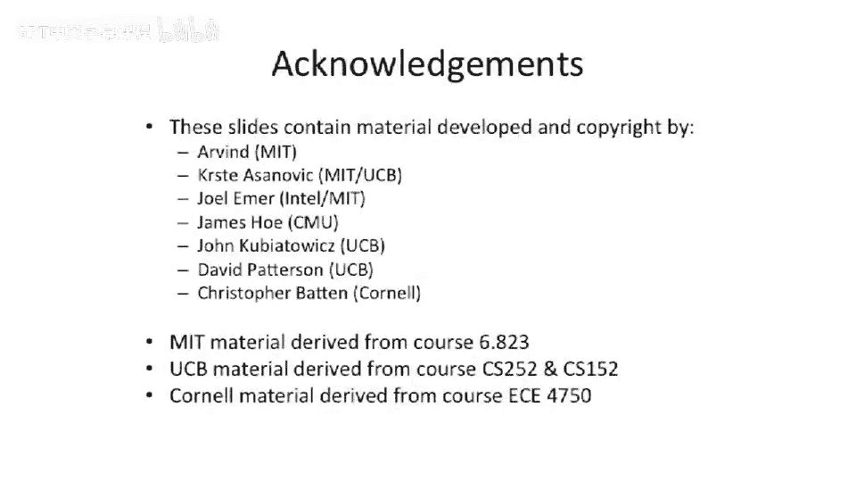

# 042：从传统VLIW到超标量处理器的演进 🚀


在本节课中，我们将继续探讨超长指令字处理器，并学习如何将一个传统的VLIW处理器，转变为能够实际获取大量指令级并行性（ILP）的处理器，这种并行性通常存在于乱序超标量处理器中。为了实现这一目标，我们需要为传统VLIW添加许多额外功能。我们将逐步展开，系统地列举乱序超标量处理器中可能存在的各种指令级并行性来源，并探讨如何在VLIW处理器中增加相应特性来达到类似效果。不过，需要提前说明的是，并非所有乱序超标量处理器的特性都能轻易地在VLIW处理器中实现，有些甚至至今都难以构建。

## 调度模型回顾 📝

在开始新内容之前，我们先回顾一下上节课的内容，并澄清关于调度模型中EQ（等于）模型和LEQ（小于等于）模型的一些概念。

需要明确的是，VLIW调度中的EQ模型和LEQ模型仅仅是**调度模型**。它们本身并非硬件实现，但会影响硬件需要完成的任务或提供的功能。

例如，在EQ模型中，如果你的VLIW处理器中有一条指令紧跟着另一条指令，并且后一条指令读取了某个寄存器的值，而这个值恰好在前一条指令的“阴影”（即延迟周期）内被计算，那么后一条指令将读取到该寄存器的**旧值**。

让我们通过一个简单的代码示例来说明：

```assembly
{ MUL R1, R3, R4 ; ... }  // 乘法指令，结果写入R1，假设延迟为4个周期
{ ADD R5, R1, R2 ; ... }  // 加法指令，读取R1
...
{ LD  R6, R1     ; ... }  // 加载指令，读取R1
```

在这个例子中，`MUL`指令将结果写入`R1`，但其延迟为4个周期。在EQ模型下，紧随其后的`ADD`指令读取`R1`时，将得到**乘法执行前**的旧值。只有等到4个周期后，例如`LD`指令执行时，才能读取到乘法计算的新结果。

这个例子想要说明的是，我们讨论的这些模型是编译器进行代码调度时需要遵循的**软件调度模型**，而非硬件问题。如果我们在LEQ模型下运行相同的代码，主要区别在于：那条读取`R1`的`ADD`指令将**不被允许**出现在乘法指令的阴影区（即其延迟周期内）。因为如果发生中断或指令被重排，导致`ADD`指令被移到`LD`指令之后（或移动超过3个周期），它就会读取到新值，从而改变程序的语义。


因此，在LEQ模型中，这条`ADD`指令必须被安排在`MUL`指令之前，或者用空操作填充延迟槽。核心要点是：这些模型是编译器调度器使用的软件模型，硬件需要实现与调度模型相匹配的机制，但它们本身并非硬件架构。

## 探索指令级并行性来源 🧩

回顾了调度模型后，现在让我们回到今天的主题，开始探索新的内容。

上一节我们回顾了VLIW的基本调度模型，本节中我们来看看乱序超标量处理器能够挖掘哪些类型的指令级并行性，以及我们如何在VLIW框架下尝试实现它们。

乱序执行处理器能够动态地发现并利用以下多种并行性：

1.  **指令间并行**：执行没有数据依赖关系的独立指令。
2.  **流水线并行**：通过多级流水线同时处理不同指令的不同阶段。
3.  **多发射并行**：每个时钟周期发射并执行多条指令。
4.  **推测执行**：在分支结果确定前，提前执行可能需要的指令。
5.  **寄存器重命名**：消除由寄存器重用引起的虚假数据依赖。

为了在VLIW处理器中获取类似的并行性，我们需要系统地为其增加功能。这通常意味着编译器需要承担更多分析、调度和优化的责任，因为VLIW处理器本身缺乏硬件的动态调度能力。

## 为VLIW添加超标量特性 ⚙️

以下是我们可以考虑为传统VLIW处理器增加的一些关键特性，以提升其指令级并行性：

*   **增强的编译器静态调度**：编译器需要进行更激进的分析，包括更精确的依赖关系分析和跨更大范围代码的指令调度。
*   **支持推测执行的硬件机制**：例如，增加检查点或恢复机制，以支持编译器安排的推测性加载或分支预测后的指令执行。
*   **更复杂的寄存器文件与重命名支持**：提供大量的物理寄存器，并由编译器在静态代码中模拟寄存器重命名，以消除写后写和读后写依赖。
*   **高级分支预测集成**：虽然VLIW依赖编译器进行分支预测和调度，但可以集成硬件分支预测器为编译器提供信息，或支持预测执行路径的调度。

需要再次强调的是，并非所有乱序执行的特性都能完美映射到VLIW的静态调度范式中。例如，完全动态的、基于运行时信息的依赖解析和指令调度，就是VLIW架构难以直接实现的。

## 总结 📚




本节课中，我们一起学习了从传统超长指令字处理器向更高并行性处理器演进的思想。我们首先回顾并澄清了EQ和LEQ调度模型，明确了它们是指导编译器工作的软件模型。接着，我们系统地探讨了乱序超标量处理器所能利用的指令级并行性来源。最后，我们分析了如何通过为VLIW处理器增加诸如更智能的编译器、推测执行支持、寄存器重命名等特性，来逼近超标量处理器的性能。理解这些概念有助于我们看清不同处理器架构设计哲学之间的权衡与联系。