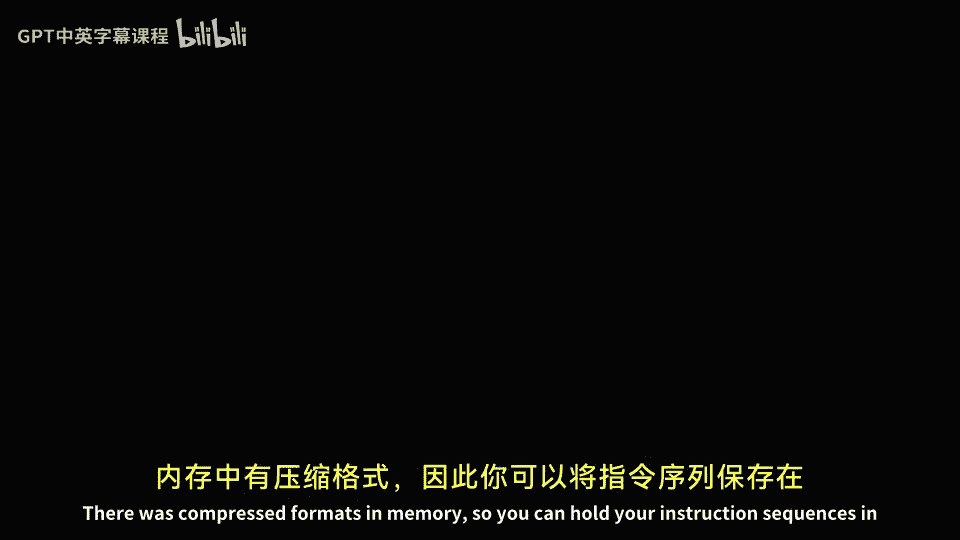
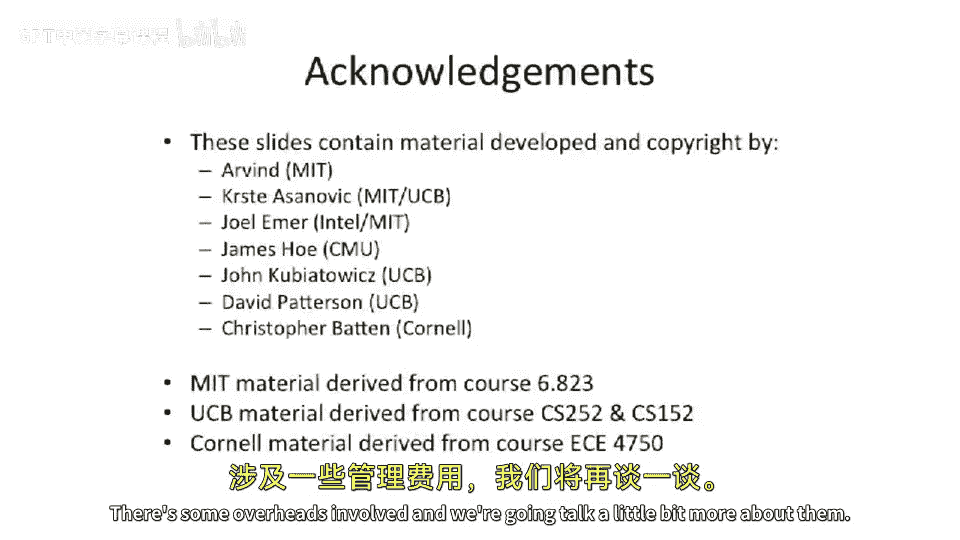

# 043：谓词执行技术回顾 🧠




在本节课中，我们将学习一种称为“谓词执行”的技术，它主要用于解决超长指令字处理器中因分支预测错误导致的性能瓶颈问题。我们将从基本概念开始，逐步深入到完全谓词执行，并分析其优缺点。

---

## 概述

上一节我们讨论了VLIW指令的编码方式及其面临的挑战，例如指令字中存在大量空操作。本节中，我们来看看如何通过“谓词执行”技术来提升VLIW处理器的性能，特别是处理难以预测的分支时。

## VLIW中的分支问题

在乱序超标量处理器中，硬件可以动态调度指令，围绕分支预测错误进行工作。然而，在VLIW处理器中，所有调度决策都由编译器在编译时静态完成。当遇到难以预测的数据依赖分支时，这会导致显著的性能下降，因为编译器无法准确预知分支方向。

## 谓词执行简介

谓词执行是一种将控制依赖（即分支）转换为数据依赖的技术。其核心思想是：通过添加条件，让指令仅在特定条件下执行，从而消除或减少对分支的依赖。

### 部分谓词执行：条件移动

我们首先引入两种指令作为部分谓词执行的例子：`move if zero` 和 `move if not zero`。它们的语义如下：

*   **`move if zero Rt, Rs, Rd`**：如果寄存器 `Rt` 的值等于0，则将寄存器 `Rs` 的值复制到 `Rd`；否则，保持 `Rd` 不变。
*   **`move if not zero Rt, Rs, Rd`**：如果寄存器 `Rt` 的值不等于0，则将寄存器 `Rs` 的值复制到 `Rd`；否则，保持 `Rd` 不变。

以下是这两种指令的伪代码描述：
```assembly
// move if zero
if (Rt == 0) {
    Rd = Rs;
}
// move if not zero
if (Rt != 0) {
    Rd = Rs;
}
```

### 谓词执行示例分析

考虑一个寻找最小值的C代码片段：`x = (a < b) ? a : b;`。

*   **传统MIPS汇编**（使用分支）：需要3-4条指令，且如果分支预测错误，会产生额外的惩罚周期。
*   **使用条件移动的MIPS汇编**：通过`set less than`、`move if zero`和`move if not zero`三条指令，**总是**在3个周期内完成，消除了分支预测错误的影响。

当分支难以预测且分支两侧的代码块（称为“代码块”）很短时，这种转换能带来显著的性能提升。

### 谓词执行的适用场景

以下是谓词执行技术适用性的一些考量：

*   **代码块大小**：谓词执行最适合**短小的代码块**。如果`if`或`else`分支中的指令很多，强制并行执行所有指令反而会增加总执行时间，不如承受分支预测错误的惩罚。
*   **分支平衡性**：如果分支两侧的代码长度严重不平衡（例如一边3条指令，另一边1000条），且分支预测准确率尚可，使用传统分支可能更高效。
*   **核心优势**：谓词执行将**控制流**转换为了**数据流**，在VLIW架构中，这允许编译器将原本串行的分支两侧代码填充到同一个长指令字的不同槽位中并行执行，从而缩短关键路径。

## 完全谓词执行

部分谓词执行需要显式使用`CMOV`类指令。而完全谓词执行则更进一步，它为**几乎所有指令**都增加了一个条件执行字段。

### 工作机制

1.  **谓词寄存器**：处理器增加一个独立的单比特谓词寄存器文件，用于存储真/假值。
2.  **条件化指令**：每条指令都关联一个谓词寄存器。仅当该谓词寄存器的值为真（或假，取决于约定）时，该指令才会执行并产生效果；否则，该指令相当于空操作。
3.  **谓词设置**：需要专门的指令来设置谓词寄存器。例如，一条比较指令可以同时设置两个谓词寄存器：`P1`（条件为真）和`P2`（条件为假，即`P1`的反）。

### 完全谓词执行示例

考虑一个包含`if-then-else`的基本块序列。通过完全谓词执行，编译器可以：
1.  使用一条比较指令设置谓词`P1`（条件成立）和`P2`（条件不成立）。
2.  将`then`块中的指令与`else`块中的指令**并行排列**在VLIW指令字中。
3.  `then`块指令以`(P1)`为条件，`else`块指令以`(P2)`为条件。
4.  这样，无论分支条件如何，硬件都会同时发射两侧的指令，但只有条件成立的那一侧会实际执行，从而在保持语义正确的同时实现了指令级并行。

研究表明，完全谓词执行平均可以消除约50%的分支。

### 实现挑战

尽管强大，完全谓词执行也带来了硬件复杂性：
*   需要额外的谓词寄存器文件。
*   需要谓词值的旁路网络。
*   增加了指令编码的复杂度。
*   因此，仅有少数指令集（如Intel Itanium IA-64）尝试实现了近似完全谓词执行的特性。

---

## 总结




本节课我们一起学习了谓词执行技术。我们从VLIW处理器的分支难题出发，首先介绍了通过**条件移动指令**实现的**部分谓词执行**，它能够有效消除短小、难以预测的分支。接着，我们探讨了更激进的**完全谓词执行**，它通过为所有指令添加条件执行前缀，允许编译器更大胆地调度指令，将分支两侧的代码并行化，从而挖掘更多指令级并行。最后，我们也指出了完全谓词执行在硬件实现上的额外开销。谓词执行是编译器与指令集架构协同设计以提升性能的一个经典范例。