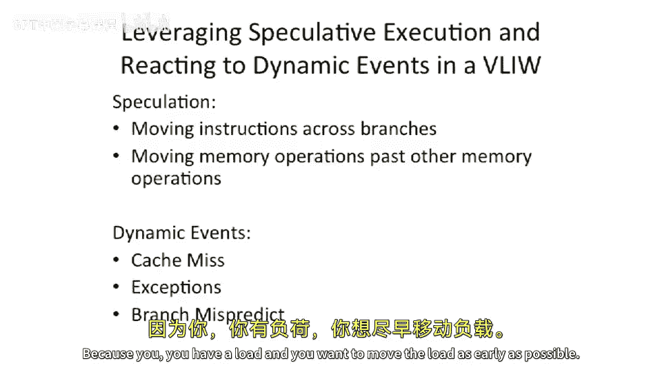
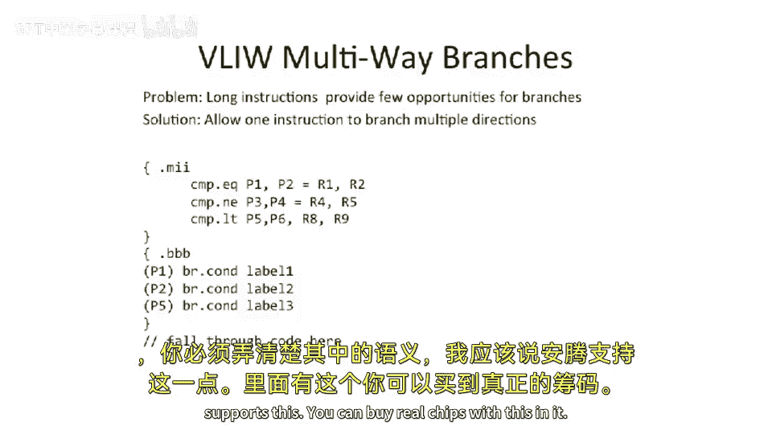

# 045：VLIW处理器中的推测执行技术




在本节课中，我们将学习如何在VLIW处理器中，通过引入推测执行技术来提升性能。我们将探讨两种主要的推测类型：控制推测（跨越分支移动指令）和数据推测（重新排序内存访问指令）。这些技术借鉴了乱序超标量处理器的思想，但需要在VLIW的静态编译环境中实现。

## 控制推测：跨越分支移动指令


上一节我们介绍了VLIW处理器的基本概念。本节中我们来看看如何通过控制推测来提升指令级并行度。

我们的核心挑战在于，分支指令会限制编译器所能进行的代码移动形式。例如，一个加法指令很容易移动到分支之前。但对于可能触发异常（如缺页错误）的指令（例如加载指令），移动它就可能带来问题。

如果我们将一个加载指令移动到分支之上，而该分支原本会绕过这个加载指令，那么程序在正确的执行顺序中本不应执行此加载。然而，由于指令被提前执行，如果它触发了异常，程序就会崩溃，即使程序逻辑本身没有错误。

我们的解决方案是引入特殊的指令，这些指令不会触发异常。具体来说，我们使用**推测性加载**指令（例如 `load.s`）。如果该指令访问内存时本应触发异常（如缺页错误），它不会立即中断进程，而是将目标寄存器标记为一个特殊状态（在安腾架构中称为“非数”或“毒药位”）。

随后，在原始加载指令的位置（即分支保护之后），我们插入一个**检查指令**（例如 `check.s`）。该指令会检查目标寄存器的值。如果寄存器处于“毒药位”状态，则跳转到修复代码；否则，程序正常继续。修复代码会重新执行该加载指令及其所有依赖的推测性指令，然后跳回主流程。

这种“毒药位”状态会在寄存器之间传播。这意味着，我们可以将依赖于推测性加载的多个指令也一并移动到分支之前。只要在最终使用该值之前进行检查，如果发现错误，修复代码可以重新执行整个推测指令序列。

以下是推测性加载和检查的示意流程：
```
// 原始代码（分支保护了加载）
if (condition) {
    // 分支跳转，不执行加载
} else {
    value = load[address]; // 可能异常的加载
    result = value + 10;
}

// 使用推测执行优化后的代码
value_spec = load.s[address]; // 推测性加载，不触发异常
result_spec = value_spec + 10; // 依赖指令也可上移
if (condition) {
    // 分支跳转
} else {
    check.s value_spec; // 检查，若为“毒药位”则跳转修复代码
    // 正常使用 result_spec
}
```

## 数据推测：重新排序内存访问

上一节我们介绍了如何安全地跨越分支移动指令。本节中我们来看看另一种推测：数据推测，它主要解决内存访问指令（加载和存储）的重排序问题。

在静态编译中，如果编译器无法证明两个内存访问地址不同，它就必须保守地假设它们存在依赖关系，从而限制指令调度。这严重影响了性能。乱序超标量处理器可以动态地推测加载和存储的地址不同，如果推测错误则回滚。我们希望在VLIW处理器中也能实现类似的效果。

我们的解决方案是增加硬件检查机制，以确保当编译器重排序加载和存储指令时，它们的访问地址确实不同。这类似于乱序处理器中的**内存歧义消除**逻辑，但需要在指令集架构层面进行修改。

具体实现需要新增两条指令：**高级加载**（`load.a`）和**加载检查**（`load.c`），同时修改存储指令的语义。

以下是数据推测的工作流程：
1.  编译器将一条加载指令移动到某个存储指令之前，推测它们的地址不同。
2.  将原来的加载指令改为 `load.a` 指令。该指令执行加载操作，同时将其访问的**地址**和**大小**记录到一个特殊的硬件表中（在安腾中称为**高级加载地址表**）。
3.  程序继续执行，包括那个存储指令。存储指令执行时，会将其访问地址与ALAT表中的条目进行比较。
4.  如果地址匹配（即推测错误），存储指令会将该地址从ALAT中移除。
5.  在原始加载指令的位置（即存储指令之后），编译器插入一条 `load.c` 检查指令。该指令检查ALAT中是否还存在对应的地址条目。
6.  如果地址仍在表中（说明没有冲突存储发生），推测成功，指令流继续。
7.  如果地址不在表中（说明发生了地址冲突），推测失败，`load.c` 指令会跳转到修复代码。修复代码会重新执行该加载指令及其所有依赖指令。

通过这种方式，VLIW处理器在静态编译的框架下，实现了类似动态乱序执行的数据推测能力。

## 其他性能增强技术：多路分支

除了推测执行，VLIW架构还可以通过其他方式提升性能，例如处理多路分支。

在VLIW中，一个指令束包含多个操作。如果程序中有密集的条件分支，每个短分支都可能浪费指令束中的多个槽位。为了解决这个问题，可以引入**多路分支**指令。

其核心思想是，在一个指令束中并行执行多个条件比较，将结果写入不同的谓词寄存器。然后，在下一个指令束中，可以包含多个基于这些谓词寄存器的分支指令，它们可以跳向不同的目标地址。

这要求指令集定义明确的分支优先级顺序。例如，当同一个指令束中的多个分支条件都满足时，可以规定第一个分支的优先级最高，其次为第二个，以此类推，从而确保执行结果的确定性。

## 总结

本节课中我们一起学习了VLIW处理器中提升性能的关键推测技术。
*   **控制推测** 通过引入不会触发异常的推测性加载指令（`load.s`）和后续的检查指令，允许编译器将加载及其依赖指令安全地移动到分支之前，以隐藏访存延迟。
*   **数据推测** 通过新增高级加载（`load.a`）、加载检查（`load.c`）指令以及一个硬件地址表（ALAT），使编译器能够推测性地重排序加载和存储指令，即使无法静态证明地址无关性。
*   **多路分支** 通过在一个指令束中支持多个条件分支，减少了因分支频繁造成的指令槽浪费，提高了代码密度和执行效率。




这些技术扩展了经典VLIW架构的能力，使其能够更有效地挖掘指令级并行性，接近乱序超标量处理器的性能水平。