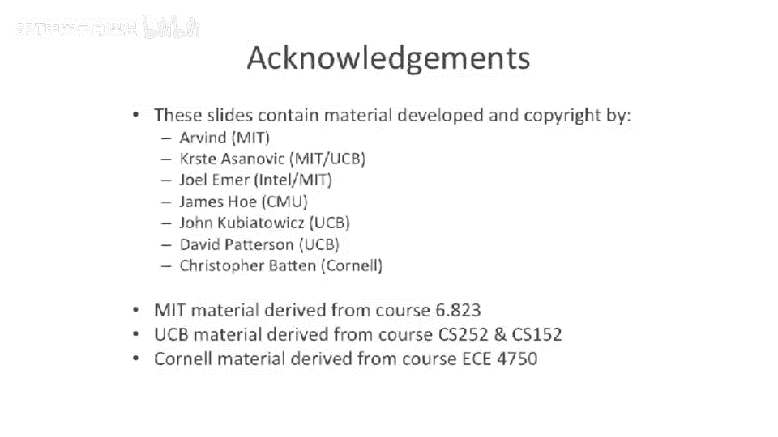

# 046：动态事件与集群式超长指令字

## 概述
在本节课中，我们将探讨指令级并行性面临的挑战，特别是编译器难以处理的**动态事件**。我们将了解这些事件为何难以解决，并介绍几种硬件和编译技术来应对它们，例如**通知式加载**和**集群式VLIW设计**。最后，我们将学习如何构建更宽的VLIW处理器。

---

## 动态事件的挑战
上一节我们讨论了指令级并行的基本概念。本节中，我们来看看一些更棘手的挑战，即**动态事件**。动态事件是指编译器无法预测或做出反应的事件，这使得静态调度的VLIW处理器处理起来尤为困难。

### 缓存未命中
第一个动态事件是**缓存未命中**。对于编译器而言，预测一个加载指令是否会缓存命中极其困难。超标量处理器可以动态地重新调度指令，绕过未命中的加载指令，执行不依赖于该加载结果的其他指令。然而，静态调度的VLIW处理器无法做到这一点。

以下是应对缓存未命中的两种技术方案：

*   **通知式加载**：这是一种学术提案。其核心思想是，当加载指令缓存未命中时，处理器可以**无效化**后续的某些指令，从而根据缓存命中与否改变代码执行序列。公式上可以表示为：`if (load_miss) { nullify(subsequent_instructions); }`。
*   **双路径代码生成**：由Elbrus处理器采用。编译器为同一段代码生成**两个不同的调度序列**：一个针对缓存命中的情况优化，另一个针对缓存未命中的情况优化。处理器根据实际加载结果动态选择执行路径。

### 分支预测错误
第二个动态事件是**分支预测错误**。虽然我们可以使用**谓词执行**来消除一些分支，但对于大型代码块，完全谓词化并不现实。

一种解决方案是在VLIW指令集中加入**分支延迟槽**，并在延迟槽中使用**谓词执行**。

以下是其工作原理：
1.  假设一个3路宽的VLIW处理器，指令集包含分支延迟槽。
2.  在延迟槽中放置的指令，使用与分支判断**相同的条件**进行谓词化。
3.  无论分支实际走向如何，延迟槽中的指令都会执行，但其效果（是否写回）取决于谓词条件。
4.  编译器可以从分支的两个目标路径中提取指令放入延迟槽，从而部分规避分支预测错误的惩罚。

这项技术曾在MIT的**M-machine**研究处理器中实现。

### 异常
第三个动态事件是**异常**。异常几乎无法预测，对编译器和超标量处理器都是难题。但好在异常发生频率不高，对整体性能影响相对较小，通常不是优化的首要焦点。

---

## 构建更宽的VLIW处理器
当我们试图构建更宽（例如8路、16路）的VLIW处理器时，会面临新的挑战：庞大的寄存器文件和复杂的前馈网络会带来极高的成本和延迟。

解决方案是采用**集群式VLIW**设计。这与集群式超标量处理器的思想类似，但在VLIW中，这是在**指令集架构（ISA）层面**进行的划分。

以下是集群式VLIW的关键特点：
*   **划分集群**：将整个处理器划分为多个**集群**，每个集群拥有自己的**本地寄存器文件**和功能单元（如ALU）。
*   **集群内通信**：集群内部的功能单元之间，**前馈旁路**速度很快、带宽很高。
*   **集群间通信**：不同集群之间的数据传递**带宽较低、延迟较高**。通常需要显式的**移动指令**在集群间传递数据，例如：`MOV clusterA.reg1, clusterB.reg2`。
*   **统一执行**：所有集群仍然同时执行**同一条**超长指令字中的不同部分，它们是一个统一的处理器，而非多个独立核心。

这种设计被应用于德州仪器的**C6000系列DSP**、惠普与意法半导体合作的**LX处理器**等产品中，在需要高指令级并行的嵌入式领域（如数字信号处理、打印机）取得了成功。

---

## 总结
本节课中我们一起学习了指令级并行中**动态事件**带来的挑战，包括缓存未命中、分支预测错误和异常。我们探讨了**通知式加载**、**双路径代码生成**、**带谓词的分支延迟槽**等应对技术。最后，我们了解了如何通过**集群式VLIW**设计来构建更宽的处理器，以在保持性能的同时管理硬件复杂度。这些方案体现了在编译器静态调度与硬件动态灵活性之间寻求平衡的设计智慧。