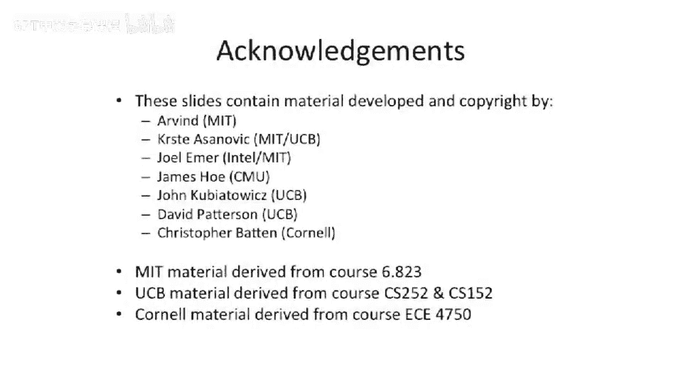

# 047：案例研究 - IA-64 安腾处理器 🖥️

在本节课中，我们将要学习一个现代超长指令字架构的案例研究：英特尔安腾处理器。我们将探讨其设计理念、关键特性、实现挑战以及它最终未能成为主流的原因。

---

## 概述

安腾处理器，也被称为 IA-64 或 EPIC 架构，是英特尔与惠普合作开发的一款现代 VLIW 处理器。它旨在成为统一的 64 位解决方案，以取代 x86 架构，并整合当时的工作站市场。然而，由于多种原因，它最终未能达到预期的市场接受度。

---

## 背景与目标

上一节我们介绍了 VLIW 架构的基本概念，本节中我们来看看一个具体的、也是最具争议的现代 VLIW 实现。

安腾处理器是英特尔选择的 64 位指令集架构，意图逐步淘汰 x86。然而，历史表明，市场最终选择了 AMD 提出的 **AMD64**（即对现有 x86 架构的 64 位扩展），而非一个全新的架构。

---

## 实现历程与挑战

安腾的研发和上市过程充满了挑战。

*   **首款实现（Merced）**：原计划 1997 年上市，但首次客户发货延迟至 2001 年。其时钟频率低，性能未达预期，甚至被同期的高端 x86 处理器超越。
*   **后续改进（McKinley）**：第二代实现性能有所改善，但构建此类处理器依然困难。
*   **巅峰产品（Poulson）**：2011年推出的 Poulson 处理器是一个庞然大物，采用 32 纳米工艺，拥有 8 个核心，超过 30 亿个晶体管，是当时最大的商用处理器。它主要应用于高端服务器市场，而非最初设想的工作站领域。

---

## 核心架构特性

安腾架构包含多项旨在提升指令级并行性的设计。

### 指令束与模板位

安腾使用 **128 位指令束**，每个束内可容纳三个操作。束内包含“模板位”，用于描述束的内容以及束与束之间的并行执行关系。这使得指令边界可以灵活调整，以便混合不同格式的指令（例如，将包含立即数的指令与不含立即数的指令打包）。

### 庞大的寄存器文件

由于是 VLIW 架构且依赖编译器进行静态调度（如上一讲所述），这增加了对通用寄存器的需求。硬件不进行寄存器重命名，因此需要大量架构寄存器供编译器使用。

以下是安腾的寄存器配置：
*   **128 个通用寄存器**
*   **128 个浮点寄存器**
*   **谓词寄存器**：支持近似完全谓词执行，通过一个需要旁路的谓词寄存器文件来控制后续指令是否执行。

### 旋转寄存器文件

这是一个解决软件流水线中寄存器压力问题的创新特性。

在上一讲的例子中，为了获得高性能，我们需要展开循环并进行软件流水线调度，但这会增加对寄存器数量的需求，并产生不同于循环体的序幕和收尾代码。

旋转寄存器文件的解决方案是：将一部分寄存器空间设置为可“旋转”的。访问寄存器（如 `R1`）时，会加上一个名为“旋转寄存器基址”的架构可见寄存器的值（使用模运算），从而指向物理寄存器文件中的不同位置。

**关键机制**：每开始一次新的循环迭代，就改变 RB 的值，使其指向一组不同的物理寄存器。这样，编译器可以通过编码寄存器编号之间的偏移量，来指定跨循环迭代的数据依赖关系。

例如，一次循环中的存储指令可能需要使用三个迭代周期前加载的数据。编译器可以这样编码：加载指令写入 `F1`，而存储指令读取 `F4`（假设偏移为3）。当循环迭代、RB 改变后，`F4` 实际指向的物理寄存器正是之前 `F1` 写入的值。

通过这种方式，**单条指令**（配合循环分支和 RB 更新）就能实现包含序幕、收尾和主循环体的完整软件流水线，无需展开生成大量代码。

---

## 失败原因分析

尽管技术上有诸多创新，但安腾可以被认为是一款失败的产品。以下是其失败的主要原因：

1.  **限制了微架构师的发挥**：IA-64 加入了大量架构级特性（如完全谓词、旋转寄存器文件、复杂的指令束）来获取静态并行性。这增加了处理器的复杂性和状态，将许多决策权交给了编译器，束缚了硬件微架构优化的手脚。
2.  **首款产品性能不佳**：Merced 处理器时钟频率低，性能未达预期，严重损害了其市场声誉。
3.  **未能解决所有动态调度问题**：纯编译器方法无法处理所有动态情况，例如无法根据缓存命中/失效来动态调整指令调度。
4.  **编译器复杂度高**：需要依赖性能剖析来优化，并非所有开发者都愿意或能够进行。
5.  **静态并行性有限**：并非所有程序中都存在大量可被编译器静态发掘的指令级并行性。
6.  **动态乱序执行超标量处理器的成功**：当业界争论复杂乱序处理器是否太难建造时，市场投入最终证明了它们可以被成功建造并具备高性能。这成为了当今桌面处理器的主流。
7.  **AMD64 的崛起**：AMD 推出的 **x86-64**（即对现有 x86 的 64 位扩展）满足了市场对 64 位计算且保持向后兼容的强烈需求，最终被英特尔采纳并成为行业标准。
8.  **代码膨胀**：VLIW 指令通常会导致代码体积显著增大。

一个颇具讽刺意味的故事是：曾设计 DEC Alpha 处理器的团队在加入英特尔后，评估安腾架构时认为过于复杂。他们甚至考虑过为安腾构建一个乱序执行版本，这实际上会试图“撤销”编译器所做的所有静态调度工作，代之以硬件动态调度。这凸显了架构设计初衷（顺序执行）与后期性能优化思路（乱序执行）之间的根本矛盾。

---

## 总结

本节课中我们一起学习了英特尔安腾处理器的案例。我们了解了其作为现代 VLIW 架构的设计目标、核心特性（如指令束、大寄存器文件、旋转寄存器），并深入分析了导致其未能赢得市场的一系列关键因素，包括实现挑战、性能问题、编译器复杂性以及来自兼容性解决方案（AMD64）和动态调度硬件的竞争。安腾的故事生动地展示了处理器架构设计中技术理想、工程实现与市场现实之间的复杂博弈。

---

