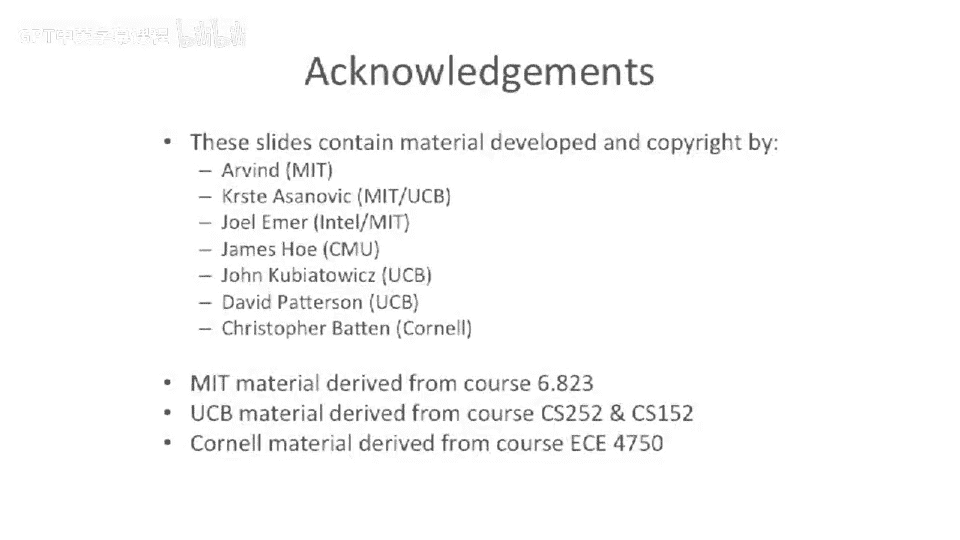

# 051：动态分支预测


在本节课中，我们将要学习动态分支预测技术。我们将探讨如何通过硬件机制，在程序执行过程中动态地预测分支指令的走向，以提高处理器的性能。我们将从简单的1位预测器开始，逐步深入到更复杂的模式历史表和锦标赛预测器。

## 概述

分支预测是处理器设计中的关键技术，旨在减少因分支指令带来的流水线停顿。静态预测方法简单但准确率有限。本节我们将重点介绍动态分支预测，它通过分析程序运行时的历史行为来做出更准确的预测。

上一节我们介绍了静态分支预测的基本概念，本节中我们来看看动态预测方法。

## 动态预测硬件基础

动态分支预测通过在流水线前端添加额外的硬件单元来实现。其核心是在计算下一条指令地址（PC+4）的路径上插入一个多路选择器。

该多路选择器的选择信号由预测硬件产生，用于决定下一条指令是顺序地址（PC+4）还是分支目标地址。然而，分支目标地址在流水线较后的阶段才能计算出来，无法在一个周期内反馈，因此目标地址的获取是动态预测需要解决的一个关键问题。

首先，我们需要解决如何控制这个决定下一条PC的多路选择器。

## 1位预测器：利用时间局部性

一种动态预测方案是尝试利用程序行为的内在规律。我们首先尝试利用的是分支的**时间相关性**，即同一个分支指令的历史结果对其未来结果有预测作用。

例如，在循环中，一个通常被采取的分支，其未来的结果很可能也是被采取。我们可以用一个1位预测器来实现这个想法，它本质上是一个有限状态机。

该状态机包含两个状态：**预测不采取**和**预测采取**。初始状态为“预测不采取”。如果某个分支的实际结果是“不采取”，则保持在该状态；如果结果是“采取”，则切换到“预测采取”状态。反之亦然。这个预测器只需要在控制逻辑中增加1个额外的比特位。

以下是其工作原理的简化描述：
```
状态： 预测不采取 <-> 预测采取
转移： 实际结果“不采取”则保持或切回“预测不采取”
       实际结果“采取”则保持或切到“预测采取”
```

让我们分析一下这个预测器的性能。假设有一个循环迭代4次。

以下是其预测表现的分析：
*   **第一次迭代**：预测器初始为“预测不采取”，但循环需要“采取”，因此**预测错误**。之后状态变为“预测采取”。
*   **第二、三次迭代**：预测为“采取”，实际也是“采取”，**预测正确**。
*   **第四次迭代（循环退出）**：预测为“采取”，但实际是“不采取”，因此**预测错误**。

在这个例子中，预测准确率是50%，表现并不理想。如果循环体执行很多次（例如100次），中间部分预测正确，但进入和退出循环时都会预测错误。

## 2位饱和计数器预测器

为了提升预测准确率，我们可以使用更多比特位。接下来我们介绍2位饱和计数器预测器。

我们在处理器架构中增加一个2位的计数器。所谓“饱和”，是指该计数器的值有上下限（例如00到11），达到极值后不再增加或减少。

这个计数器可以处于四种状态：**强不采取**、**弱不采取**、**弱采取**、**强采取**。预测逻辑通常认为“强采取”和“弱采取”状态时预测“采取”，反之预测“不采取”。每次分支执行后，根据实际结果更新计数器：如果实际“采取”则增加计数值（向“强采取”方向移动），如果实际“不采取”则减少计数值（向“强不采取”方向移动）。

```
状态转移示例（一种常见设计）：
强不采取 (00) -> 实际“采取” -> 弱不采取 (01)
弱不采取 (01) -> 实际“采取” -> 弱采取 (10)
弱采取 (10) -> 实际“采取” -> 强采取 (11)
强采取 (11) -> 实际“不采取” -> 弱采取 (10)
（反向过程类似）
```

这种设计引入了**滞后效应**，即需要连续两次不同的结果才能完全改变预测方向。这有助于避免因单次异常分支结果（如循环末尾的一次“不采取”）而破坏对规律性模式的预测。

对于长循环，2位预测器在循环体内可以达到很高的预测准确率，并且对循环结束时的“不采取”不敏感，性能优于1位预测器。

## 分支预测缓冲表（BHT）

单一的2位预测器只能跟踪一个分支的历史。为了同时预测程序中众多的分支指令，我们引入**分支预测缓冲表**。

我们利用程序计数器（PC）的一部分地址位作为索引，访问一个预测器表格。表格的每个条目可以存储一个2位饱和计数器。这样，不同的分支指令（通过PC索引到不同或相同的条目）可以拥有独立的预测历史。

```
预测流程：
下一条指令PC -> 取部分位（索引） -> 查BHT表 -> 获得2位计数器状态 -> 做出预测（采取/不采取）
执行后更新：根据实际结果更新该PC索引对应的2位计数器。
```

这类似于缓存的组织方式。我们可以设计成直接映射，也可以设计成组相联映射，以减少不同分支地址冲突带来的“颠簸”。一个拥有4096个条目的2位BHT，其存储开销约为8KB（4096 * 2位）。这样的预测器可以达到80%-90%的预测准确率。

## 基于模式历史表（PHT）的预测器

以上方法主要利用**时间相关性**。接下来我们探讨利用**空间相关性**的预测器，即利用附近其他分支指令的结果来预测当前分支。

考虑以下代码模式：
```c
if (x < 7) { ... }
if (x < 5) { ... }
```
这两个条件分支在逻辑上是相关的。如果第一个条件（x<7）成立，那么第二个条件（x<5）更可能成立。这种不同分支之间的关联就是空间相关性。

耶尔·帕特等人提出了利用**分支历史寄存器**（BHR）和**模式历史表**（PHT）的预测器。BHR是一个移位寄存器，记录最近执行的多个分支的全局结果（例如，1表示采取，0表示不采取）。每次处理一个分支指令，其实际结果就被移入BHR。

```
BHR更新示例：
BHR初始: 0000
分支1结果“采取”(1): BHR变为 0001
分支2结果“不采取”(0): BHR变为 0010
分支3结果“采取”(1): BHR变为 0101
```

PHT是一个以BHR当前值为索引的表格。PHT的每个条目可以是一个简单的预测位（如1位），也可以是一个状态机（如2位饱和计数器）。当遇到一个分支时，我们用当前的BHR值索引PHT，得到对该分支的预测。

这种方法的优势在于能捕捉跨分支的复杂模式。例如，对于一个固定迭代4次的循环（模式：采取，采取，采取，不采取），在循环体内部，BHR会逐步形成“111”的模式。当PHT学习到“111”模式后，下一次遇到此模式时，它就能准确预测出接下来的分支将是“不采取”（即循环退出），从而完美预测整个循环。

## 两级自适应预测器与锦标赛预测器

为了融合时间与空间相关性，我们可以构建**两级自适应预测器**。第一级可能由PC索引选择不同的BHR（局部历史），第二级则由BHR（可能结合PC哈希）索引PHT。这允许预测器针对不同的分支指令灵活选择是利用其自身历史（局部历史）还是全局分支历史。

为了追求超过97%的极高准确率，现代高性能处理器采用了**锦标赛预测器**（或称混合预测器）。其核心思想是：同时维护多个不同的预测器（例如，一个基于全局历史的预测器，一个基于局部历史的预测器），并增加一个**元预测器**（或选择器）。

元预测器本身也是一个预测器，它学习在特定的分支指令处，哪一个子预测器的历史准确率更高。当该分支再次出现时，元预测器决定使用哪个子预测器的结果作为最终预测。

```
工作流程：
遇到分支 -> 所有子预测器（全局/局部）均产生预测 -> 元预测器根据该分支历史选择其中一个预测 -> 输出最终预测
执行后更新：1. 用实际结果更新所有子预测器。2. 更新元预测器：哪个子预测器这次对了，就强化选择它的倾向。
```

通过这种“预测器的预测器”机制，系统可以动态地为每个分支选择最合适的预测策略，从而将预测准确率提升至98%甚至99%以上，这对于具有超长流水线的现代处理器至关重要。

## 预测器的训练与更新时机

训练这些复杂的预测器需要注意时机。通常，预测动作发生在流水线前端的取指阶段。但预测器的更新（即根据分支实际结果修改BHR、PHT、计数器等状态）往往被推迟到流水线后端的提交或退休阶段。

这样做的优点是确保用于训练的结果是**已提交的、确定正确的**分支结果，避免了因误预测路径上的指令或流水线冲刷而污染预测器状态。缺点是训练反馈有延迟，新分支需等待一段时间后才能从最近的历史中受益，但这在可接受的范围内。

## 总结




本节课中我们一起学习了动态分支预测技术的演进。我们从简单的1位和2位饱和计数器预测器开始，理解了利用时间局部性的原理。接着，我们探讨了通过分支预测缓冲表（BHT）为不同分支维护独立预测状态的方法。然后，我们引入了基于分支历史寄存器（BHR）和模式历史表（PHT）的预测器，它能捕捉分支间的空间相关性。最后，我们介绍了融合多种策略的两级自适应预测器和更高级的锦标赛预测器，它们通过元预测机制动态选择最佳预测策略，从而实现了接近99%的高预测准确率，以满足现代深度流水线处理器的性能需求。