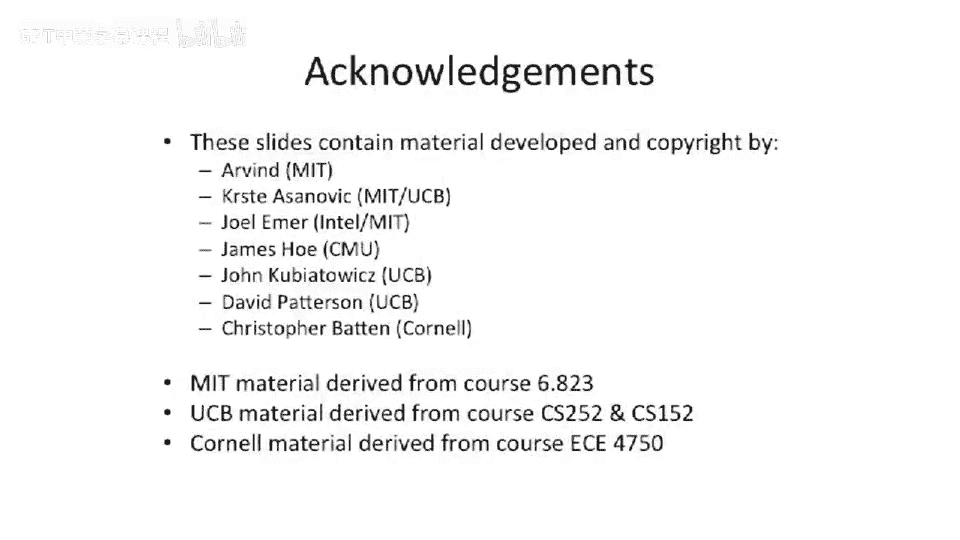

# 053：基础缓存优化 🧠

在本节课中，我们将学习缓存的基本概念及其优化方法。缓存是提升计算机性能的关键组件，通过减少处理器访问主内存的延迟来加速程序执行。我们将从回顾缓存的基本原理开始，然后深入探讨一系列优化技术，包括如何减少命中时间、降低缺失率，以及如何通过更高级的缓存组织方式来提升整体性能。

---

## 回顾：缓存基础与三C缺失

上一节我们介绍了缓存的基本作用。现在，我们来回顾一下缓存性能分析中的核心概念：三C缺失。

平均内存访问时间可以用以下公式表示：
**平均访问时间 = 命中时间 + 缺失率 × 缺失惩罚**

缺失主要分为三类：
*   **强制性缺失**：首次访问某块数据时必然发生的缺失。除非采用预取等高级技术，否则无法避免。
*   **容量缺失**：当工作数据集大小超过缓存容量时发生的缺失。数据会因为缓存空间不足而被持续替换出去。
*   **冲突缺失**：在组相联或直接映射缓存中，即使缓存总容量足够，但多个数据块映射到同一个缓存组（set）而引发的缺失。这本质上是“鸽巢原理”的体现。

---

## 基础缓存优化技术

了解了缓存缺失的类型后，本节我们来看看几种基础的缓存优化方法，它们主要围绕如何降低命中时间和缺失率展开。

### 降低命中时间：使用更小、更简单的缓存

降低命中时间最直接的方法是使用更小或更简单的缓存。更小的缓存具有更短的访问延迟。

**示例**：在奔腾4处理器中，为了达到极高的时钟频率，其一级缓存设计得非常小，以确保能在一个时钟周期内完成访问。

### 降低缺失率：调整块大小

增大缓存块（行）的大小可以利用空间局部性，一次性载入更多相邻数据，从而可能降低缺失率。

**优点**：
*   对于相同总量的数据，更大的块意味着更少的标签（tag）开销。
*   对于远离处理器的缓存层级（如L2、L3）和主内存（如DDR），更大的块能更好地利用突发传输和宽总线带宽。

**缺点**：
*   如果程序空间局部性差，会浪费带宽和缓存空间。
*   对于固定大小的缓存，块增大会导致总块数减少，可能增加冲突缺失。

以下图表展示了块大小与缺失率之间的权衡关系，通常存在一个最优值：

### 降低缺失率：增大缓存容量

增大缓存容量是降低缺失率最有效的方法之一。更大的缓存可以容纳更多的工作数据集。

**经验法则**：缓存容量翻倍，缺失率大约降至原来的 $\sqrt{1/2}$（约0.7倍）。
**代价**：需要更多的芯片面积，并且可能增加缓存访问时间。

### 降低缺失率：提高相联度

提高缓存相联度（如从直接映射变为2路组相联）可以有效减少冲突缺失。

**经验法则**：一个容量为 N 的直接映射缓存，其缺失率大约与一个容量为 N/2 的2路组相联缓存相当。
**代价**：高相联度缓存需要并行检查更多标签，设计更复杂，可能增加命中时间和功耗。

---

## 高级缓存优化概述

在回顾了基础优化后，本节我们将预览接下来要讨论的更高级的缓存优化与组织技术。这些技术旨在更精细地提升缓存子系统的性能和效率。

以下是本讲及下一讲将涵盖的高级主题简介：

*   **缓存流水线化**：探讨在实际硬件中如何组织缓存的读写步骤（如先检查标签再写入数据），以优化时序和性能。
*   **写缓冲**：在缓存层级之间加入一个缓冲区，用于临时存放被替换出的脏数据块，从而允许处理器继续执行，无需等待数据写回下一级存储器。
*   **多级缓存**：分析为何采用L1、L2、L3等多级缓存结构能有效平衡访问速度、容量和成本，从而提升整体性能。
*   **受害者缓存**：在主要缓存旁放置一个全相联或高相联的小缓存，用于存放刚从主缓存中被替换出的数据块。这相当于以一种低成本的方式增加了缓存的相联度。
*   **预取**：介绍硬件预取和软件预取技术，通过预测程序未来的数据访问模式，提前将数据取入缓存。
*   **增加缓存带宽**：讨论如何通过**多端口**或**分体**等技术，使缓存每个周期能支持多次访问，以满足多发射处理器的需求。
*   **编译器优化**：介绍编译器如何通过代码变换（如循环分块、数据合并等）来改善程序的空间和时间局部性，从而提升缓存命中率。
*   **非阻塞缓存**（将在下一讲详述）：允许缓存处理一次缺失时，继续服务后续的缓存访问请求。这对于开发内存级并行至关重要，并且同样适用于顺序执行处理器。

---

## 总结

本节课我们一起学习了缓存的核心性能指标与基础优化方法。我们从回顾平均访问时间公式和三C缺失模型开始，明确了优化方向。接着，我们探讨了通过**减小缓存尺寸**来降低命中时间，以及通过**调整块大小**、**增大缓存容量**和**提高相联度**来降低缺失率的基本策略，并分析了各自的优缺点。最后，我们概述了即将深入的一系列高级缓存优化技术，这些技术将从组织结构、带宽、并行度等更多维度进一步提升缓存系统的效率。理解这些基础是掌握后续复杂缓存设计的关键。