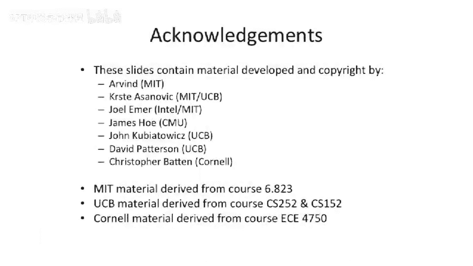

# 055：写缓冲优化技术

在本节课中，我们将学习缓存优化技术中的第二项：写缓冲。我们将探讨如何利用写缓冲来处理缓存中的读缺失和写操作，从而降低缺失惩罚并提升系统带宽。

上一节我们介绍了第一种优化技术。本节中，我们来看看第二种优化技术：如何处理缓存中的读缺失。

## 处理读缺失与脏数据

当CPU需要从数据缓存中读取数据时，可能会发生读缺失。如果缓存中对应位置的数据是“脏”的，意味着它已被修改且尚未写回下一级存储，我们就不能简单地丢弃它。在简单的实现中，处理器必须等待这个脏数据块被写回主存后，才能获取新数据并填充到缓存中，这会造成显著的延迟。

为了解决这个问题，我们可以在L1缓存和下一级缓存之间引入一个**写缓冲**。

## 写缓冲的工作原理

写缓冲是一个小型缓冲区，用于临时存放需要从L1缓存写出的数据块。其工作流程如下：

以下是写缓冲处理读缺失的基本步骤：
1.  CPU发生读缺失，需要从L2缓存或主存获取新数据。
2.  同时，需要被替换的脏数据块被立即移入写缓冲，而不是直接写回下一级存储。
3.  读请求被发送到下一级存储。
4.  当新数据返回时，可以直接存入L1缓存中已腾出的位置。
5.  写缓冲中的数据在后台被逐步写回下一级存储。

这种设计的关键优势在于，**读操作无需等待脏数据完全写回**，从而显著降低了读缺失的惩罚。

## 写缓冲带来的挑战与权衡

然而，引入写缓冲也带来了一些复杂性。主要问题在于，当写缓冲已满时，如果又产生了新的脏数据需要替换，处理器只能暂停，直到写缓冲有空闲位置。

以下是写缓冲可能面临的两种场景：
1.  **单次替换**：第一个脏数据块进入写缓冲，读操作可以继续，性能得到提升。
2.  **连续替换**：如果短时间内连续产生多个需要替换的脏数据块，写缓冲被填满，后续操作必须等待，处理器会停顿。

因此，写缓冲的设计是一种权衡。它假设短时间内连续发生多次替换的概率较低，从而在大多数情况下能有效提升性能。

## 写穿透缓存与合并写缓冲

写缓冲的另一个重要应用是配合**写穿透缓存**。在写穿透缓存中，每一次写操作不仅要更新L1缓存，还必须立即写穿到下一级缓存。如果对L2缓存的写入带宽有限，频繁的写操作会成为瓶颈。

解决方案是使用一种特殊的**合并写缓冲**。这种缓冲区可以合并对同一缓存行的多次写操作。

以下是合并写缓冲的工作方式：
1.  第一个写操作将其目标缓存行数据载入写缓冲。
2.  后续对同一缓存行内不同地址的写操作发生时，不会触发新的写穿请求。
3.  相反，新数据会被合并到写缓冲中已有的对应缓存行条目里。
4.  最终，合并后的整个缓存行被一次性写回L2缓存。

这在处理顺序写入大量连续地址的程序时特别有效，例如数组运算，能大幅减少对L2缓存的写入带宽需求。

## 写缓冲对性能指标的影响

最后，我们来总结写缓冲如何影响关键的缓存性能指标。

以下是写缓冲对各指标的影响分析：
*   **缺失率**：**不变**。缓存大小和关联度未改变，因此缺失率基本不受影响。
*   **缺失惩罚**：**降低**。这是引入写缓冲的主要目的，它允许读缺失操作与脏数据写回操作重叠执行。
*   **命中时间**：**不变**。L1缓存的正常读写命中流程没有变化。
*   **带宽**：**可能提升**。对于写穿透缓存，合并写缓冲能有效减少对下一级存储的写入次数，从而提升有效带宽。

本节课中，我们一起学习了写缓冲这项重要的缓存优化技术。我们了解了它如何通过暂存待写回的脏数据来降低读缺失的惩罚，以及如何通过合并写操作来提升写穿透缓存的带宽效率。理解这些机制有助于我们设计更高效的内存层次结构。