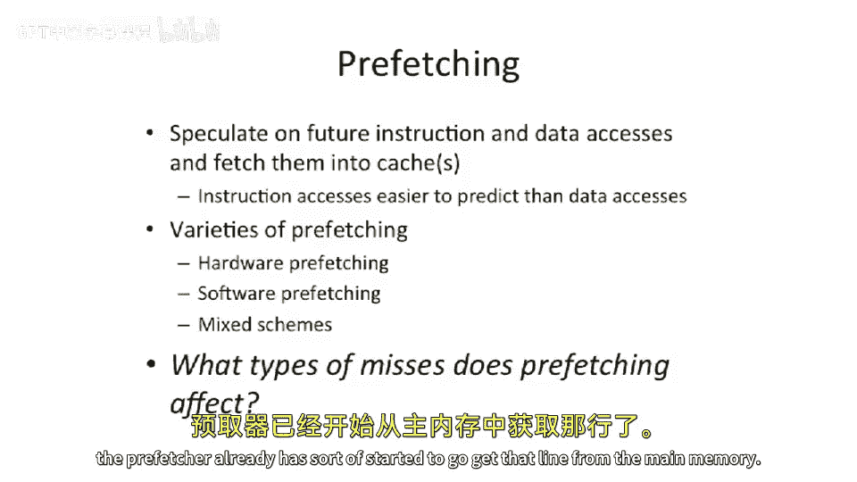
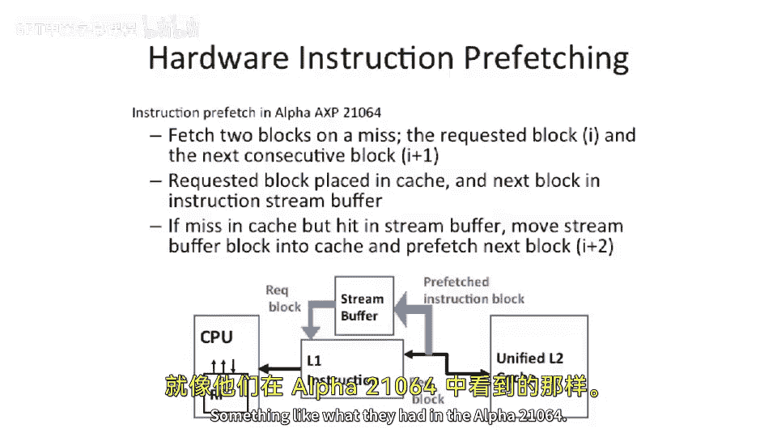
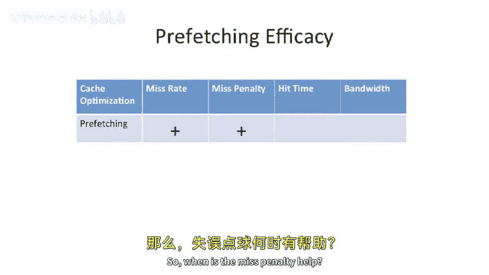
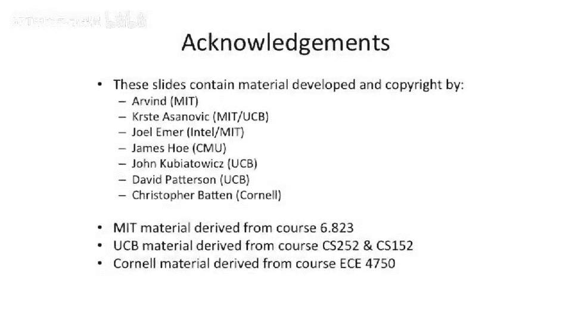

# 058：预取技术 🚀

在本节课中，我们将要学习**预取技术**。预取是一种通过预测未来将要使用的指令或数据，并提前将其从内存或外层缓存加载到更近的缓存层级，以提升系统性能的技术。我们将探讨其工作原理、不同类型、优缺点以及对缓存性能指标的影响。

## 预取的基本概念

上一节我们介绍了缓存的基本原理，本节中我们来看看预取技术。预取的核心思想是**推测性地获取数据**。处理器推测在不久的将来会访问某个缓存行，尽管当前尚未发起该访问请求。基于某种合理的预测，系统会提前从内存或外层缓存获取该数据，并将其放入更近的缓存层级。

预取的基本公式可以表示为：
`预取操作 = 推测(未来访问地址) -> 提前加载(数据) -> 存入低级缓存`

## 预取的种类

以下是三种主要的预取实现方式：

*   **硬件预取**：完全基于硬件的解决方案。硬件尝试检测并决定哪些数据值得提前获取。
*   **软件预取**：由编译器或程序员决定哪些数据值得提前获取。
*   **混合方案**：软件向硬件提供提示，告知硬件何时进行预取可能是有益的。

## 预取对缓存缺失的影响

一个重要的问题是：预取会影响哪些类型的缓存缺失？

预取在带来好处的同时，也可能有负面影响。因为它可能将我们尚未确定需要的数据提前载入缓存，从而**污染缓存**。让我们通过“3C”模型来分析：

*   **容量缺失**：预取会以负面方式影响容量。你有效地污染了缓存，因为预取的数据占用了空间，可能导致缓存的有效容量变小。
*   **冲突缺失**：预取也可能增加冲突缺失。如果你有一个糟糕的预取器，它获取的数据从未被访问或在之后短时间内未被访问，那么你不仅污染了容量，还可能制造更多冲突。新数据被载入某一行，可能导致其他有用数据被驱逐，这甚至会干扰最近最少使用（LRU）等替换策略。

那么，我们为什么还要使用预取？它主要在**强制性缺失**方面提供巨大帮助。对于首次访问的“冷数据”，如果预取系统能抢先将其载入缓存，就可以完全消除或减少强制性缺失的延迟。

如何减少这种缺失代价？假设你对某一行发生缓存缺失，而预取器已经启动了从主内存获取该行的操作。缺失状态处理寄存器（MSHR）可以检测到该行的请求已在处理中，从而不会发送后续请求，只需等待数据返回。这可以降低强制性缺失的延迟。或者，如果预取器非常精准，它可能在你访问数据之前就已将其载入缓存，使得访问时数据已在其中，仿佛预取器能未卜先知。

然而，与所有缓存技术一样，你必须确保预取的数据有很高的使用概率，否则你只是在污染缓存。

## 指令预取与数据预取

需要指出的是，**指令缓存通常比数据缓存更容易预测**。原因在于指令行为通常非常规整：你执行一条指令，接着执行下一条，依此类推。虽然存在分支，但在执行直线代码（尤其是在循环中）时，预取器可以非常有效。

另一方面，数据访问通常更具随机性，但并非总是如此。例如，在顺序读取整个数组或进行内存复制时，数据预取同样可以非常有效。

## 预取面临的挑战

我们已经触及了预取的一些问题。为了让预取有效，它必须是**有用的**，即应该在缓存中产生命中。如果预取器带来的数据从未被执行（指令侧）或从未被加载/存储访问（数据侧），那么它就是无用的。

事情在这里变得更复杂，因为你必须开始考虑数据的**及时性**。及时性意味着，如果你将数据预取到缓存中，但时间太早，等到你去读取时，它可能已经被从缓存中驱逐了。预取过早会浪费带宽和能量。同样，预取也可能太晚，例如在加载请求发生后才决定预取，这同样没有帮助。

此外，预取可能导致显著的**缓存和带宽污染**。你既可能污染缓存容量，也可能浪费大量带宽。在多芯片或多核系统中，片外内存带宽是重要且有限的资源，开启预取可能只是在浪费带宽。

预取是一种**推测性执行**。你试图拉取数据，但这是推测性的，你并不100%确定会使用那些数据。任何拉入但未使用的数据都意味着带宽的浪费。

## 预取策略与示例

通常，放置预取器的一个好位置是在**L2缓存和L1缓存之间**，尤其是在指令侧。L1到L2之间的带宽相对廉价，因为它是片内总线，可以直接连接且可以做得较宽。而从最后一级缓存（LLC）到主内存的带宽则通常非常昂贵。因此，常见的策略是仅实现从L2到L1的预取，如果数据不在L2中，则放弃预取。

### 硬件指令预取示例

让我们从一个简单的硬件指令预取案例开始，例如Alpha 21064处理器中的设计。它采用了一种称为**流缓冲区**的额外缓冲结构。流缓冲区用于存储**下一个可能被使用的缓存行**。

其工作流程如下：当你因某个指令缓存块（例如块 `I`）发生缓存缺失时，硬件以高概率推测块 `I+1` 将被使用。但在其设计中，后续缓存块并不直接污染指令缓存，而是存入流缓冲区。这相当于为下一个预测行增加了一点额外的相联性。

在这个例子中，当你从L1缓存执行代码并顺序执行（即代码顺序向下，缓存行末尾没有分支）时，预测器效果很好。它有效地重叠了执行块 `I` 与从L2/主内存获取块 `I+1` 的成本。当需要块 `I+1` 时，它在流缓冲区中命中，然后被移入缓存。同时，硬件预取系统会说：“啊，我现在正在执行块 `I+1`，也许预取块 `I+2` 是个好主意。” 这样，你就重叠了块 `I+1` 的执行与块 `I+2` 的获取。

### 数据预取策略

数据预取的世界更为复杂，因为数据访问模式不如指令规整。但我们可以尝试一些策略。

最基本的方法是类似于指令预取：如果你在缓存块 `B` 上发生缺失，同时也获取块 `B+1` 到缓存中。这在某些情况下是有帮助的，例如顺序流式访问数组或进行内存复制时。这称为**缺失时预取**。注意，这里是“缺失时预取”，而不是“命中时预取”，这与之前的指令侧例子略有不同。

另一种策略是**单块前瞻**。即无论是否缺失，只要你访问了块 `B`，就从下一级缓存预取块 `B+1`。一个问题是：这与直接**加倍缓存块大小**是否相同？这看起来很像总是取回两个块。但预取操作允许你设计不同的权衡，例如仅从L2加载到L1，而不必访问最后一级缓存。其缺点在于，这并非简单地增大块大小，你实际上需要维护两套标签。

你可以将此思想扩展为 **N块前瞻**。目标是隐藏主内存延迟。如果你访问块 `B`，硬件通过启发式方法（通常是一些监视访问模式的小型监视器）决定开始从主内存预取块 `B+1`， `B+2`， ...， `B+N`。这样，当你尝试访问下一个块时，它可能已经在那里了，从而显著提升性能。

然而，这些策略并非总是有效。有时你可能遇到**跨步访问**，例如访问结构体数组中的某个特定字段。这时，你不是以步长为1访问，而是以某个固定偏移量（步长）访问。你需要一个**跨步预取器**。现代Intel处理器就含有跨步检测器。这些硬件部件监视缓存访问模式，如果发现处理器按固定步长 `N` 访问（访问块 `B`， `B+N`， `B+2N`...），它就会预取块 `B+4N`。

例如，IBM的Power 5处理器拥有相当复杂的硬件预取方案，每个处理器有8个独立的跨步预取器，每个最多可以预取当前访问之前12行的数据。

### 软件预取

我们也可以考虑**基于软件的预取**。编译器或程序员可以分析代码，例如在一个循环中，他们知道下一次迭代将访问 `A[i+1]` 和 `B[i+1]`。与其等待真正需要时发生缓存缺失，不如提前告诉内存系统去获取这些数据。

软件预取主要有两种方式：
1.  预取操作本身就是会提前将缓存行载入的加载指令。
2.  一些架构采用更混合的硬件-软件方法，提供专门的**预取指令**。这种指令向硬件提示可能使用该数据，但可能不希望为此浪费片外内存带宽（例如，仅从L2预取到L1，不触发缓存缺失），并且不应优先于真正的缓存缺失请求。

软件预取面临的主要挑战是**时机**，而非可预测性。在上述循环中，访问模式是可预测的，但我们不知道预取是太早还是太晚。因此，我们需要设置一个提前量参数 `P`，预取 `A[i+P]` 和 `B[i+P]`。`P` 需要设置得当，以覆盖到下一级缓存或主内存的缺失延迟，但又不能太早以致污染缓存或引起冲突。

估算 `P` 很困难，因为我们在静态编译时难以确知动态的运行时的内存延迟、缓存命中/缺失情况、内存控制器拥塞程度以及不同（微）架构的差异。此外，还必须考虑**预取指令本身的成本**。它们不是免费的。如果添加预取指令带来的性能收益无法抵消其执行开销，那么这可能不是一个好的权衡。

## 预取的效果总结

本节课中我们一起学习了预取技术。最后，让我们总结一下预取对缓存性能指标的影响：

*   **缺失代价**：可能降低。如果对一个数据的预取请求已在处理中，随后发生了对该数据的需求缺失，那么缺失代价可以缩减为只需完成当前正在进行的预取。
*   **缺失率**：可能降低。如果预取器将数据载入缓存，随后命中该数据，那么缓存缺失次数就会减少。
*   **带宽**：如果实施不当，预取可能损害带宽利用率（负面影响）。
*   **命中时间**：通常不受预取影响。

预取是一种强大的性能优化技术，但需要精心设计，以平衡其带来的收益（减少强制性缺失、隐藏延迟）与潜在成本（缓存污染、带宽浪费、指令开销）。