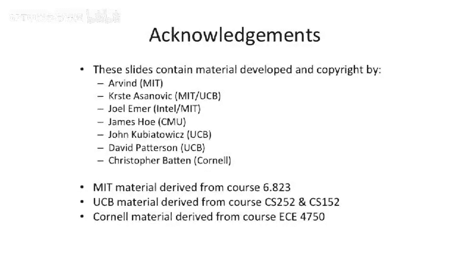

# 060：软件内存优化


在本节课中，我们将探讨软件如何通过一系列技术来优化缓存和内存系统的性能。我们将学习编译器如何调整数据结构、循环顺序，以及如何利用特殊的硬件指令来提升程序的时空局部性，从而减少缓存未命中并提高整体效率。

---

## 软件能做什么？🤔

上一节我们讨论了缓存的基本原理，本节中我们来看看软件层面能采取哪些优化措施。

软件，特别是编译器，可以对缓存和内存系统产生显著影响。编译器开发者会花费大量时间思考如何优化内存访问。

以下是编译器常用的一些技术：

*   **数据结构填充**：编译器有时会在数据结构中插入额外的字节（填充），这虽然浪费了一些内存，但可以改善访问模式。例如，它可以避免数据在缓存中发生冲突，或者以某种有益的方式组织冲突，从而更好地利用时间或空间局部性。
*   **提供缓存提示指令**：这是一种软硬件结合的方案。处理器可以增加特殊指令，让编译器或程序员向体系结构提示是否应将数据载入缓存。例如，如果你知道某块数据只会使用一次，就不应将其拉入缓存，因为它永远不会被再次访问，只会造成缓存污染和未命中开销。
*   **提前驱逐数据**：如果软件知道某些数据不会再被使用，可以主动将其从缓存中清除。这可以通过类似 **`flush and invalidate`** 的指令实现，它会将脏数据写回主存并使缓存行失效。这为新数据腾出了空间，避免了后续的驱逐开销。
*   **缓存行置零指令**：这是上述指令的逆操作。某些架构（如Alpha）提供了类似 **`write 0, 64`** 的指令，它可以直接用零填充整个缓存行，而无需从更高级别的缓存或主存中读取旧数据。当你随后要向这个位置写入新数据时，就节省了读取旧数据的带宽。
*   **重组数据结构**：在支持反馈驱动的编译中，编译器可能会重新组织数据结构中字段的排列顺序。通过将经常被连续访问的字段放在一起，可以显著提升空间局部性。

---

## 循环交换 🔄

现在，我们来看一些具体的软件优化策略。首先从循环交换开始。

请看以下代码片段。我们有一个双层循环，遍历一个二维数组 `x`，并将每个元素乘以2。

```c
for (j = 0; j < N; j++) {
    for (i = 0; i < M; i++) {
        x[i][j] = x[i][j] * 2;
    }
}
```

在C语言中，多维数组在内存中是按行主序存储的。这意味着数组 `x[0][0]`, `x[0][1]`, `x[0][2]`... 在内存中是连续的，然后才是下一行 `x[1][0]`, `x[1][1]`...。

然而，在上面的循环中，内层循环遍历的是 `i`（行索引），外层循环遍历的是 `j`（列索引）。这导致内存访问模式是跳跃式的：先访问 `x[0][0]`，然后跳很远访问 `x[1][0]`，再跳很远访问 `x[2][0]`，以此类推。这种访问方式严重破坏了缓存行的空间局部性，因为每次可能只用到缓存行中的一个数据，就跳到了下一个不连续的缓存行。

一个简单的优化是交换循环顺序：

```c
for (i = 0; i < M; i++) {
    for (j = 0; j < N; j++) {
        x[i][j] = x[i][j] * 2;
    }
}
```

现在，内层循环连续遍历 `j`（列），这正好匹配了内存中行的连续布局。程序会顺序访问 `x[i][0]`, `x[i][1]`, `x[i][2]`...，从而完美地利用了空间局部性，性能会得到大幅提升。

**这项优化主要提升了哪种局部性？** 答案是空间局部性。

---

## 循环融合 🤝

接下来，我们看看循环融合如何优化。

观察以下两段连续的循环代码：

```c
for (i = 0; i < N; i++) {
    a[i] = b[i] * c[i];
}
for (i = 0; i < N; i++) {
    d[i] = a[i] * c[i];
}
```

这段代码先计算数组 `a`，然后再用 `a` 和 `c` 计算数组 `d`。假设数组很大，无法完全放入缓存。

在第一个循环中，程序会依次读入 `b[i]`、`c[i]`，计算后写入 `a[i]`。当它遍历完整个数组后，最早被访问的 `a[0]` 和 `c[0]` 很可能已经被后续的数据挤出缓存了。

接着，第二个循环开始，它需要再次读取 `a[i]` 和 `c[i]`。这导致刚刚被踢出的数据又需要从内存或下级缓存中重新加载，造成了糟糕的时间局部性。

编译器可以识别这种模式，并进行循环融合：

```c
for (i = 0; i < N; i++) {
    temp = b[i] * c[i]; // 计算中间结果
    a[i] = temp;        // 写入a
    d[i] = temp * c[i]; // 复用c[i]和temp计算d
}
```

融合后，对于每个 `i`，`b[i]`、`c[i]` 被读入缓存，中间结果 `temp` 被计算并写入 `a[i]`，然后立即用仍在缓存中的 `c[i]` 和 `temp` 计算 `d[i]`。这样，`c[i]` 的数据在缓存中被复用了，`a[i]` 也无需在第二个循环中重新读取，极大地改善了时间局部性。

**这项优化主要提升了哪种局部性？** 答案是时间局部性。

---

## 分块（阻塞）矩阵乘法 🧱

最后，我们探讨一个更复杂的优化：分块（或称为平铺）矩阵乘法。

矩阵乘法的朴素实现通常包含三层循环：

```c
for (i = 0; i < N; i++) {
    for (j = 0; j < N; j++) {
        sum = 0;
        for (k = 0; k < N; k++) {
            sum += a[i][k] * b[k][j];
        }
        c[i][j] = sum;
    }
}
```

这种实现的问题在于内存访问模式不友好。对于矩阵 `a`，我们按行访问，有较好的空间局部性。但对于矩阵 `b`，内层循环 `k` 遍历的是列，这导致对 `b` 的访问是跳跃的，每次可能只用到缓存行中的一个元素，空间局部性极差。同时，对于大的矩阵，三个数组（`a`, `b`, `c`）的数据会在缓存中相互竞争，导致频繁的未命中。

分块算法将大矩阵分解成更小的块（Tile），然后在块上进行计算。伪代码结构如下：

```c
for (ii = 0; ii < N; ii += BLOCK_SIZE) {
    for (jj = 0; jj < N; jj += BLOCK_SIZE) {
        for (kk = 0; kk < N; kk += BLOCK_SIZE) {
            // 计算小块: c[ii:ii+BLOCK][jj:jj+BLOCK] +=
            //          a[ii:ii+BLOCK][kk:kk+BLOCK] *
            //          b[kk:kk+BLOCK][jj:jj+BLOCK]
            for (i = ii; i < ii+BLOCK_SIZE; i++) {
                for (j = jj; j < jj+BLOCK_SIZE; j++) {
                    sum = c[i][j];
                    for (k = kk; k < kk+BLOCK_SIZE; k++) {
                        sum += a[i][k] * b[k][j];
                    }
                    c[i][j] = sum;
                }
            }
        }
    }
}
```

**分块如何提升性能？**

1.  **缩小工作集**：每次只将几个小块的数据加载到缓存中，大大降低了对缓存容量的需求，使得数据更可能停留在高速的L1缓存中。
2.  **提升时间局部性**：在一个块的计算过程中，`a` 的子块行和 `b` 的子块列被反复使用。`c` 的结果元素也在块内被累加多次。
3.  **提升空间局部性**：对 `a` 和 `b` 子块的访问，在块内循环时变得更连续（因为 `kk` 块内的 `k` 是连续的），更好地利用了缓存行。

因此，分块技术同时改善了**时间局部性**和**空间局部性**。

---

## 编译器内存优化的收益总结 📈

通过应用上述软件优化技术，我们可以在内存层次结构的几个关键指标上获得收益：

*   **带宽**：通过使用非临时提示指令，避免不必要的数据缓存，可以节省通往内存的带宽。
*   **命中时间**：这主要由硬件决定，软件优化影响有限。
*   **未命中惩罚**：这是软件优化最能发挥作用的领域。通过提升局部性（如循环交换、融合、分块），使工作集更适合缓存容量，可以显著减少访问延迟更高的下级缓存或主存的次数，从而降低平均未命中惩罚。

---




本节课中我们一起学习了多种软件内存优化技术。我们了解了编译器如何通过填充数据结构、提供缓存提示来辅助硬件。重点掌握了三种关键的代码变换：**循环交换**以改善空间局部性，**循环融合**以改善时间局部性，以及**分块技术**在矩阵乘法等场景中综合提升两种局部性。理解并应用这些技术，对于编写高性能计算程序至关重要。