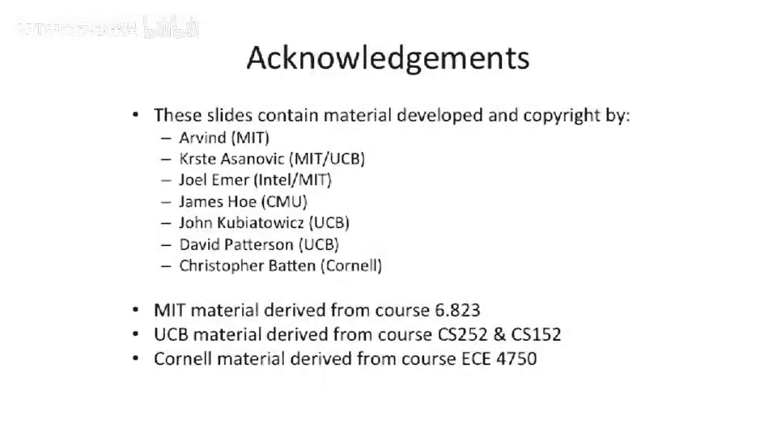

# 061：非阻塞缓存 🚀

在本节课中，我们将要学习非阻塞缓存（也称为乱序内存系统或无锁定缓存）的核心概念。这种设计允许处理器在发生缓存未命中时继续执行后续指令，从而显著提升系统性能。

## 概述

非阻塞缓存的核心思想是允许处理器在等待一个内存访问请求完成的同时，继续处理后续的、不相关的内存访问请求。这打破了传统阻塞式缓存中“一遇未命中，流水线即停”的限制。

## 非阻塞缓存的基本概念

上一节我们介绍了非阻塞缓存的目标，本节中我们来看看它能实现的具体功能。

非阻塞缓存主要允许两种操作：
1.  **命中在未命中之下**：即使之前有一个加载指令发生了缓存未命中，只要后续指令不依赖其结果，处理器仍可以继续执行并可能命中缓存。
2.  **未命中在未命中之下**：可以同时处理多个未完成的缓存未命中请求。

一个重要的观点是，非阻塞缓存不仅适用于乱序执行处理器。通过一些设计技巧（例如标记寄存器状态），它同样可以应用于顺序执行处理器甚至VLIW顺序处理器。

## 面临的挑战

实现非阻塞缓存需要解决几个主要挑战：

以下是实现过程中需要处理的核心问题：
*   **乱序返回的数据**：多个未完成的内存请求可能以不同于发出顺序的次序返回数据。系统必须能正确地将返回的数据交付给对应的指令和缓存位置。
*   **对同一缓存行的访问冲突**：例如，对同一缓存行的连续两次加载都会未命中，系统应合并请求，避免向内存系统发送重复请求。更复杂的情况是，对同一缓存行先加载后存储，如果处理不当，可能导致缓存中的数据不是最新值。

## 工作原理与时间线分析

为了理解非阻塞缓存的优势，我们将其与阻塞缓存进行对比。时间从左向右推进。

*   **阻塞缓存**：处理器执行一次加载/存储，发生缓存未命中。处理器必须**等待**，直到缓存行被填充，然后才能返回数据并继续执行。期间没有重叠操作。
*   **非阻塞缓存（命中在未命中之下）**：处理器执行加载到寄存器R5，发生未命中。只要后续指令不尝试读取R5，处理器可以**继续执行**。后续指令可能访问缓存并命中。仅当有指令真正需要使用R5的数据时，处理器才需要等待。这样，我们就将计算与未命中惩罚**重叠**了起来。
*   **非阻塞缓存（未命中在未命中之下）**：处理器可以连续发生多个缓存未命中，并将这些请求都发送到内存系统。处理器在整个过程中持续执行，**重叠了多个内存访问与计算**。

通常，系统中允许的未完成内存请求数量是有限的，例如4个或8个。

## 核心数据结构：MSHR

实现非阻塞缓存的关键是一个称为**未命中状态处理寄存器**的数据结构。它有几个不同的名称（如Miss File、MSHR），但其功能类似。

MSHR本质上是一个小型表格，用于跟踪所有未完成的内存请求。让我们看看它的内部结构：

以下是MSHR包含的主要字段：
*   **有效位**：指示该条目是否正在使用。
*   **块地址**：发生未命中的**整个缓存行**的地址，而不是单个加载/存储的地址。用于后续请求的合并检查。
*   **已发出位**：指示该未命中请求是否已真正发送到主存系统。一个请求可能已记录但尚未发出。
*   **加载/存储条目列表**：每个条目跟踪一个具体的加载或存储操作。
    *   **有效位**：条目是否有效。
    *   **指针**：指向其所属的MSHR条目。
    *   **偏移量**：该加载/存储操作在缓存行内的具体位置。
    *   **目标字段**：对于加载，这是数据最终要写入的**物理寄存器标识符**；对于存储，这可能指向一个存储缓冲区条目，以便在数据返回后与缓存行合并。
    *   **类型**：操作类型（如字、半字、字节）以及是加载还是存储。

### 工作流程

1.  **处理新的未命中**：当发生缓存未命中时，系统首先检查MSHR中的`块地址`字段，进行**相联查找**。
    *   如果找到匹配项（说明对同一缓存行已有未完成请求），则只需创建一个新的`加载/存储条目`，并将其`指针`指向那个已存在的MSHR条目。这实现了请求合并。
    *   如果未找到匹配项，则需要同时分配一个新的`MSHR条目`和一个`加载/存储条目`。
2.  **处理返回的数据**：当缓存行数据从内存返回时，系统根据返回信息找到对应的MSHR条目。
    *   首先，将数据填充到缓存中。
    *   然后，根据该MSHR条目的编号，**相联查找**所有`加载/存储条目`中`指针`匹配的项。
    *   对于每个匹配的加载条目，根据其`偏移量`从返回的缓存行中提取数据，并写入`目标字段`指定的寄存器。
    *   对于每个匹配的存储条目，则将存储缓冲区的数据与返回的缓存行合并后写回缓存。
3.  **资源管理与清理**：如果MSHR或加载/存储条目用完，处理器可以简单暂停，直到有条目被释放。当某个缓存行的所有等待操作都处理完毕后，清理对应的MSHR条目和所有相关的加载/存储条目。

## 顺序处理器中的应用

将非阻塞缓存集成到顺序处理器中也是可行的。一种常见方法是使用**记分牌**为每个寄存器维护一个特殊状态位。当发生加载未命中时，将该目标寄存器标记为“忙碌”。如果后续指令试图读取这个“忙碌”的寄存器，处理器就暂停；否则，处理器可以继续执行。当数据从内存返回时，更新寄存器并清除“忙碌”位。这样，只要没有数据依赖，处理器就能在未命中期间继续工作。

## 优势总结

本节课中我们一起学习了非阻塞缓存的原理与实现。最后，我们来总结它的主要优势：

以下是采用非阻塞缓存带来的关键收益：
*   **提高缓存带宽**：允许在未命中期间处理其他命中请求，更充分地利用了缓存端口。
*   **合并未命中请求**：通过MSHR将对同一缓存行的多个未命中合并为一个内存事务，减少了内存总线流量。
*   **降低有效未命中惩罚**：通过将未命中延迟与有用的计算工作重叠，从处理器的角度看，内存访问的延迟被有效地隐藏了，从而提升了整体性能。

---

**核心概念公式/代码表示**：
*   **MSHR查找（合并检查）**：`if (new_miss_block_addr == any_existing_mshr.block_addr) then merge_request() else allocate_new_mshr_entry()`
*   **数据返回分发**：`for each load_store_entry where load_store_entry.pointer == returned_mshr_id: register[load_store_entry.destination] = cache_line[load_store_entry.offset]`