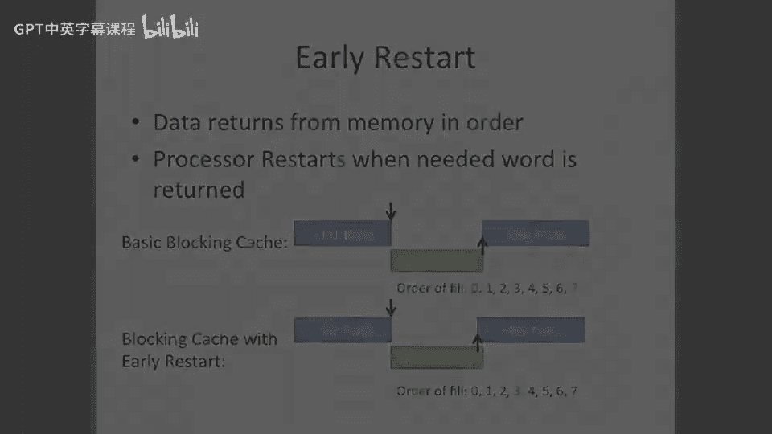

# 062：关键字优先与提前重启 🚀

在本节课中，我们将学习两种优化缓存性能的技术：**关键字优先**和**提前重启**。这两种技术旨在减少处理器因缓存未命中而等待数据的时间，从而提升整体执行效率。

上一节我们介绍了缓存未命中处理的基本流程。本节中我们来看看如何通过改变数据返回顺序来优化这一过程。

## 关键字优先

**关键字优先**的核心思想是，处理器可以告知内存系统哪个字（word）是最重要的。通常，内存阵列和总线设计允许数据在多个周期内分批次传输。许多大型内存阵列（如主板上的DRAM）并不关心数据返回的顺序，它们只希望尽可能高效地利用总线。

因此，我们可以指定一个关键地址。例如，假设我们请求的地址是3，我们可以要求内存系统：“请先返回地址3的数据”。

以下是其工作流程：
*   内存系统收到请求后，会优先返回指定关键地址的数据。
*   关键数据（例如地址3的数据）首先返回。
*   一旦关键数据到达，处理器就可以**立即恢复执行**，而缓存行的其余部分仍在后台填充到缓存中。

这样，我们就实现了处理器执行与缓存填充的**部分重叠**。不过，这种优化的收益取决于所需数据在缓存行中的位置。如果所需的是最后一个字，可能节省多个周期；如果所需的是第二个字，则可能只节省一个周期。此外，实现关键字优先机制需要额外的硬件复杂度。

## 提前重启

**提前重启**是另一种实现类似目标但硬件需求更简单的方法。与关键字优先不同，内存系统仍然按照**标准顺序**返回数据。

其工作原理如下：
*   内存系统按顺序（如0, 1, 2, 3...）返回缓存行的数据。
*   处理器持续监控返回的数据流。
*   一旦检测到它所需要的关键字（例如地址3）返回，处理器就**立即重启执行**。

因此，在提前重启机制下，我们同样可以获得一部分处理器执行与缓存填充的重叠时间。相比之下，在没有此类优化的标准情况下，处理器必须等待整个缓存行都填充完毕才能重启，从而完全损失了这部分潜在的重叠周期。

本节课中我们一起学习了**关键字优先**和**提前重启**这两种缓存优化技术。它们通过改变数据返回策略或执行重启时机，减少了处理器的等待时间，提升了系统性能。理解这些技术有助于我们更深入地认识现代处理器如何通过精细的设计来隐藏内存访问延迟。