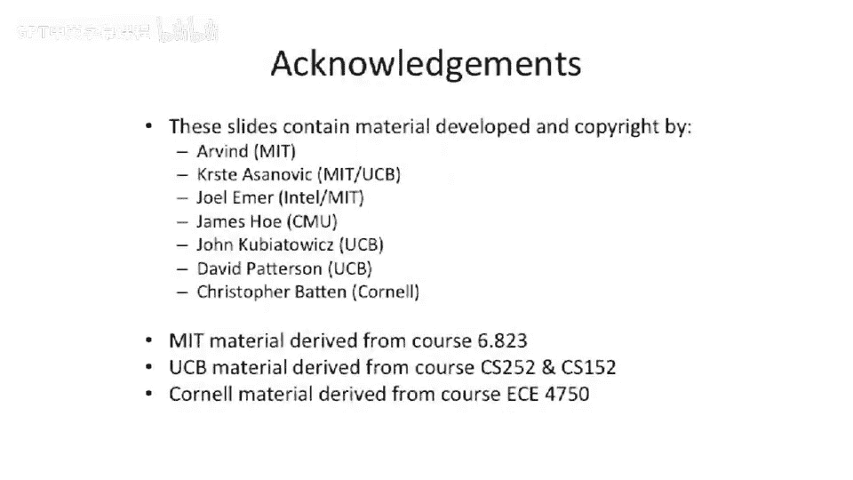

# 063：内存管理入门 🧠

在本节课中，我们将学习计算机体系结构中的一个核心主题：内存管理。我们将探讨地址翻译、内存保护以及虚拟内存的概念，这些是现代计算机系统高效、安全运行的基础。

## 概述

内存管理是计算机体系结构与操作系统交叉领域的重要课题。它主要解决三个核心问题：地址翻译、内存访问保护和虚拟内存扩展。通过有效的内存管理，系统可以实现灵活的内存布局、防止内存碎片、隔离不同用户或进程的数据，甚至让程序使用比物理内存更大的地址空间。

上一节我们介绍了简单的物理地址直接访问模型。本节中，我们来看看如何通过地址翻译来构建更强大的内存管理系统。

## 内存管理的三大核心功能

我们可以将内存管理的功能大致分为三个重要且相互独立的部分。

### 1. 地址翻译
在地址翻译中，我们将一个地址转换为另一个地址。通过这种重映射，我们可以实现更灵活的内存布局，并防止内存碎片化问题。

**内存碎片化**是指当许多小块数据或代码被加载后，其中一些完成或释放，导致内存空间中留下许多“空洞”。除非压缩或重新布局内存，否则很难重新利用这些空间。这在类似C/C++这种没有自动垃圾回收机制的语言中尤为常见。

### 2. 内存保护
内存保护旨在限制对内存的访问，只允许授权用户或进程访问特定的内存区域。这对于多用户系统至关重要，例如，可以防止一个用户读取另一个存储在内存中的银行记录。

### 3. 虚拟内存
虚拟内存允许系统提供比实际物理内存更大的地址空间。这是通过将不常用的数据暂时转移到硬盘（或其他存储介质，如SSD）上，并在需要时再换回内存来实现的。在Linux等系统中，这通常通过“交换分区”或“后备存储”来实现。

现代系统大多采用基于分页的机制来实现这些功能。接下来，我们将从历史发展的角度，探讨几种不同的内存管理方案。

## 初始状态：无内存管理

在早期计算机系统中，并没有复杂的内存管理。程序直接使用物理地址访问内存。

**工作方式**：程序产生一个地址，该地址直接索引物理内存并返回数据。

**代码示例**：`load [物理地址]`

这种模式在单程序运行时是可行的，例如早期的EDSAC计算机。但它存在明显局限：
*   只能同时运行一个程序。
*   程序拥有全部内存，地址固定。
*   无法运行多个程序，无法提供内存保护，也无法实现虚拟内存。

尽管如此，程序员仍希望编写位置无关的子程序，以便在不同程序中复用。这通常通过**链接器**和**加载器**在软件层面实现。
*   **链接器**：将多个编译好的目标文件合并成一个可执行程序，并解析其中的地址引用。
*   **加载器**：将可执行程序从磁盘载入内存，并可能执行运行时链接，修补地址以指向动态库的正确位置。

在这种绝对地址模型中，所有地址都是**物理地址**，直接对应内存硬件。虽然简单，但无法满足我们之前提出的三大需求。

## 引入地址翻译

为了构建更强大的系统，我们需要引入**地址翻译**的概念。这带来了两种地址：
*   **虚拟地址**：由CPU生成和使用的地址。
*   **物理地址**：经过翻译后，用于实际访问主内存（DRAM）的地址。

地址翻译硬件位于CPU和内存之间，负责将程序使用的虚拟地址映射到物理内存中的实际位置。这为实现内存保护、多程序运行和虚拟内存奠定了基础。

在下一节中，我们将深入探讨第一种实用的地址翻译与保护机制：分段（基址-界限寄存器）模型。

## 总结

本节课我们一起学习了内存管理的基本概念和重要性。我们明确了内存管理的三大核心功能：**地址翻译**、**内存保护**和**虚拟内存扩展**。我们从最简单的物理地址直接访问模型出发，看到了它的局限性，并引出了通过地址翻译来构建更强大、更灵活内存系统的必要性。理解虚拟地址与物理地址的区别是学习后续更复杂机制（如分段、分页）的关键第一步。