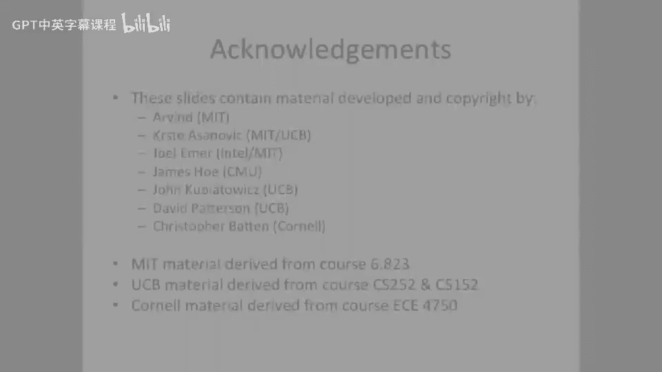

# 065：基于页面的内存系统


在本节课中，我们将学习计算机体系结构中的一个核心概念：基于页面的内存系统。我们将探讨如何通过分页技术管理内存，解决内存碎片化问题，并理解虚拟地址到物理地址的转换机制。课程将涵盖线性页表、多级页表及其优缺点，以及它们在现代计算机系统中的应用。

## 分页的基本概念

上一节我们介绍了分段内存管理的局限性。本节中，我们来看看计算机架构师提出的另一种解决方案：分页。

分页的核心思想是，将整个内存划分为固定大小的区域，称为“页”。这与可变大小的段不同。例如，可以将内存划分为4KB大小的页。这样，程序看到的连续虚拟地址空间，可以被映射到物理内存中不连续的页上。

以下是分页机制的核心公式：
*   **虚拟地址 = 虚拟页号 + 页内偏移**
*   **物理地址 = 物理页号 + 页内偏移**

虚拟页号用于在页表中查找对应的物理页号，而页内偏移则直接用于在找到的物理页内定位具体的字节。

## 页表的作用与结构

现在，我们来深入了解页表的具体作用和工作原理。

页表是一个数据结构，它存储了虚拟页号到物理页号的映射关系。每个进程都有自己的页表。当处理器生成一个虚拟地址时，内存管理单元（MMU）会查询页表，完成地址转换。

页表中的每个条目（Page Table Entry, PTE）通常包含以下信息：
*   **有效位**：指示该页是否已加载到物理内存中。
*   **物理页号**：该虚拟页对应的物理页的起始地址。
*   **状态位**：例如读/写权限位、访问位、修改位等，用于内存保护和统计。

操作系统通过更改一个特殊的“页表基址寄存器”，可以在不同进程间快速切换。写入该寄存器后，整个内存映射视图会立即改变，为新进程提供独立的地址空间和保护。

## 线性页表的挑战

了解了页表的基本结构后，我们来看看最简单的实现方式——线性页表——所面临的挑战。

线性页表是一个连续的数组，虚拟页号直接作为数组索引。然而，这种方法存在严重问题。

以下是线性页表大小的计算示例（32位地址空间，4KB页，4字节PTE）：
```plaintext
虚拟地址空间大小 = 2^32 = 4 GB
页大小 = 4 KB = 2^12 字节
页表条目数 = 4 GB / 4 KB = 2^20 个
每个PTE大小 = 4 字节
页表总大小 = 2^20 * 4 字节 = 4 MB
```
这意味着，每个进程的页表就需要占用4MB内存。如果有100个进程，仅页表就需要400MB，这在32位系统中是巨大的开销。对于64位系统，问题会更加严重。

此外，线性页表本身需要连续的内存空间，可能导致外部碎片。每次内存访问都需要先查询页表（一次内存读），然后再访问目标数据（第二次内存读），这使内存访问延迟翻倍。

## 多级页表与稀疏表示

面对线性页表的空间效率问题，架构师们引入了多级页表。

多级页表将单一的线性页表组织成树状结构。例如，一个两级页表使用虚拟地址的一部分索引第一级目录，再用另一部分索引第二级页表。其核心优势在于支持稀疏表示。

如果地址空间的某个大区域未被使用，对应的第一级目录条目可以标记为空，其下所有的第二级页表就无需分配，从而节省大量空间。操作系统还可以将每一级页表的大小设计为恰好一页，便于在物理内存中灵活分配，避免外部碎片。

然而，多级页表增加了地址转换的延迟。一个两级页表需要三次内存访问：访问第一级目录、访问第二级页表、最后访问目标数据。级数越多，潜在延迟越高。

## 性能优化与总结

我们讨论了多级页表带来的延迟问题。为了解决这个问题，现代计算机普遍采用了“转址旁路缓存”（TLB）。

TLB是一个位于CPU内部的小型高速缓存，用于存储最近使用过的虚拟页到物理页的映射。当进行地址转换时，MMU首先查询TLB。如果命中，则无需访问内存中的页表，可以极大地加速转换过程。TLB是保证分页系统性能的关键部件。




本节课中我们一起学习了基于页面的内存系统。我们了解到，分页通过固定大小的页来管理内存，有效消除了外部碎片。页表是实现虚拟地址到物理地址映射的核心数据结构。线性页表简单但空间效率低下，多级页表通过树状结构和稀疏表示解决了空间问题，但增加了访问延迟。最后，TLB的引入极大地缓解了多级页表带来的性能开销。分页是现代操作系统实现内存管理、保护和多任务的基础。