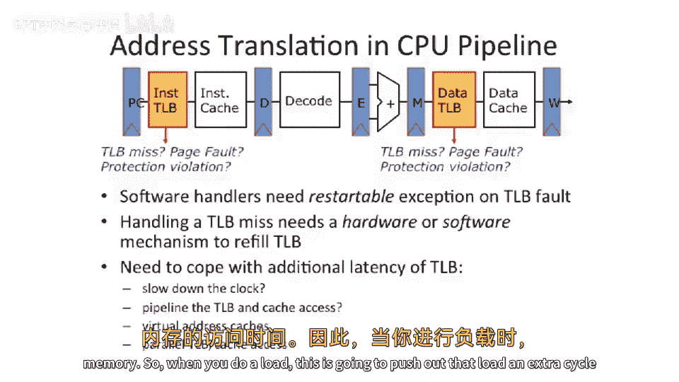

# 068：地址转换回顾与虚拟内存设计影响


在本节课中，我们将继续学习地址转换和虚拟内存，重点探讨虚拟内存系统如何影响缓存和硬件流水线的设计。我们将回顾上节课的核心概念，并深入分析地址转换在处理器流水线中引入的挑战。

## 地址转换与虚拟内存回顾

上一节我们介绍了内存管理的基本概念和功能。本节中，我们来看看地址转换和虚拟内存的具体工作机制。

内存管理主要实现三个功能：
1.  **地址转换**：允许移动和重新映射数据。
2.  **保护**：允许在单个芯片上同时运行多个不同的操作系统或应用程序。
3.  **虚拟内存**：允许系统使用比物理内存更大的地址空间。

我们重点讨论了分页机制，并简要提到了按需调页。

## 现代虚拟内存系统

现代虚拟内存系统，例如在桌面Linux上运行的，允许应用程序使用比物理RAM更大的内存。系统通过将不常用的内存页面交换到大容量存储设备（如磁盘）来实现这一点。

虚拟内存交换不仅限于磁盘，也可以通过网络进行，例如在早期的工作站网络中，计算机可以将内存交换到相邻计算机的RAM中，从而有效扩大可用内存。

这一切工作的关键在于**按需调页**机制。操作系统仅在绝对必要时才映射页面。当需要为新的页面腾出空间时，操作系统可以决定将某些页面换出。

*   **干净页面**：如果内存中的数据与磁盘上的副本一致（即未被修改），则可以直接丢弃，无需写回磁盘。
*   **脏页面**：如果数据已被修改，则必须写回磁盘以保存更改。

在操作系统课程中，通常会实现按需调页方案，并尝试不同的页面置换算法来管理数据的换入和换出。

## 硬件层面的地址转换流程

从硬件层面看，地址转换的工作流程如下：

1.  **TLB查询**：处理器将虚拟地址送入**转换后备缓冲器** 进行查询。
2.  **TLB命中**：如果TLB中存在该地址的映射（TLB命中），则同时检查保护位，确认当前进程是否有读写权限。如果一切正常，则使用转换后的物理地址访问数据。
3.  **保护错误**：如果权限检查失败，将产生保护错误，操作系统通常会终止该进程（例如，引发段错误）。
4.  **TLB未命中**：如果TLB中没有该映射（TLB未命中），则需查找页表。
    *   **硬件页表遍历器**：在一些体系结构（如x86）中，由硬件状态机自动遍历页表，找到映射后装入TLB。
    *   **软件页表遍历**：在一些体系结构（如MIPS、Alpha）中，由操作系统软件遍历页表。有些架构（如MIPS）会提供特殊硬件来加速软件遍历过程。
5.  **页错误**：如果页表中也不存在该映射，则产生页错误，陷入操作系统。
    *   操作系统检查所需数据是否在磁盘（交换空间）上。
    *   如果数据在磁盘上，操作系统将其载入内存，更新页表和TLB，然后恢复进程执行。
    *   如果访问的是不存在的内存，则操作系统通常会终止进程（段错误或总线错误）。

## 地址转换对硬件流水线设计的影响

既然我们决定采用虚拟内存和TLB，接下来看看这如何影响硬件流水线的设计。

以下是将地址转换直接加入一个五级流水线的简单示意图：

```
取指 (IF) -> 译码 (ID) -> 执行 (EX) -> [TLB查询] -> 访存 (MEM) -> 写回 (WB)
                                         [缓存访问]
```

这是一种简单直接的方法，但存在严重延迟问题。它将TLB查询和缓存访问串行地加入关键路径中，这可能会降低处理器主频或增加访存延迟。

我们希望能将这两种结构移出关键路径。另一种思路是将TLB查询和缓存访问流水线化，各作为一个独立的流水级。

但这会带来新的挑战：
*   **数据访问侧**：增加一个流水级意味着加载指令的延迟会增加一个周期。
*   **指令访问侧**：增加流水级会影响分支预测。如果分支预测错误，恢复的延迟会增加一个周期。同时，指令内存无法在一个周期内被有效访问。



不过，将指令TLB移出关键路径通常更容易实现，因为指令地址的高位（页号）不常改变。只有在进行远跳转或执行到页面末尾时才会跨越页边界，这两种情况都相对罕见。

因此，设计优化主要关注数据访问侧的地址转换延迟问题。

## 总结


本节课中，我们一起学习了地址转换和虚拟内存的核心机制。我们回顾了从虚拟地址到物理地址的转换流程，包括TLB查询、页表遍历和页错误处理。重点分析了引入地址转换后对处理器硬件流水线设计带来的挑战，特别是如何管理TLB和缓存访问带来的额外延迟。理解这些硬件与操作系统的交互细节，是设计高效计算机体系结构的关键。