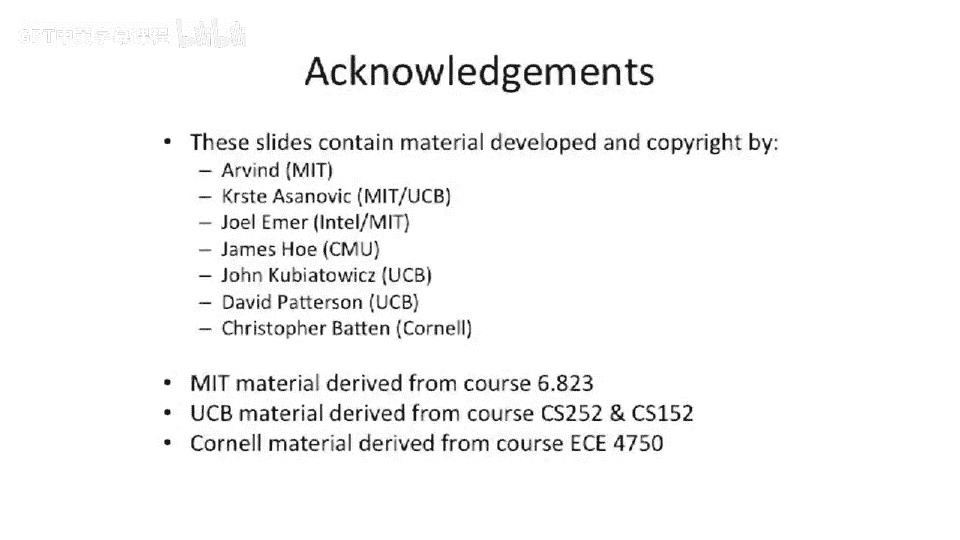

# 071：向量并行性入门


在本节课中，我们将要学习向量处理器中的基本执行模型，并探讨如何通过并行化技术来提升其性能。我们将从最简单的顺序执行开始，逐步引入并行概念。

---

## 顺序向量执行模型

上一节我们介绍了向量处理的基本概念，本节中我们来看看一个基于顺序标量处理器构建的向量处理器是如何工作的。

该处理器包含取指、解码阶段，以及一个特殊的重命名阶段。它拥有两条主要的流水线和一个写回阶段。寄存器文件分为两种：我们之前称为“旧寄存器文件”的标量寄存器文件，以及存储大量数据的向量寄存器文件。向量长度寄存器在取指阶段之前独立设置。

这个特殊的重命名阶段承担了大量工作。当一条向量运算指令到达此阶段时，它会开始从向量寄存器文件中顺序读取数据元素。例如，对于一个向量长度为64的乘法操作，该阶段会顺序执行64次读取，并将64个独立的“微操作”送入乘法流水线。

**核心概念**：在此示例中，我们尚未利用任何并行性，所有操作都是顺序执行的。指令可以在此阶段暂停，并基于当前向量长度寄存器的值，生成相应数量的微操作。

让我们看一个基础操作的例子。以下是一段执行相同操作的代码，它将向量A和向量B的每个元素相乘，其中循环次数I设为4（为简化绘图，未使用64）。

对应的汇编代码如下：
```assembly
LV V1, Ra
LV V2, Rb
MULV.D V3, V1, V2
SV V3, Rc
```

第一条加载指令`LV`在取指、解码后，会在R阶段停留一段时间，顺序地向流水线中插入多次加载操作。

这种基础的向量执行模型没有旁路机制，并且依赖寄存器相关性检查。相关性检查是针对整个向量寄存器进行的。如果整个向量寄存器尚未就绪，后续指令就会被阻塞。这意味着，我们必须等待前一条指令的所有结果都写回向量寄存器文件后，才能开始下一条指令的寄存器读取。

因此，乘法操作必须等待所有加载完成并写回后才开始，而存储操作又必须等待所有乘法完成。此模型中的记分牌和旁路机制非常有限，基本上需要确保所有数据都已就绪在寄存器文件中，才能继续执行。

这里引入一个术语：**“节拍”**。一个节拍是指在该架构下执行一条向量指令所需的时间。在本例架构中，由于向量长度为4，且一次只能有效使用一个运算单元，所以节拍是4。

---

## 引入并行性以提升性能

目前我们获得的唯一优势是降低了内存带宽需求，但并未减少取指带宽，这不足以带来显著的性能提升。为了跑得更快，我们需要考虑如何让操作重叠执行。

如果我们拥有不同的功能单元（如X单元负责加载，Y单元负责存储，加法单元，乘法单元等），我们就可以在空间和时间上重叠它们的执行。

以下是一个更高效的例子，假设向量长度为32，并且我们拥有多个功能单元副本。我们可以同时使用多个单元来增加并行性。

我们可以通过同时使用多个单元来增加并行性。例如，我们的加法器单元、乘法器单元、加载单元可以各有多个副本。这些副本我们称之为 **“通道”**。




---

## 总结


本节课中我们一起学习了向量处理器的顺序执行模型，了解了“节拍”的概念。我们认识到，仅靠向量化减少指令数并不足以最大化性能。因此，我们探讨了通过引入多个功能单元（通道）并在空间与时间上重叠执行，来开发并行性，从而降低整体执行时间、提升处理器性能的基本思路。