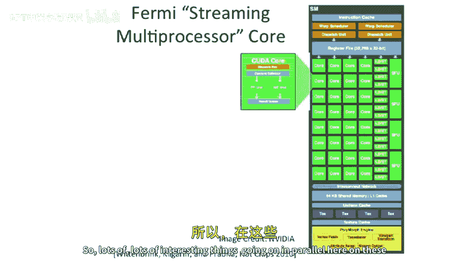

# 076：GPU与向量处理器

在本节课中，我们将要学习图形处理器单元（GPU）的基本概念，了解它们与向量处理器的异同，并探讨其独特的编程模型和架构设计。

上一节我们介绍了向量处理器和短向量指令集。本节中我们来看看一个常见但又不完全是向量处理器的例子：图形处理器单元（GPU）。

## 🎮 GPU的起源与演变

GPU最初并非为通用计算而设计，其目标是渲染三维图形。早期GPU采用固定功能管线，不具备可编程性。随着发展，GPU开始引入更多灵活性。

一个例子是Nvidia早期芯片中的“像素着色器”。游戏程序员可以为屏幕上渲染的每个像素编写一个小程序，实现自定义的渲染效果。

有趣的是，人们开始利用像素着色器来执行非图形计算任务，例如进行矩阵乘法，并将结果输出为一幅图像。这催生了在GPU上进行通用计算的想法。

## 🔄 从GPU到GPGPU

GPU制造商意识到，如果鼓励人们在GPU上编写程序，可能会扩大其用户基础。因此，他们开始使GPU架构更加通用。

这导致了通用图形处理器单元（GPGPU）的出现。它仍然是特殊的硬件，但增加了通用计算能力。Nvidia为此推出了名为CUDA的编程语言。工业界还有一个更广泛接受的标准，称为OpenCL。

## ⚙️ GPGPU与向量处理器的关键区别

GPGPU的编程模型有些奇特。它是一个线程模型。首先，我们需要明确GPGPU与真正的向量处理器之间的几个关键区别。

在GPGPU架构中，存在一个主机CPU（如x86处理器）和一个通过PCIe等总线连接的图形卡。这与我们上节课讨论的、拥有紧密耦合控制处理器的向量处理器不同。GPGPU的标量处理器（主机CPU）距离较远，并不严格驱动一切。实际上，你需要以某种方式在向量单元上运行所有控制代码。

这种连接式主机处理器模型也有其优势。你可以运行程序的**数据并行**部分，同时让主机CPU运行其他任务。

## 💻 CUDA编程模型简介

CUDA是Nvidia为其GPU设计的编程模型。其基本思想是：每个线程只做很少的工作。

以下是其核心概念的一个示例。假设我们有一个传统的循环，执行向量运算 `y[i] = y[i] + a * x[i]`（类似于LINPACK基准测试中的内循环）。

在CUDA中，我们定义一个包含多个数据的数据块，并启动大量线程来并行处理。每个线程执行相同的操作，但处理不同的数据索引 `i`。线程索引 `i` 通过特殊关键字（如 `threadIdx.x`）获取。同时，需要一个条件判断（类似于向量处理中的条带挖掘循环）来确保线程不会处理超出向量长度 `N` 的数据。

从编程模型上看，每个线程似乎是完全独立的。然而，底层硬件架构并非如此。

## 🧵 SIMT：单指令多线程

CUDA模型被称为**单指令多线程**。本质上，它隐藏了一个**单指令多数据**架构。所有线程在同一时间执行相同的指令。

如果线程间的控制流出现分歧（例如，某些线程进入`if`分支，而其他线程没有），这是允许的，但会导致部分流水线闲置，因为硬件仍然试图让所有线程同步执行相同的指令。因此，强烈建议使用**谓词执行**来允许线程走向不同的分支，以避免性能损失。

## 🏗️ GPU内部架构一瞥

GPU内部架构非常复杂。它们本质上是具有多“车道”的大规模并行架构，类似于向量处理器。此外，它们还叠加了多线程技术。

为了隐藏较高的内存访问延迟，GPU通常没有传统缓存，而是采用细粒度线程交错调度。当一个线程因访问内存而停顿时，硬件会立即切换到另一个就绪的线程。因此，GPU混合了**多线程**和**SIMD**两种并行技术。

以Nvidia的“Fermi”架构为例。芯片中包含用于图形处理的固定功能单元（如顶点着色器、纹理映射单元），以及用于通用计算的**核心阵列**。每个核心包含浮点单元和整数单元。水平方向可以看作是多个并行的“车道”，而垂直方向则体现了SIMD的宽度。顶部的“Warp调度器”负责将指令调度到不同的并行单元上执行。

## 📝 本节总结

本节课中我们一起学习了GPU的基本概念。我们了解到GPU起源于图形渲染，后演变为支持通用计算的GPGPU。其编程模型（如CUDA）基于单指令多线程，但底层是SIMD架构。GPU通过结合大规模并行车道和细粒度多线程来挖掘极高的并行性能，但其编程需要特别注意控制流的一致性以避免性能下降。尽管其术语体系与计算机架构传统不同，但其核心思想与向量处理有相似之处，可以看作是一种特殊形态的并行处理器。