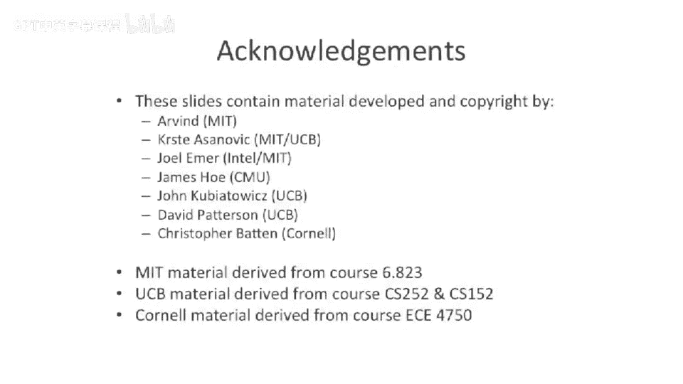

# 082：顺序一致性模型 🧠

在本节课中，我们将学习一个用于描述不同处理器间内存操作顺序的模型——顺序一致性。这是一个非常强的内存排序模型，虽然现代计算机处理器通常不实现它，但它是理解和推理并行程序的重要基础。

## 模型介绍

上一节我们讨论了多处理器系统的基本概念，本节中我们来看看一个具体的内存模型。顺序一致性模型的核心思想是：保证所有处理器上所有程序指令的执行序列，在所有处理器看来，是这些指令按程序顺序的一个有效交错序列。

**公式化描述**：假设有 N 个处理器，每个处理器上的指令序列为 `P_i: I_i1, I_i2, ...`。顺序一致性要求存在一个全局的指令执行顺序，该顺序是 `{I_11, I_12, ..., I_N1, I_N2, ...}` 的一个交错排列，并且对于任意处理器 `P_i`，其指令 `I_i1, I_i2, ...` 在该全局顺序中保持其原有的先后次序。

## 模型详解与示例

为了理解顺序一致性，我们来看一个具体的例子。假设有两个处理器（线程）T1和T2，以及四个变量X, Y, X‘, Y’。初始时，X=0，Y=10。

以下是两个线程执行的代码：
*   **线程 T1**: `store X, 1` -> `store Y, 11`
*   **线程 T2**: `load Y -> R1` -> `store R1 -> Y‘` -> `load X -> R2` -> `store R2 -> X’`

在顺序一致性模型下，允许出现多种有效的指令交错执行顺序。以下是几种可能的情况：

以下是几种有效的顺序一致性执行结果：

1.  **顺序执行 T1 后 T2**:
    *   执行顺序: `T1.store X,1` -> `T1.store Y,11` -> `T2.load Y (得11)` -> `T2.store 11 -> Y‘` -> `T2.load X (得1)` -> `T2.store 1 -> X’`
    *   最终结果: `X‘ = 1`, `Y’ = 11`

2.  **交错执行**:
    *   执行顺序: `T1.store X,1` -> `T2.load Y (得10)` -> `T2.store 10 -> Y‘` -> `T2.load X (得1)` -> `T2.store 1 -> X’` -> `T1.store Y,11`
    *   最终结果: `X‘ = 1`, `Y’ = 10`

然而，并非所有结果都是顺序一致的。例如，如果处理器内部乱序执行（例如T1先执行 `store Y,11`，再执行 `store X,1`），则可能产生非顺序一致的结果。

以下是一个非顺序一致的执行结果示例：

*   **非顺序一致执行** (T1内部指令乱序):
    *   执行顺序: `T1.store Y,11` -> `T2.load Y (得11)` -> `T2.store 11 -> Y‘` -> `T2.load X (得0)` -> `T2.store 0 -> X’` -> `T1.store X,1`
    *   最终结果: `X‘ = 0`, `Y’ = 11`
    *   这个结果 `(0, 11)` 在顺序一致性模型下是无法通过任何有效的、保持各线程内部顺序的指令交错得到的。

## 顺序一致性的挑战

为什么如此“合理”的模型却很少被实际硬件实现呢？原因主要在于性能。我们之前讨论过的所有提升性能的技术，几乎都与它冲突。

1.  **乱序执行处理器**：为了充分利用指令级并行，硬件希望重新排序加载和存储操作。顺序一致性要求严格保持每个线程内的内存操作顺序，这限制了此类优化。
2.  **缓存的存在**：在现代多核系统中，每个核心通常有自己的缓存。当一个处理器将数据存入自己的缓存时，其他处理器可能无法立即看到这个更新。为了保证全局一致的顺序视图，需要复杂的、通常代价高昂的缓存一致性协议和内存屏障机制，这会严重限制性能。

因此，顺序一致性虽然易于程序员理解和推理，但对硬件设计者而言约束太强，难以实现高性能。

## 顺序一致性与依赖关系

在单处理器中，我们通过数据依赖（如写后读 `RAW`）和控制依赖来保证指令顺序。在顺序一致性模型中，除了这些依赖，还增加了一个关键约束：

**每个内存操作都依赖于其所在线程中之前的所有内存操作。**

这意味着，在硬件或编译器看来，线程内的内存操作之间被添加了额外的“顺序弧”。即使两个操作访问不同的地址且没有数据依赖，在顺序一致性模型下，它们也不能被重新排序。这解释了为什么在之前的例子中，T1的两个存储操作 (`store X,1` 和 `store Y,11`) 不能被交换顺序。

## 总结

本节课中我们一起学习了顺序一致性内存模型。
*   它定义了多线程程序执行的一种强一致性视图：所有线程看到的执行历史是每个线程内部操作按序交错的结果。
*   它是一个**便于编程推理的模型**，但因其严格的排序要求，会**阻碍硬件进行乱序执行、缓存优化等性能提升操作**，因此**在实际的现代处理器中很少被完全实现**。
*   顺序一致性在指令间引入了超越数据依赖的**线程内内存操作顺序约束**。

认识到理想模型与现实硬件之间的差距后，在接下来的课程中，我们将探讨硬件设计者提出的各种**更弱但更高效的内存模型**，以及它们为程序员提供了哪些可用的机制来在需要时强制排序，从而在性能与程序正确性之间取得平衡。