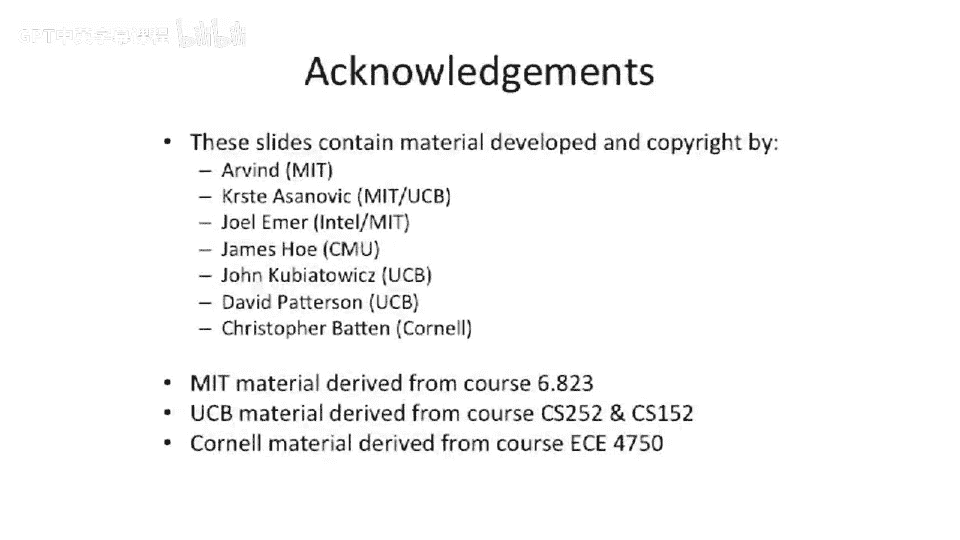

计算机体系结构：84：顺序一致性回顾

在本节课中，我们将继续探索多处理器系统，并重点回顾顺序一致性这一重要的内存模型概念。我们将理解其定义、对程序员的友好性，以及为何现代高性能处理器通常不严格实现它。

---

上一节我们讨论了多处理器系统中的并发问题。本节中，我们来看看一个关键的内存模型：顺序一致性。

顺序一致性作为一个模型，其基本含义是：系统中有多个不同的线程在执行。来自不同线程的内存访问操作可以交错执行，但所有线程必须就一个统一的执行顺序达成一致。所有线程都必须看到相同的操作顺序。并且，这些加载和存储操作的顺序，必须符合每个线程自身程序所规定的顺序。因此，你不能在一个线程内部重新排序其内存操作。

举例来说，如果有两个线程，每个线程有两个内存操作，那么存在多种有效的交错执行顺序。无效的情况是，一个线程内部的两个操作顺序被交换了。这种情况就不满足顺序一致性。

需要指出的是，我们目前讨论的处理器构建方式，并不维持这种严格的顺序。我们讨论过乱序执行处理器和乱序内存系统。从定义上讲，这些机制并不遵循顺序一致性的概念。

为了追求性能，我们有时希望移动加载操作的位置，例如将加载提前以尽早向内存系统发出请求；或者将存储操作推后，因为在结果计算完成前不希望它被过早提交。这些优化手段与严格的内存模型（如顺序一致性）是相互冲突的。

实际上，你可能找不到任何真正实现完全顺序一致性的处理器。例如，最初的共享内存处理器之一，IBM的RP3，可能拥有非常严格的内存模型，但除此之外，大多数现代处理器甚至不接近这个标准。

然而，我们仍然将顺序一致性视为一个优秀的模型，因为程序员喜欢这样思考问题。他们希望自己编写的代码按顺序执行，并且相对于其他线程上运行的代码，其执行顺序也是确定的。

总结来说，顺序一致性最终实现的效果是：它在我们之前讨论的同一处理器内加载与存储的排序约束之外，增加了额外的约束。你可以将其理解为在我们的依赖关系图中引入了额外的弧：一个线程中的每条内存指令，都依赖于该线程中所有先前的内存指令。这是一种确保不进行任何重排序的推理方式。如果你引入了所有这些依赖弧，就不会意外破坏顺序一致性。

但顺序一致性并未规定线程之间的依赖关系。也就是说，没有跨越这两个线程的依赖弧。因此，所有有效的交错执行顺序都是允许的。

---

本节课中，我们一起学习了顺序一致性的核心概念。我们了解到它是一个对程序员友好的理想化模型，保证了所有线程看到一个统一且符合程序顺序的内存操作序列。但同时，我们也认识到，为了实现更高的性能，现代处理器通常会采用更宽松的内存模型，允许一定程度的重排序，这便引入了内存一致性的复杂性。理解顺序一致性是理解更复杂内存模型的基础。