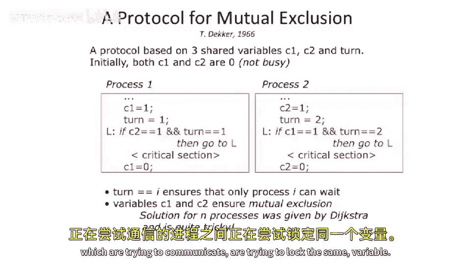
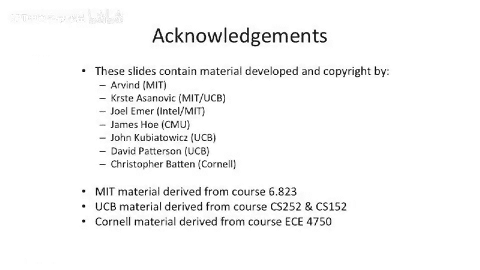

# 089：缓存一致性系统构建入门 🧠

在本节课中，我们将学习如何构建缓存一致性系统。我们将从回顾上一讲末尾讨论的互斥锁概念开始，然后过渡到构建内存一致性系统的基础协议。

上一节我们介绍了内存一致性的概念，本节中我们来看看如何构建一个能确保这种一致性的系统。

## 互斥锁回顾

在上一讲的末尾，我们讨论了互斥锁。我们提到了可以使用 `test-and-set` 这类专用操作来实现互斥，但也可以仅使用基本的加载和存储指令。我们讨论了使用 **Dekker算法**。

Dekker算法的一个关键见解是，在两个试图通信或锁定同一变量的进程之间，存在一个共享的**轮转变量**。

## 扩展到多进程互斥

接着，我们将这个概念扩展到了**多进程互斥**。这类似于去熟食店取号排队：你取一个号码票，然后店员叫到你的号码时，你才能获得服务。这就是实现多个人访问同一资源的一种方式。

然而，与熟食店墙上有一个显示号码的屏幕，或者店员负责叫号不同，在计算机系统中，我们需要以某种分布式的方式来实现这一点。

在多进程互斥中，实际完成服务（即退出临界区）的进程，负责唤醒下一个等待的进程。正如之前所说，这更复杂一些，但你仍然可以基于同样的思想，仅使用加载和存储指令来实现互斥。

本节课中我们一起学习了从互斥锁到构建缓存一致性系统的过渡，回顾了使用基本内存操作实现互斥的关键思想，为后续深入探讨缓存一致性协议奠定了基础。