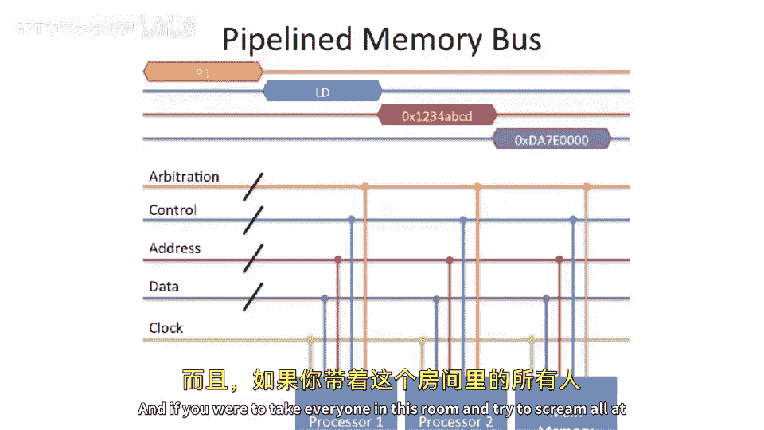

# 090：总线实现 🚌

在本节课中，我们将学习多处理器系统中，用于实现缓存一致性的不同系统类型，特别是小型对称多处理器（SMP）的总线实现方式。我们将从总线的基本概念开始，逐步深入到其物理实现细节，包括多路总线、仲裁机制以及流水线化等优化技术。

---

## 对称多处理器（SMP）概述

上一节我们介绍了缓存一致性的概念，本节中我们来看看如何实现支持缓存一致性的系统。首先，我们从**对称多处理器**开始。

为什么称之为“对称”多处理器？因为在SMP系统中，所有处理器到内存的距离都是相等的。如下图所示，处理器通过一个**共享的CPU-内存总线**连接到内存，并且所有处理器都能以相同的方式访问内存和I/O设备（如磁盘、显卡、网络控制器）。

总线只是多处理器系统的一种互联设计。另一种设计是**点对点互联**，即处理器之间直接连接，但这可能需要复杂的路由。本节课我们主要关注使用共享总线的小型对称多核系统。

---

## 多路总线及其信号

现在，让我们聚焦于这个共享总线，看看它的具体构成。下图展示了一个**多路内存总线**的示意图。

“多路”意味着它是一种共享介质，所有处理器（如处理器1、处理器2）和主内存都连接到这同一组导线上，并通过分接点接入。这种设计的优点是连接简单：处理器1要读取地址5的数据，它只需在总线上“喊出”请求，主内存听到后即可回应。

然而，其缺点是**处理器1和处理器2不能同时“喊话”**。随着处理器数量增加，这种共享总线可能成为瓶颈。我们将在后续讨论大型系统时深入这个问题。

以下是构成多路总线所需的各类信号线：

*   **时钟**：由外部驱动，用于同步总线上的所有设备。
*   **仲裁线**：用于决定在任一给定时刻，谁有权使用总线。
*   **控制线**：用于声明要执行的操作类型（例如，读或写）。
*   **地址线**：用于指定要访问的内存地址。
*   **数据线**：用于传输实际的数据。

---

## 总线仲裁机制

由于总线是共享资源，我们需要一个公平的机制来决定使用权，这就是**仲裁**。

仲裁逻辑有几种实现方式。一种是**固定优先级下拉总线**，即每个实体有一根专属请求线，采用固定优先级（例如处理器1总是优于处理器2）。但这种方式不够公平。

更常见的是**请求-授予系统**。以下是其工作流程：
1.  一个仲裁器芯片连接所有实体的请求线。
2.  在内存总线周期开始时，需要总线的实体会**置位**其请求信号。
3.  仲裁器根据内部状态（如轮询调度算法）考虑所有请求。
4.  仲裁器仅**置位**其中一个实体的授予信号，告知其赢得总线使用权。

因此，使用总线的第一步就是通过仲裁线竞争总线访问权。

---

## 总线事务与流水线优化

赢得总线后，一个完整的事务如何进行？在传统的多路总线中：
1.  处理器置位控制线（如声明“读”操作）。
2.  处理器在地址线上放置目标地址（如“地址5”）。
3.  处理器等待主内存响应。
4.  主内存将数据放到数据线上，处理器读取数据。

这种模式的缺点是，处理器必须**在整个事务期间独占总线**，从仲裁、发控制信号、发地址到等待数据返回，耗时可能很长，严重降低了总线利用率。

为了解决这个问题，设计者借鉴了CPU设计中的思想：**流水线化总线**。其核心思想是将总线的不同功能段（仲裁、控制、地址、数据）像流水线一样分开使用。

以下是流水线总线的一个示例时序：
*   **周期1**：处理器1仲裁并赢得总线。
*   **周期2**：处理器1在控制线上声明“读”操作。
*   **周期3**：处理器1在地址线上放置地址。
*   **周期4**：主内存返回数据。

流水线的好处在于，总线资源被高效复用：
*   在处理器1使用控制线的周期，另一个事务可以开始仲裁。
*   在处理器1使用地址线的周期，前一个事务的数据可能正在返回，而新的控制信号也可以发出。

这样，总线不必被单个事务长期独占，从而提升了整体带宽。

---

## 高级优化：分离事务总线

在实际中，总线设计更为复杂。一种高级优化是**分离事务总线**。

在基本流水线中，如果主内存返回数据需要多个周期，总线仍然可能被阻塞。分离事务总线将一次请求分解为完全独立的两个阶段：
1.  **请求阶段**：处理器仲裁总线，发出读请求和地址，然后立即释放总线。
2.  **响应阶段**：当数据准备好后，**主内存需要重新仲裁总线**，赢得使用权后，再次声明地址并返回数据。

这使得请求和响应完全解耦，总线在等待数据期间可以被其他事务使用，进一步提高了效率。分离事务是实现高性能共享总线系统的关键技术。

---

## 总结与展望

本节课中我们一起学习了小型对称多处理器（SMP）系统的总线实现。我们首先了解了SMP的基本结构和多路总线概念，然后详细分析了总线上的各类信号，特别是**仲裁机制**如何解决访问冲突。接着，我们探讨了**总线流水线化**和**分离事务**这两种关键优化技术，它们通过提高总线利用率来提升系统性能。

核心挑战在于，共享总线本质上是一个“同一时间只能一人发言”的媒介。虽然通过仲裁和流水线可以高效管理，但当处理器数量持续增长时，总线仍可能成为瓶颈。这引出了对更复杂互联网络（如点对点网络）的需求，我们将在后续关于大型多处理器系统的课程中讨论这些内容。