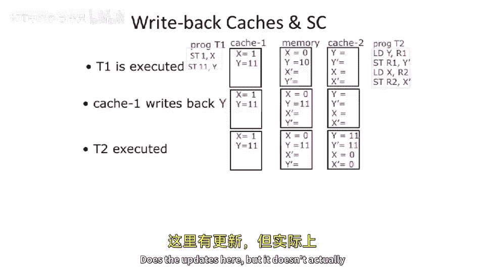
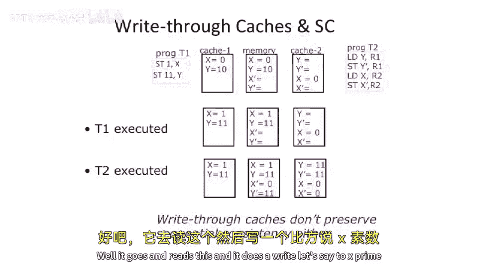
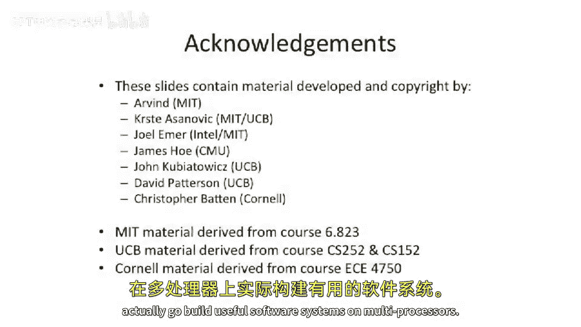

# 091：缓存一致性问题与协议概述


在本节课中，我们将探讨多处理器系统中引入缓存后带来的核心问题——缓存一致性问题。我们将分析为何简单的写回和写直达缓存策略在多核环境下会失效，并引出解决此问题的关键概念：缓存一致性协议。

## 缓存不一致性问题

上一节我们介绍了多处理器系统的基本结构。本节中，我们来看看当多个处理器拥有自己的私有缓存时，会出现什么问题。

我们以一个简单的双处理器系统为例。系统包含两个CPU（CPU1和CPU2），它们各自拥有一个私有缓存，并通过总线与主内存相连。假设内存地址A的初始值在所有缓存和主存中均为100。

### 写回缓存的问题

首先，考虑两个缓存都采用**写回**策略的情况。


1.  **CPU1更新数据**：CPU1执行写操作，将地址A的值更新为200。由于是写回缓存，这个新值200只会被写入CPU1的私有缓存中，而不会立即写回主内存。
2.  **数据不一致状态**：此时，系统中出现了三个不同的值：
    *   CPU1的缓存：`A = 200`（最新值）
    *   主内存：`A = 100`（旧值）
    *   CPU2的缓存：`A = 100`（旧值）
3.  **问题后果**：如果CPU2尝试读取地址A，它将始终从自己的缓存中得到旧值100，永远无法看到CPU1的更新。更严重的是，如果CPU2随后将地址A更新为300，系统将出现三个不同的有效值，导致程序状态完全混乱。

### 写直达缓存的问题

那么，如果采用**写直达**缓存，问题是否就解决了呢？让我们重置初始状态（所有位置A=100）并分析。

1.  **CPU1更新数据**：CPU1将地址A更新为200。由于是写直达，这个值会同时写入CPU1的缓存和主内存。
2.  **数据不一致状态**：此时：
    *   CPU1的缓存：`A = 200`
    *   主内存：`A = 200`
    *   CPU2的缓存：`A = 100`（旧值）
3.  **问题后果**：CPU2的缓存中仍然保留着旧的副本。当CPU2读取地址A时，它发现该数据已存在于自己的缓存中（缓存命中），因此会直接返回旧值100，而不会去访问已更新为200的主内存。因此，CPU2同样无法看到CPU1的更新。

**核心结论**：无论是写回还是写直达缓存，在多处理器系统中，只要存在多个私有缓存副本，就可能导致一个处理器无法看到另一个处理器对共享数据的写入，即产生**缓存不一致**问题。这破坏了多线程编程的基础，使得线程间无法可靠通信。

## 缓存不一致如何破坏顺序一致性

上一节我们看到了不一致的现象，本节我们来看看它如何具体违反我们在上节课学到的**顺序一致性**内存模型。

回顾顺序一致性的要求：任何执行结果都必须等同于某种将所有处理器操作按某种顺序交错排列的执行。

考虑以下两个线程（T1和T2）的程序，它们共享变量`x`和`y`（初始值`x=0`, `y=10`），并写入新变量`x_prime`和`y_prime`（初始值无关）。



```c
// 线程 T1
x = 1;
y = 11;

// 线程 T2
r1 = y;       // 加载y到寄存器r1
y_prime = r1; // 将r1存入y_prime
r2 = x;       // 加载x到寄存器r2
x_prime = r2; // 将r2存入x_prime
```

在顺序一致性下，不允许出现`(x_prime, y_prime) = (0, 11)`的结果。因为要得到`y_prime=11`，T2必须在T1写完`y=11`之后才读`y`；既然T1先写`x=1`后写`y=11`，那么当T2读到`y=11`时，它随后读到的`x`就不应该是0。

然而，在存在私有缓存的系统中，这个非法结果可能出现。以下是写回缓存场景下的一种可能执行序列：

1.  T1执行完毕：将`x=1`和`y=11`写入**CPU1的私有缓存**，未写回内存。此时内存中`x=0, y=10`。
2.  缓存写回Y：假设CPU1的缓存将`y`写回内存。内存变为`x=0, y=11`。
3.  T2执行完毕：T2从内存读取`y=11`，从内存读取`x=0`（因为`x`还未从CPU1缓存写回），然后计算得到`y_prime=11`, `x_prime=0`，并将它们写入CPU2的缓存。
4.  缓存写回X：CPU1的缓存将`x=1`写回内存。内存最终变为`x=1, y=11`。

最终，内存中留下了`(x_prime, y_prime) = (0, 11)`这个顺序一致性模型下**不可能出现的结果**。这表明，简单的缓存策略破坏了我们对内存行为的保证。

## 解决方案：缓存一致性协议



既然问题源于缓存间缺乏协调，那么解决方案自然就是引入一种协调机制——**缓存一致性协议**。

**缓存一致性协议**是一组由硬件实现的规则，它确保对一个内存位置的写操作，最终能被所有持有该位置副本的处理器观察到。其核心目标是维护一个**单一地址的写操作对所有处理器可见的顺序**。

重要的是，我们需要区分两个概念：
*   **内存一致性模型**：这是**对程序员可见的保证**，定义了内存操作的合法顺序和可见性规则（如顺序一致性）。它是“合同”或“规范”。
*   **缓存一致性协议**：这是**硬件的实现机制**，旨在底层维护数据副本的一致性，以支持上层的内存一致性模型。它是“引擎”。

协议本身并不直接定义顺序一致性，但它提供了必要的工具（如总线监听、目录协议）来**实现**顺序一致性或其他更宽松的模型（如完全存储定序、弱一致性）。现代多处理器通常采用宽松的内存模型以获得更高性能，同时依赖强大的缓存一致性协议在幕后工作。

## 总结

本节课中我们一起学习了：
1.  **问题根源**：在多处理器私有缓存架构中，数据的多个副本会导致一个处理器的写入对其他处理器不可见，即**缓存不一致**。
2.  **影响**：这种不一致性会直接破坏高层次的内存**顺序一致性**保证，导致程序出现违反直觉的错误结果。
3.  **核心概念**：解决此问题需要硬件实现**缓存一致性协议**，其核心职责是确保**对单个内存地址的写操作能最终传播到所有缓存副本**。
4.  **概念区分**：**内存一致性模型**是编程接口的规范，而**缓存一致性协议**是支撑该规范的底层硬件实现机制。




理解了问题和目标后，在接下来的课程中，我们将深入探讨具体的缓存一致性协议是如何设计和工作的。