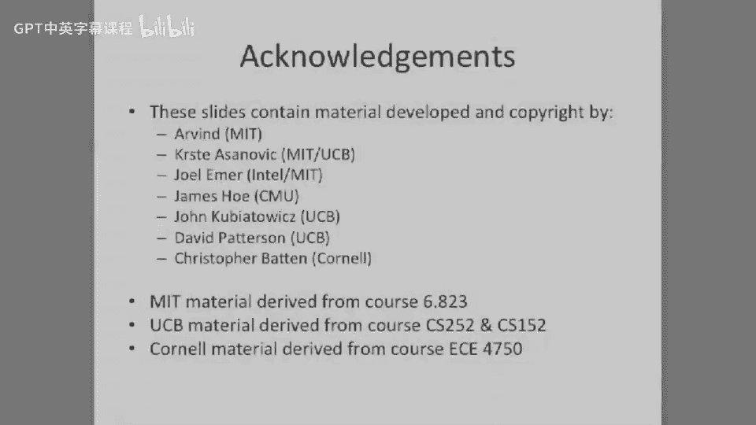

# 093：缓存一致性协议 🧠

在本节课中，我们将要学习多处理器系统中一个核心问题——缓存一致性。当多个处理器拥有自己的缓存时，如何确保它们看到的内存数据是一致的？我们将重点介绍基于侦听总线的缓存一致性协议，特别是两种主要类型：更新协议和作废协议，并深入探讨经典的MSI和MESI状态机协议。

---

## 侦听缓存与一致性概念

上一节我们介绍了多处理器系统中缓存带来的数据不一致问题。本节中我们来看看一种经典的解决方案：侦听缓存一致性协议。

这个想法由Jim Goodman和他的学生提出。其核心思想是让缓存“监视”或“侦听”总线上的所有内存事务（如DMA传输或其他处理器的读写请求），并在必要时采取正确的行动。

那么，“正确的行动”具体指什么？我们在这里故意说得有些模糊，因为存在两类主要的处理思想。但最基本的原则是：如果一个缓存看到总线上出现一个针对其内部所有地址的内存事务，它就需要采取某种行动。

这个行动可能是：至少需要告知总线上的其他实体，它拥有该数据的一个（可能）更新的副本。在本节课中，我们将探讨两种不同的协议类别来处理这个问题。

---

## 侦听缓存的实现

如果我们查看其实现，会有一个处理器和一个缓存。缓存中有什么？我们有实际存储数据的数据阵列，还有一个标签和状态阵列。标签阵列包含地址匹配逻辑和地址的高位标签；状态阵列则记录数据是否脏、是否有效，以及LRU/MRU等信息。

侦听缓存设计的洞见在于：**为标签和状态阵列增加第二个端口**。这个第二端口连接到内存总线上，必须监视总线上所有的内存事务。当它看到一个事务的地址与其缓存中已有的地址匹配时，它必须以某种方式发出信号，表明存在一个需要处理的情况。

这可能包括从其自身缓存中移除该数据，或者将数据发送到总线上，并告诉试图读取数据的其他处理器或DMA代理稍等片刻。我们将在接下来的幻灯片中详细探讨可以采取的不同行动。

但这种侦听协议的缺点是什么？每个连接到共享总线上的实体（每个处理器或每个缓存）都必须监视所有的内存事务。这意味着处理器需要能够在其无关的总线活动发生时，并发地访问自己的缓存。这就要求我们的侦听缓存标签阵列是双端口的，这使其体积更大、功耗可能更高。

---

## 共享内存多处理器与侦听缓存

现在，让我们看看配备了侦听缓存的共享内存多处理器系统。

在这个示意图中，中间有一个共享内存总线，左边有三个处理器和三个侦听缓存。现在，当处理器3试图进行一次事务时，它需要（例如）向总线广播它要读取某个地址。其他缓存需要被通知到这一点，它们必须检查自己的标签，然后采取“正确的行动”。

那么，“正确的行动”具体指什么？我们接下来将详细探讨。

我们将侦听缓存一致性协议大致分为两类：
*   **更新协议**
*   **作废协议**

区别是什么？我们试图在所有缓存之间保持数据一致，即试图消除陈旧数据。

第一类做法是尝试进行**写更新**，有时也称为**基于广播的协议**。其基本思想是：每当你在自己的缓存中进行写操作时，你也将这个写操作广播到总线上。所有在总线上侦听的实体，如果其缓存中拥有该地址的数据，就会看到这个写操作，并获取更新后的数据来更新自己的缓存副本。

这类似于我们之前看到的“写直达”情况，但现在是在总线上：当有人写数据时，所有其他缓存通过侦听特定地址和新的数据来更新自己的本地缓存。每次写操作都会更新系统中所有其他缓存的数据。

这样做的好处是：它保证了当另一个处理器试图读取（例如）地址5的数据时，它不再拥有陈旧值，因为它已经通过广播被更新了。

第二类做法，也是当今更常见的，称为**作废协议**或**写无效协议**。在写无效协议中，每当你进行一次写操作时，你会**使该数据在所有其他缓存中的副本无效**。通过使所有其他副本无效，你实际上消除了存在陈旧数据的可能性。

---

## 更新协议与作废协议详析

首先，我们来看基于写更新的协议或基于广播的协议。我们将考察两种情况：缓存写缺失和缓存读缺失。

**写缺失**：如果你在缓存中写缺失，你告诉系统中的所有其他实体你正在进行写操作，所有其他侦听总线的处理器会就地更新它们的副本。你广播“我要写地址5”，其他拥有地址5的缓存会内部更新其副本。这听起来不错，但需要大量带宽，因为你基本上向所有人广播了写操作。

**读缺失**：你知道主内存总是最新的，因为你被迫以写直达方式更新了主存。所以在读缺失时，你只需去主内存读取，甚至不需要检查其他缓存。

**读命中**：数据在你的缓存中，并且你知道数据是最新的，所以无需担心。

现在，让我们看看**写无效协议**。在写缺失和读缺失时会发生什么？

**写缺失**：在基于作废的协议中，在进行写操作之前，你实际上需要**使所有其他拥有该地址的缓存副本无效**。这是如何工作的？在共享的多主设备总线上，你宣告“我要写地址5”。所有其他拥有侦听缓存的实体都会听到，并使其缓存中的数据无效，将其从缓存中移除。通过移除，它们就不再可能拥有陈旧值。不过这里需要指出一点：当你进行作废时，你可能需要先将数据写回主内存。例如，如果一个写回缓存中有一个脏数据块（比如地址5），然后处理器1试图写这个数据，那么在某个时刻，你需要合并缓存行中的数据。处理器2可能必须去作废，但至少它知道必须进行这个作废操作，并且必须在处理器1进行写操作之前完成。我们可以在侦听共享总线上完成这一切。

**读缺失**：如果没有其他人拥有该副本，这很简单。你在总线上宣告“有人有地址5吗？”，如果没人回应，说明没有其他缓存拥有该数据。反之，如果有人拥有该数据的脏副本，他们需要将其写回主内存，而你需要读取那个最新的副本。因此，他们需要刷新数据，并根据缓存一致性协议可能还需要使数据无效。

在继续之前，我还想指出写无效协议与写更新（广播）协议各自的适用场景。

今天你看到的大多数处理器都使用某种作废协议。通常，这些协议效果更好，因为总线上的带宽需求更少，因为你只需要在发生缓存写缺失或读缺失时才需要在总线上通信。

相反，更新协议基本上必须广播所有的更新。但更新协议在**多读单写**的场景下实际上更胜一筹。假设有五个处理器通过内存读取一个处理器的输出，即存在某种生产者-消费者关系。在更新协议中，那个处理器只需写入，它就会广播并将数据推送给那五个试图读取的处理器。在作废协议中，每次读写时，你基本上都必须让作废操作来回折腾数据，因此在单写多读的情况下，作废协议的总线通信量可能反而更大。

但在今天的剩余时间里，我们将专注于基于侦听总线的作废协议。

---

## MSI协议：基础状态机

那么，让我们看看为了实现写无效协议，需要在缓存中添加哪些额外信息。

我们将看一个基础案例，称为 **MSI协议**。这是你将看到的最基础的协议之一。这里添加了一些额外的位。让我们看看标签信息：你有一个处理器标签，通常你有一个有效位。我们讨论过在类似处理器的缓存中拥有有效位或脏位。每个缓存行都有这些信息。我们将使用这两个位来编码一个状态机中的状态，而不是使用一个有效位和一个脏位。

我们有两个位，所以可以编码四种状态。我们实际上可以只用两个位编码三种状态。我们将看一个协议，根据状态名称，我们称之为MSI协议。我们有：
*   **M**：已修改
*   **S**：共享
*   **I**：无效

我们说无效状态基本上表示数据是否有效。如果你处于无效状态，数据无效。如果你处于其他任何状态，数据在你的缓存中是有效的。

但现在，我们不再仅仅有一个指示数据在你的缓存中是否脏的脏位，而是拥有另外两个状态：已修改和共享。我们将看到，通过添加这些状态，我们可以保证一定程度的缓存一致性，我们将在此基础上实现一个缓存一致性协议。并且，通过记住数据是被广泛共享还是我们拥有唯一副本，我们可以减少总线上的通信。

这三个状态是什么？
*   **I（无效）**：不言自明。你缓存中的数据无效。不允许读取。如果你尝试访问一个状态位被设置为无效的数据，你将发生缓存缺失，并且必须转换到其他两个状态之一。
*   **M（已修改）**：意味着缓存中的数据相对于主内存中的数据已被修改。这是脏数据。
*   **S（共享）**：意味着你拥有数据的只读副本，并且其他人也可能拥有该数据的只读副本，因此称为“共享”。当我们处于共享状态时，不允许进行写操作。

关于这一点需要指出的是：每个缓存中的每个缓存行都有自己的状态机。不同的缓存拥有自己独立的状态信息副本。状态信息只与那个特定的缓存或处理器相关。我们在这里构建的状态图只与处理器1相关。我们将看到，因为它是侦听缓存，你可能处于某个状态，然后看到总线上的一个事务，你可能必须采取一些行动来保持内存一致性。

让我们逐步讲解这个基本状态图。完成后，我们将看到，当我们实现类似这样的协议时，数据将保持一致。

我们的第一个状态转换是什么？假设我们有一个**读缺失**。我们处于无效状态，然后进行读操作。这里从无效状态出发（我没有画成循环，否则图会太复杂）。你发生读缺失，你向总线宣告：“我想读取某个地址”。处理器1向总线宣告它想读取一个地址。总线上会发生一些事情，其他处理器可能必须进行状态转换，但最终，你将从主内存获取数据或缓存行，并进入共享状态。现在你有了一个只读副本。你可以随意从缓存中读取它，之后无需再在总线上通信，因为你只需发生缓存命中。

但是，如果你需要进行写操作，事情就变得复杂一些。让我们看看这种情况：你拥有处于共享状态的数据，但其他某个处理器试图进行读取。他们向总线宣告：“我想读取处于共享状态的地址”。如果我们查看状态图，这是可以的。我们处于共享状态，我们可以拥有一个只读副本，其他人也可以同时拥有一个只读副本。所以我们只是从S状态保持到S状态。当其他人（其他处理器）读取数据时，我们无需做任何事情。

现在，假设我们处于共享状态，但其他某个处理器向总线宣告：“我打算进行写操作。我想写你缓存中处于共享状态的地址”。我们说过，陈旧数据会导致数据不一致，而这正是我们试图防止的。所以，如果你看到其他处理器试图进行写操作，你只需从缓存中丢弃该数据。因为你只拥有一个只读副本，你不需要将其写回，甚至不需要告诉任何人。你只需要保证当他们说“我想写”时，你从S状态转换到I状态。不过，这意味着如果处理器1将来想读取该数据，它将不得不再次获取一个副本，因为它拥有的副本现在无效了。

假设你拥有处于共享状态的数据，但现在你想对该数据进行写操作。当它处于共享状态时，你能进行写操作吗？不能。为什么？因为其他人可能拥有它的副本。你处于共享状态，这意味着它是共享的，其他人可能拥有该数据的陈旧副本。所以，当你进行写操作时，在转换状态之前，你需要广播你打算写入该行的意图。处理器1必须向侦听总线广播它想写入该行。它说“我想写”，但在转换之前，它需要等待或给予所有其他处理器时间来使数据无效并可能将其写回主内存。

不同的处理器以不同的方式实现这一点。有些处理器只是等待一段特定的时间作为等待期。你广播说“我打算写，但我要等到未来某个时间点才写”，这给了其他处理器足够的时间来侦听该事务、使数据无效，并在必要时将其写回主内存。假设其他所有人都只拥有数据的只读副本，他们需要从S状态转换到I状态。

这里需要指出的是，系统中不同的缓存不必同时拥有相同状态的数据。这是每个缓存的状态。当你有写意图时，你广播这个信息，其他所有人都必须使其缓存中的数据无效。所以，无论他们处于S状态还是M状态，他们都需要以某种方式转换到I状态。只有在那之后，你才能转换到M状态并实际进行写操作。

我说过，除了等待期，还有其他方法可以做到这一点。人们可能做的一件事是：广播他们的写意图，但不实际进行写操作，而是等待所有其他缓存以某种方式发回确认。这在功能上是相同的。你可以等待，并确信你等待了足够长的时间；或者你可以等到每个人都回应说“好的，我完成了”。

那么，这个已修改状态能给你带来什么？如果你处于已修改状态，你可以读写数据。假设处理器1进行读或写操作，你只需保持在已修改状态，可以进行任意多次读写，并且永远不需要在总线上通信。你拥有唯一的副本，你可以读写它。你保证没有其他人拥有副本。

假设你处于M状态，其他某个处理器广播其写意图。你处于已修改状态，你拥有脏数据，你已经对该数据进行了写操作，主内存中的数据是过时的。你能做的最基本的事情是：使你的副本无效，并将该副本交还给主内存（或将数据写回主内存）。然后，其他处理器将从主内存读取该数据，并将其拉入他们的已修改状态。所以你将从M转换到I，而他们将（假设）从I转换到M。

这个图中还有一个状态转换。如果你处于已修改状态，其他某个处理器试图进行读取（或通过总线广播读取意图），会发生什么？这里的好处是，你实际上不必转换到无效状态。原因是你拥有数据的最新副本。他们需要看到数据的最新副本，这样他们就不会得到陈旧数据，而你也没有任何陈旧数据。但是，你不必转换到无效状态。如果你将来想读取，你可能会尝试转换到这个状态，但这将要求你实际再次拉入数据。相反，在MSI协议中，如果另一个处理器试图进行读取，你首先进行写回。在你完成写回后，你转换到共享状态，而他们以只读副本的形式拉入数据，你也拥有一个只读副本。所以你们都将转换到共享状态。

让我们更详细地看看这个。哦，对不起，我漏掉了一个状态转换：**写缺失**。如果你处于无效状态，并且你想写一行。我们没有画这个转换，但有一个从无效状态直接到这里的转换。在这个写缺失时，你广播你的写意图，你必须等待所有人完成作废并可能写回主内存。在基本情况下，你从主内存拉入数据，并进入已修改状态。

---

## 双处理器示例演练

现在，让我们看一个基本的双处理器示例，逐步执行一系列读写操作，观察发生的一切。

我们在顶部有处理器1，在底部有处理器2。我们将逐步执行不同的状态转换，因为处理器1进行读取，处理器2进行读取，处理器1进行写入，处理器2进行写入。

假设发生的第一件事是处理器1进行读取。这都是针对同一个地址，或同一个缓存行，或同一个缓存行内的所有地址。处理器1进行读取。我们假设所有缓存中的所有数据初始都是无效的。通常当你重置计算机系统时，所有人的缓存都是无效的。它们怎么可能不是呢？所以你将发生读缺失。它将访问主内存，并将数据带入处理器1的共享状态。处理器2目前将使该数据保持无效。

现在，处理器1进行写入。它广播写意图。处理器2没有这个数据，系统中也没有其他人有这个数据。所以没有人在总线上回应说“我有数据，请等待”。因此，处理器1直接转换到已修改状态。在这种情况下，它甚至拥有最新的数据，所以它甚至可能不需要访问主内存。

然后，处理器1可以在此之后进行读写操作。现在，处理器2进行读取。处理器2发生读缺失。现在我们将看到两个不同的状态转换发生：处理器1将进行状态转换，处理器2也将进行状态转换。处理器2目前处于无效状态，它将在读缺失时转换到共享状态。同时，因为处理器1拥有处于已修改状态的数据，它必须写回数据并转换到共享状态。所以现在这两个处理器都处于共享状态。它们都拥有只读副本，并且数据的最新副本已经被推送到主内存或写回主内存。

现在，假设处理器2进行写入。它处于共享状态，处理器1也处于共享状态。当你进行这个写操作时，我们将看到从处理器2发出的写意图。这实际上将导致处理器1从共享状态转换到无效状态。这有点奇怪：处理器2在做某事，但它导致处理器1的状态机转换。这是因为它们在共享总线上：处理器2宣告“我很快要写”。处理器1看到这个，并进行转换。一旦你知道处理器1完成了这个转换，处理器2现在可以转换到已修改状态，并实际继续对该行进行读写。

假设处理器1想读取这一行。这一行正承受大量访问流量。处理器2刚刚写了它，它处于已修改状态。处理器1处于无效状态。突然，将要发生的是：它将试图转换到共享状态。但这个已修改状态会导致问题。所以我们必须等待写回发生（从已修改到共享）。它将使该数据无效，然后最终，处理器1将能够将其带入共享状态。

假设处理器1现在进行读取。它处于共享状态，处理器2也处于共享状态。我们看到从处理器1发出的写意图。所以处理器2将从共享转换到无效。只有在那之后，你才被允许从共享转换到已修改。

最后，假设处理器2试图进行一次写入来结束这一切。我们让处理器1处于已修改状态，处理器2处于无效状态，它将试图走这条路。同时，处理器1将不得不以某种方式使该数据无效。所以我们看到写尝试发生。将要发生的是：当它看到写意图时，处理器1必须从已修改转换到无效并写回数据。只有在那之后，写缺失才能发生，处理器2才能将其带入已修改状态。

最后，处理器1可以尝试进行一次写入。我们这样做是为了完成这个图中的最后一个状态转换。处理器1试图写入这个地址。它处于无效状态，处理器2处于已修改状态。你将看到它广播写意图。当它进行这个广播时，它需要从已修改转换到无效并写回数据，然后处理器1才能拉入后台数据并可以对该行进行写入。

这里有一点观察：我们已经走过了基本的MSI协议。但这里的一个核心思想是：**如果一个缓存行在一个缓存中处于已修改状态，那么该数据只能有一个副本**。这是允许基于MSI侦听的作废协议工作的重要不变量。这保证了内存的一致性，因为可写数据在任何地方都只有一个副本。如果你仔细研究这个案例（我建议你更仔细地研究一下），你会看到可能有多个处理器或多个处理器缓存处于共享状态并共享数据，但这些都只是只读副本。所以它们可以读取它。但当有人试图进行写操作时，你首先使所有共享副本无效，然后才能进行写操作。如果其他人试图去读取数据，你需要从已修改状态转换到共享状态。为什么我们要这样做？为什么我们不能让一个人处于已修改状态，而另一个人处于共享状态？这是因为，由于处于已修改状态，该处理器可以继续进行更多的写操作。如果你继续进行更多的写操作，那个以只读状态拉入数据的缓存将无法看到这些更新。因此，我们保证整个系统的不变量是：**如果一个缓存行处于已修改状态，那么没有其他缓存拥有该数据的副本**。这非常重要。

---

## MESI协议：增强与优化

现在，让我们尝试增强这个MSI协议。为什么我们想增强MSI协议？正如你可能想象的那样，MSI协议实际上需要相对频繁地在总线上通信。我们将看几种减少总线上通信流量的方案。这样，你可以拥有一个时钟速度更慢的总线，或者在考虑实现更好的基于作废的协议时，可以在总线上连接更多的处理器。

我们要看的第一个增强协议叫做 **MESI**，有时人们称之为伊利诺伊协议，因为它来自伊利诺伊大学和Jane Patel的研究小组。这可以追溯到1984年。实际上有**4个状态**。我们使用两个状态位来实现三个状态，但2的2次方是4，所以我们可以用同样数量的位实现四个状态，而不是三个状态。问题是，你想添加什么状态？仅仅因为你有四个状态并不意味着你的协议会更好。

我们将有一个无效状态、一个共享状态。这些看起来和之前类似。现在，我们将有一个称为**独占**状态的新状态，或“独占但未修改”。这与已修改状态非常相似。实际上，这里的洞见是：我们将从MSI的状态图中取出已修改状态，并将其拆分为两个状态：**M（已修改）** 和 **E（独占）**。

我们为什么要这样做？我们将看到，在处理器读取一个数据块，然后没有其他人读取或写入该数据，之后同一个处理器再去写入该数据的情况下，我们能够减少总线上的通信。如果你看MSI，当你进行读取时，你总是将其带入共享状态。在MESI协议中，当你进行读取，但没有其他人拥有副本时，你将直接将其带入独占状态。这允许你从独占状态升级到已修改状态，而无需在总线上通信。这与MSI协议有重要区别。因为在MSI协议中，如果你有处于共享状态的数据并想写入它，你需要广播你的写意图，每个人都需要发生侦听事务。但在MESI协议中，你不需要那额外的工作。你知道你拥有数据的独占只读副本。所以当你要进行写操作时，你可以直接进行写入。我们现在将逐步讲解这个状态图，它看起来与MSI协议非常相似。这个图中的所有状态转换都是相对于处理器1的。就像我之前说的，不同的处理器可以使同一个缓存行处于不同的状态。

让我们看看这个状态图。

**步骤1**：你进行读取，发生读缺失。注意，我在这里有一个小注释。这是从无效状态在发生读缺失时出发。我们将看到从无效状态在发生读缺失时有两个转换路径：一个进入共享状态，另一个实际上甚至进入独占状态。这意味着什么？在读缺失时，处理器1将向总线宣告：“我想读取”。在总线上，如果有人回应说“我有一个只读副本”或“我拥有该数据的副本”，那么你将转换到这里的共享状态，因为你不想使其他缓存的数据无效。这与另一种情况形成对比：如果你尝试读缺失，但目前没有其他人拥有副本。因为如果没有其他人拥有副本，我们将直接转换到这个独占状态。

假设其他某个处理器尝试进行读取，而你拥有处于共享状态的数据。你只需保持在共享状态。但你可能需要回应说“是的，我拥有该数据的副本”。这很重要，这样其他处理器在进行读取时才知道是进入共享状态还是独占状态。

假设你处于共享状态，并且你想对这个数据块进行写入。这看起来与MSI协议中发生的事情完全相同。你尝试写入，必须广播你的写意图，必须给每个人机会回应说他们拥有副本，并且他们必须使其副本无效并将其写回主内存。然后在那之后，你转换到已修改状态，现在你可以进行你的写入。就像之前一样，如果你处于已修改状态，你可以对该行进行读写，并保持在已修改状态。

最后，现在我们来到这个有趣的情况：你将进行读缺失。但是，数据没有在其他缓存中共享或已经存在于别人的缓存中。你发生读缺失，你处于无效状态，你来到这里，但数据没有在任何地方共享。这意味着什么？你在这里发生读缺失，你可以进入独占状态。这有什么好处？你拥有系统中唯一的可读副本。这之所以有用，是因为如果你尝试进行写入，你不再需要在总线上通信。所以你处于独占状态，假设处理器1尝试进行读取，这没问题，你保持在这里。现在，与之前类似，独占状态在功能上看起来与共享状态非常相似。你只拥有该数据的可读副本。如果你尝试进行写入，你需要做点什么。但这里是最大的区别：当你进行这个写入时，你不需要告诉任何人。就其他人而言，你拥有一个独占副本，现在你拥有一个已修改副本，你只需转换你的状态图。你将状态位转换到已修改状态并进行写入。所以你转换然后进行写入。这很好，正如我所说，你不需要在总线上通信来进行这个转换，而在MSI协议中，如果你只有共享状态，你需要首先广播你的写意图，这会占用总线带宽和时间，然后你才能进行转换。因此，这试图在这种特定情况下为我们节省开销。

让我们填充这里的其余状态转换。其余的状态转换看起来有些相似，除了当我们从独占状态出发时。你会明白为什么。

从无效状态出发的写缺失情况看起来与MSI相同。你在这里发生写缺失，你将广播你的写意图，等待所有人写回所有数据并使其无效，然后你进入已修改状态。

现在，这里有一个更有趣的状态转换：假设处理器1拥有处于独占状态的数据，然后其他某个处理器想要进行读取。处理器1需要说“我拥有该数据的副本”。所以当其他处理器尝试读取时，它不能进入独占状态。相反，它将通过这个路径，带着一些共享数据进入共享状态。但同时，处理器1需要从独占状态转换到共享状态。为什么？如果其他处理器拥有处于共享状态的数据，而你保持在独占状态，你可能会尝试对该数据进行写入，而其他人拥有该数据的只读副本，这会导致数据不同步，出现陈旧值。所以你需要以某种方式解决这个问题。我们解决这个问题的方法是：当其他人尝试读取数据时（另一个处理器尝试读取），我们从独占转换到共享，而其他处理器将数据作为共享副本拉入其缓存。

让我们完成这里的其余状态转换。这与我们之前在这里看到的类似。如果你处于共享状态，你看到其他处理器对你拥有的行发出写意图穿过总线，你只需使其无效。幸运的是，你不需要在这里写回任何东西，因为你只拥有只读副本。

独占状态的类似情况：你处于独占状态，你只拥有只读副本。你知道你拥有系统中唯一的副本。但如果其他某个处理器尝试进行写入，你需要进行作废。

我们还有几个状态转换。已修改状态，这与我们之前看到的类似。如果你处于已修改状态，另一个处理器尝试进行读取，你转换到共享状态。现在，你必须写回数据。但你会注意到，在这种情况下你不能转换到独占状态。事实上，进入独占状态的唯一入口点，就是这里的读缺失情况，当数据尚未在其他缓存中共享或存在时。所以，当另一个处理器尝试进行读取时，你必须写回数据，你转换到共享状态。但这与我们在MSI协议中所做的相同。

另外几件事：其他处理器尝试进行写入，你将看到他们广播的写意图。如果你处于已修改状态，你显然需要使其无效，因为只有一个缓存可以拥有脏数据。所以你看到它，你写回并转换到无效状态。这就是这个协议的全部内容。

现在我们有什么不变量？在MSI协议中，我们说对于一个特定的缓存行，在任何时候只能有一个缓存处于已修改状态。这里有什么类似的东西吗？是的，但有点不同，因为我们把已修改状态分成了两个。这里有一个类似的不变量，只是现在我们说：**一个给定的缓存行在任何时候只能在一个缓存中处于已修改或独占状态**。这保证了我们永远不会拥有陈旧数据，并保证我们拥有一个有用的缓存一致性协议。

---

## 总结与展望

在本节课中，我们一起学习了多处理器系统中的缓存一致性问题及其核心解决方案——侦听缓存一致性协议。我们首先理解了为什么需要一致性协议，然后探讨了两种主要类型：更新协议和作废协议，并分析了各自的优缺点。接着，我们深入研究了基础的MSI协议，通过状态机模型详细说明了缓存行在无效、共享和已修改三种状态间的转换规则，并通过双处理器示例进行了演练。最后，我们介绍了增强的MESI协议，它通过引入独占状态，减少了在单处理器读写场景下的总线通信开销，从而提升了性能。

下节课，我们将扩展这个话题，讨论一些其他的缓存一致性协议。我们将要讨论的是最初在AMD Opteron处理器中使用的协议，他们实际上有更多的状态，添加了一个称为O状态的状态，从MESI变成了MOESI。这个O状态是一种优化，允许进行缓存到缓存的传输，并有效跟踪谁拥有最新的写入数据，而不是总是必须将所有内容写出到主内存并进行基于内存的传输。我们还将简要讨论MESIF，这是某些Intel处理器中使用的东西，他们还将共享状态拆分到MESI之外的另一状态。

本节课就到这里。