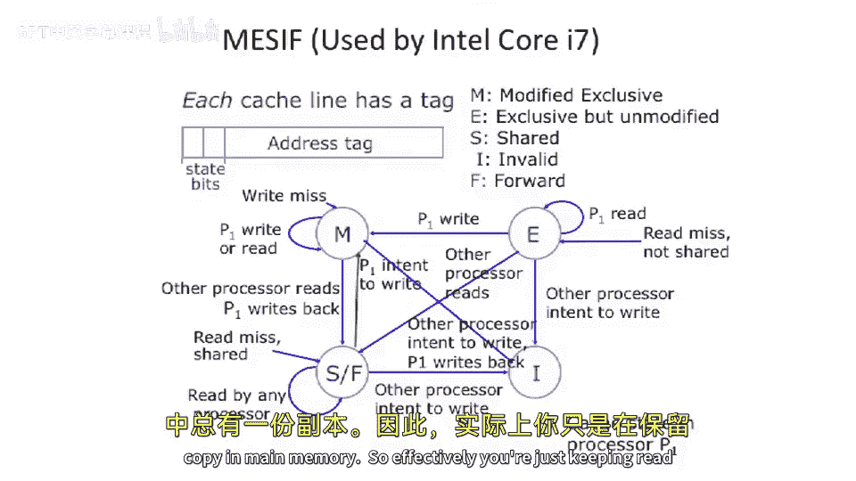

# 094：更多缓存一致性协议 🧠


在本节课中，我们将继续计算机体系结构的探索，深入讨论并行计算机架构。我们将重点介绍两种常见的缓存一致性协议增强方案：MOESI协议和MESIF协议，并探讨在扩展多处理器系统时面临的挑战，例如总线带宽限制和伪共享问题。

上一节我们介绍了缓存一致性的基本概念，并与内存一致性模型进行了区分。我们详细讲解了MESI协议（也称为伊利诺伊协议），它将MSI协议中的共享状态拆分成了共享和独占两种状态。本节中，我们将在此基础上，看看如何通过增加更多状态来进一步优化协议性能。

## MOESI协议：增加“拥有”状态

MOESI协议在MESI的基础上增加了一个“拥有”状态。其核心思想是优化数据在缓存间的传输，避免不必要的主内存回写。

以下是MOESI协议的状态转换图：

```
状态：修改(M) -> 拥有(O) -> 共享(S) -> 无效(I) -> 独占(E)
```

**核心优化**：当一个处理器（P1）的缓存行处于修改状态，而另一个处理器（P2）需要读取该数据时，P1可以直接将数据通过总线传输给P2，而无需先写回主内存。传输后，P1的缓存行状态从`修改(M)`变为`拥有(O)`，P2则获得一个`共享(S)`状态的只读副本。

处于`拥有(O)`状态的处理器负责跟踪该数据是“脏”的（即与主内存不一致）。当该行最终被替换出缓存时，拥有者必须将其写回主内存以更新数据。

如果拥有者（P1）想要写入该数据，它必须首先通过总线发送“写意图”消息，使所有其他持有共享副本的处理器将其缓存行置为`无效(I)`。之后，P1才能将状态从`拥有(O)`升级为`修改(M)`并进行写入。

这种优化减少了总线对主内存的带宽需求，允许脏数据在缓存之间直接传递。

## MESIF协议：增加“转发”状态

MESIF协议是另一种优化，被用于Intel Core i7等现代处理器中。它在MESI的基础上增加了一个`转发(F)`状态。



**核心优化**：当广泛共享的数据被首次读取时，第一个将其带入缓存的处理器会被“选举”为转发节点，该缓存行进入`转发(F)`状态。之后，当其他处理器需要该数据的只读副本时，拥有`转发(F)`状态的缓存可以直接提供数据，而无需访问主内存。

这同样降低了主内存的带宽压力。一个关键的设计选择是：当转发节点使其缓存行无效时，后续的请求将不得不重新从主内存获取数据，因为主内存中始终保存着一份正确的副本。

## 扩展性的挑战与伪共享

在讨论了协议优化后，我们来看看将这种基于总线侦听的系统扩展到大量处理器时所面临的挑战。


### 总线带宽与占用率限制

为什么我们不能简单地将1000个处理器连接到一个总线上？原因类似于一个房间里1000个人同时试图喊话。
*   **带宽问题**：总线的通信带宽是有限的。
*   **占用率问题**：为了保证缓存一致性协议的正确性，总线事务必须是原子的（即串行执行）。随着处理器数量增加，总线会变得过载，即使增加总线宽度（带宽）也无法解决串行化带来的延迟问题。

### 伪共享问题

缓存以块（如64字节）为单位管理数据。伪共享发生在以下情况：两个处理器频繁访问并修改**同一缓存行中不同且独立的数据项**。


**示例**：假设缓存行包含两个4字节整数A和B。处理器P1频繁修改A，处理器P2频繁修改B。尽管A和B在逻辑上不共享，但由于它们位于同一缓存行，当P1修改A导致该行状态变为`修改(M)`时，P2中该行的副本会被置为`无效(I)`。当P2需要访问B时，它必须重新从P1或主内存获取整个缓存行，即使B本身并未被P1修改。这种不必要的缓存行“弹跳”会严重损害性能。

**解决方案**：
1.  **程序员或编译器优化**：识别出可能被频繁独立修改的变量（如锁），并通过填充字节确保它们各自独占一个缓存行。
2.  **数据结构布局**：对于像锁数组这样的结构，将每个锁放在不同的缓存行上，以避免对单一缓存行的争用。


本节课中我们一起学习了MOESI和MESIF这两种增强型缓存一致性协议，理解了它们如何通过增加状态来优化数据共享和减少内存带宽消耗。我们还探讨了多处理器系统扩展时在总线带宽和伪共享方面面临的挑战，并了解了相应的解决思路。这些知识是构建高效并行计算系统的基础。