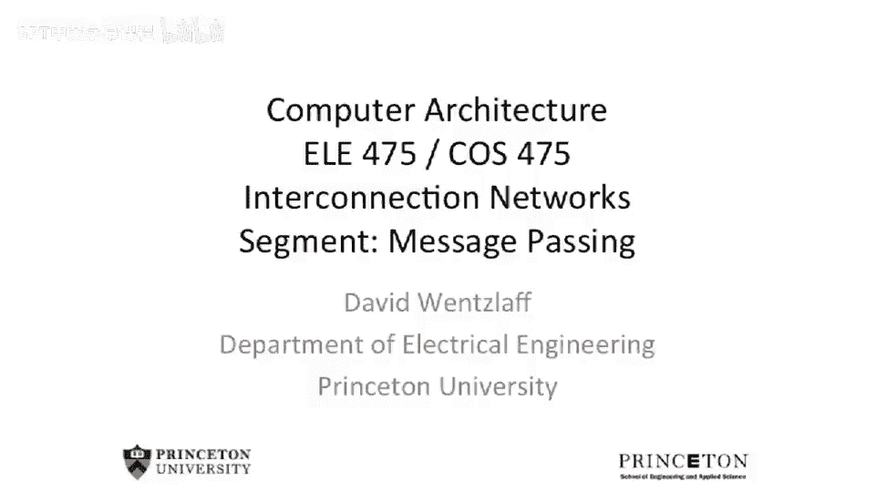
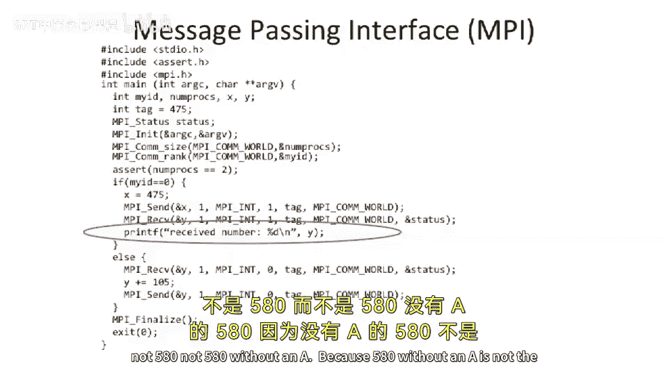
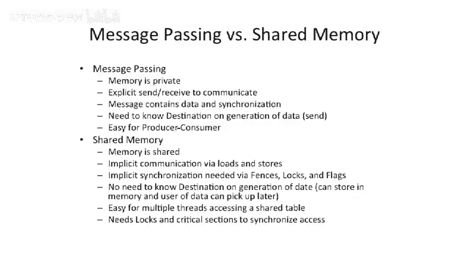
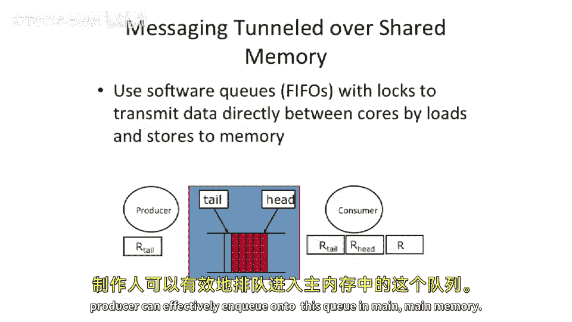
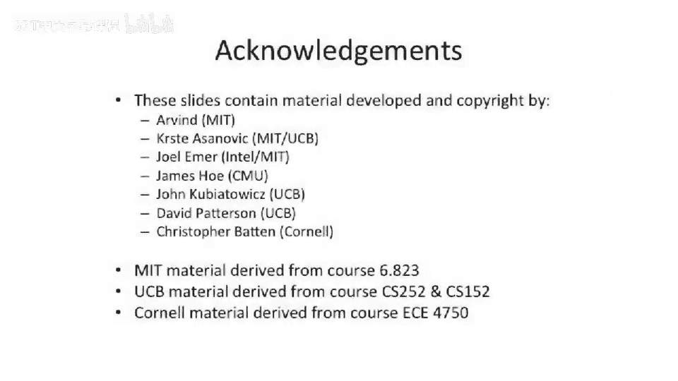

# 096：消息传递编程模型



在本节课中，我们将要学习一种与共享内存不同的并行编程模型——显式消息传递。我们将探讨其基本概念、编程接口，并通过一个MPI代码示例来理解其工作原理。最后，我们将对比消息传递与共享内存这两种模型的特点和适用场景。

## 消息传递与共享内存的对比

上一节我们介绍了共享内存架构，它通过向共享地址写入和读取数据来实现核心间的通信。本节中我们来看看另一种范式：显式消息传递。


在共享内存模型中，发送数据的核心（执行存储操作）无需知道未来哪个核心会读取该数据，甚至可能没有核心会去读取。通信通过内存地址隐式命名，并通过锁等机制保证因果性。

相比之下，显式消息传递作为一种编程模型，要求发送方明确指定接收方。我们将讨论一个基本的应用程序接口（API）。

以下是消息传递API的核心操作：
*   **发送（Send）**：指定目的地（`destination`）并传递指向某些数据的指针（`*data`）。API负责将数据送达接收方。
*   **接收（Receive）**：接收数据。最基本的接收操作不指定来源，只是按顺序接收下一个到达的数据。也可以扩展为指定来源（`source`）或使用标签（`tag`）来标识消息流。

消息传递接口（MPI）是此类编程模型中最常见的实现，它使用标签来区分不同的通信流。

## 消息传递的类型

基于发送方和接收方的数量关系，消息传递可以分为几种类型。

以下是常见的消息传递类型：
*   **单播（Unicast）**：一对一通信。发送方指定一个目的地。
*   **多播（Multicast）**：一对多通信。发送方指定一个目的地集合。
*   **广播（Broadcast）**：一对所有通信。发送方将消息发送给系统中的所有其他节点、进程或线程。

## MPI编程示例

现在，我们通过一个具体的MPI代码示例，来看看消息传递在实际中是如何工作的。



MPI采用单程序多数据（SPMD）编程模型。这意味着相同的程序会在多个核心或进程上启动，每个实例根据其唯一的ID（称为“秩”）执行不同的代码分支。

以下是一个简单的MPI程序，演示了两个进程如何通信：
```c
#include <mpi.h>
#include <assert.h>
#include <stdio.h>

int main() {
    int my_id, num_procs;
    MPI_Init(NULL, NULL);
    MPI_Comm_size(MPI_COMM_WORLD, &num_procs);
    MPI_Comm_rank(MPI_COMM_WORLD, &my_id);

    assert(num_procs == 2); // 确保正好在两个进程上运行

    if (my_id == 0) {
        // 进程0的代码
        int x = 475;
        MPI_Send(&x, 1, MPI_INT, 1, 475, MPI_COMM_WORLD); // 发送数据到进程1
        int received_num;
        MPI_Recv(&received_num, 1, MPI_INT, 1, 475, MPI_COMM_WORLD, MPI_STATUS_IGNORE); // 从进程1接收数据
        printf("Received number %d\n", received_num);
    } else {
        // 进程1的代码
        int y;
        MPI_Recv(&y, 1, MPI_INT, 0, 475, MPI_COMM_WORLD, MPI_STATUS_IGNORE); // 从进程0接收数据
        y += 105; // 进行计算
        MPI_Send(&y, 1, MPI_INT, 0, 475, MPI_COMM_WORLD); // 将结果发送回进程0
    }

    MPI_Finalize();
    return 0;
}
```
在这个程序中，进程0首先将整数475发送给进程1。进程1接收到数据后，将其增加105，得到580，然后将结果发送回进程0。进程0最终打印出接收到的数字580。这个例子展示了消息传递如何同时完成**数据传输**和**进程间同步**。

## 消息传递的实现方式

消息传递作为一种编程模型，可以通过多种硬件和软件方式实现。

以下是几种常见的MPI实现方式：
*   **专用硬件网络**：在超级计算机等大规模并行系统中，通常有专用的网络硬件直接支持MPI操作，在用户空间实现高效通信。
*   **共享内存隧道**：在共享内存机器上，MPI可以通过在内存中复制数据到特定区域，接收方再从该区域读取来实现，这通常比通用的共享内存程序性能更好。
*   **操作系统网络套接字**：在普通计算机集群上，MPI库可以通过调用操作系统API（如TCP/IP套接字）来实现进程间通信。



## 消息传递与共享内存的深入比较

我们已经看到了两种模型的基本操作，现在来系统性地比较它们的特性。

以下是消息传递与共享内存的关键区别：
*   **内存模型**：消息传递中，内存通常是每个节点/进程私有的。共享内存中，内存是全局共享的。
*   **通信方式**：消息传递通过显式的`发送/接收`原语进行。共享内存通过隐式的`加载/存储`指令进行。
*   **同步机制**：消息传递中，接收操作本身隐含了同步，确保了生产者-消费者关系。共享内存中，必须使用锁、栅栏等机制进行显式同步，否则会出现竞态条件。
*   **编程范式**：消息传递天然适合**生产者-消费者**模式的计算，可以建立明确的通信通道。共享内存则更容易处理**大型共享数据结构**（如共享表），多个处理器可以方便地对其不同部分进行操作。

## 两种模型的相互实现


一个重要的结论是，消息传递和共享内存这两种模型在功能上是等价的，可以相互实现。

*   **在消息传递上实现共享内存**：可以通过软件将所有的加载/存储指令转换为发送/接收消息。更常见的是在硬件层面实现，例如在大型缓存一致系统中，内存请求被封装成消息包，通过交换网络传输，这实际上就是用消息网络隧道共享内存。
*   **在共享内存上实现消息传递**：这在小系统中很常见。例如，可以像上节课的PIO示例一样，在共享内存中创建一个队列，生产者向队列写入，消费者从队列读取，从而模拟出消息传递的通道。





本节课中我们一起学习了显式消息传递编程模型。我们了解了其基本概念、MPI编程接口，并通过实例看到了它如何工作。关键点在于，消息传递要求显式指定通信对象，并天然结合了数据传输与同步。虽然它与共享内存模型在编程方式上截然不同，但两者在功能上是等价的，可以相互转化，并各自适用于不同类型的并行计算问题。