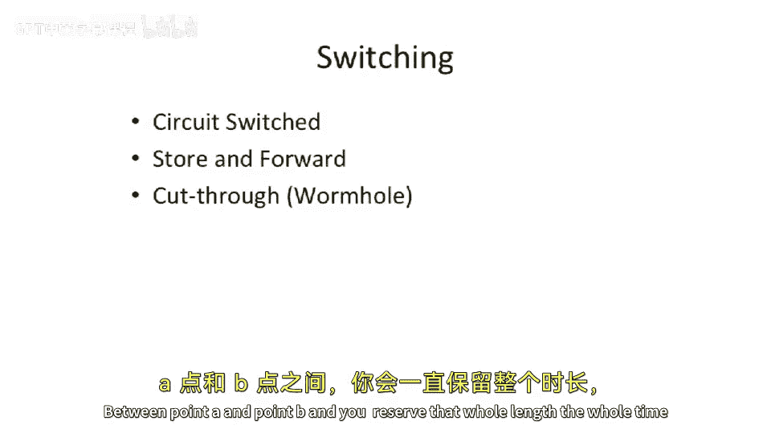

# 098：网络回顾与核心概念

在本节课中，我们将继续讨论互连网络。我们将回顾互连网络的广泛定义、核心术语以及数据在网络中传输的不同方式，特别是电路交换、存储转发和直通（虫洞）路由。

## 互连网络的广泛定义

互连网络的概念非常广泛。有时人们用它来指代连接多台计算机的网络，例如互联网这种大规模互连网络。也可以指在非常小的范围内连接组件，例如芯片上的网络或片上网络。此外，还包括机箱内不同处理器之间、处理器与内存或I/O设备之间、以及多机箱之间（如超级计算机或广域网）的连接。所有这些都属于我们讨论的互连网络范畴。

需要指出的是，我们这里讨论的“交换”概念，与计算机网络课程中定义的特定协议（如以太网交换机或路由器）中的“交换”并不完全相同。我们关注的是更广泛的、用于连接事物的方式，而不限于特定协议。

## 核心术语回顾

以下是互连网络中的几个核心概念：

*   **交换**：指连接不同事物的方式。
*   **拓扑**：指网络的布局或线路连接方式。
*   **路由**：指在网络中路由数据包（或电路交换网络中的呼叫）所使用的算法。
*   **流控制**：指如何防止数据在网络中丢失的机制，这是我们今天将重点讨论的内容。

## 数据单元：消息、数据包、流控制位与物理传输位

从术语角度回顾，数据在网络中以不同粒度单位组织：

1.  **消息**：由一定数量的字节或比特组成。
2.  **数据包**：消息被分割成数据包。一个数据包通常有头部和尾部。头部可能包含目的地和长度等有用信息，有时网络还会有尾部比特或前导码来指示数据包传输完成。
3.  **流控制位**：指在特定链路上可以进行流控制的最小数据量。它是进行数据“核算”的基本单位。
4.  **物理传输位**：流控制位可以进一步分割成多个物理传输位。物理传输位是实际在物理线路上传输的数据单位。

**举例说明**：假设一个网络中的所有数据都以32位字为单位进行处理，但网络链路宽度只有8位。那么，32位字就是一个**流控制位**，而它由4个8位的**物理传输位**组成，分4次在物理线路上传输。

## 数据交换方式

上一节我们回顾了数据组织单元，本节我们来看看数据在网络中传输的几种主要方式：电路交换、存储转发和直通交换。

### 电路交换

在电路交换中，在点A和点B之间物理地建立一条专用线路，并在整个通信期间独占该线路的全部带宽。通常包含呼叫建立和呼叫拆除阶段。

### 存储转发

在存储转发中，路径上的每个路由器都会缓冲整个数据包，等待其尾部到达后，才开始将头部发送给下一个路由器。它实际上是存储整个数据包后再转发。典型的以太网路由器和互联网路由器通常采用类似方式。如果不关心延迟，这种方式使很多事情变得更简单，因为它避免了直通路由中可能出现的死锁问题。

### 直通（虫洞）路由

当开始关注延迟时，直通路由就变得重要。在直通路由中，路由器在收到数据包尾部之前，就会开始将头部发送到下一个路由器。这样，数据包可以像虫子一样“钻过”网络，一个数据包可能同时分布在网络的多个路由器中。一个路由器尚未完全接收完数据包，下一个路由器可能已经开始接收了。

**示例说明**：假设有一个数据包，长度为8个字，网络拓扑是一个单向环或环形结构。数据包从注入点开始传输。每个周期传输一个字（物理传输位）。随着时间推移，数据包的各个部分会同时分布在网络的不同链路上向前“蠕动”，直到尾部最终到达目的地并输出。这种方式被称为直通路由或虫洞路由。

---

本节课中，我们一起学习了互连网络的广泛定义，回顾了交换、拓扑、路由和流控制等核心术语，明确了消息、数据包、流控制位和物理传输位的数据组织层次，并深入分析了电路交换、存储转发和直通（虫洞）路由这三种关键的数据交换方式及其工作原理。理解这些基础概念是进一步学习复杂网络互连技术的重要前提。