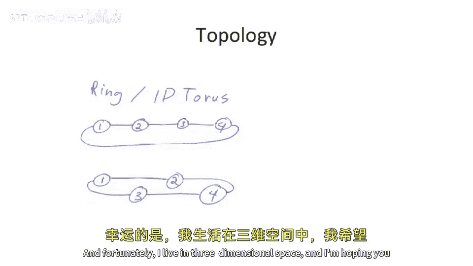
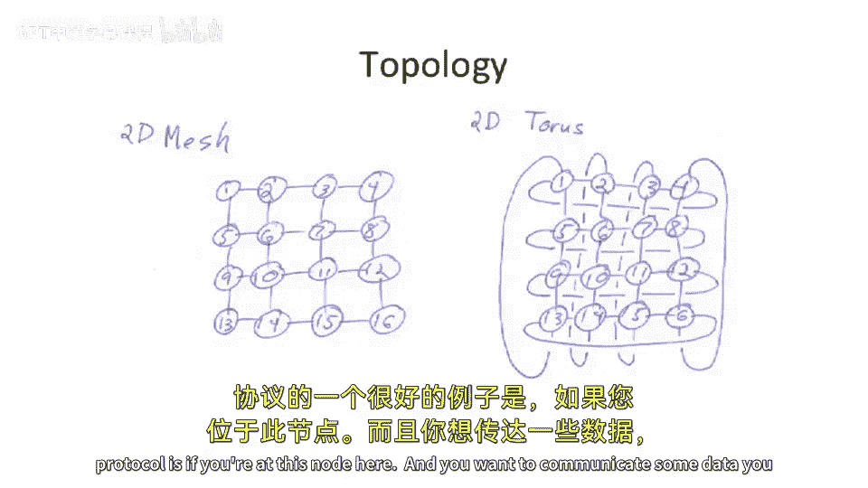
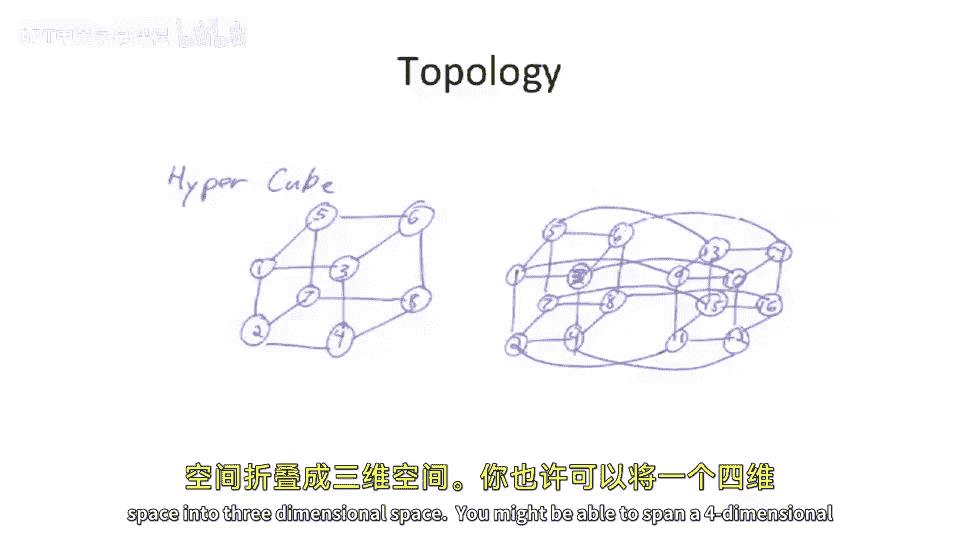
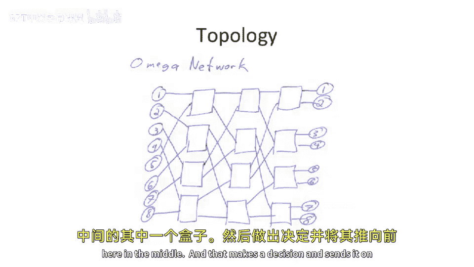
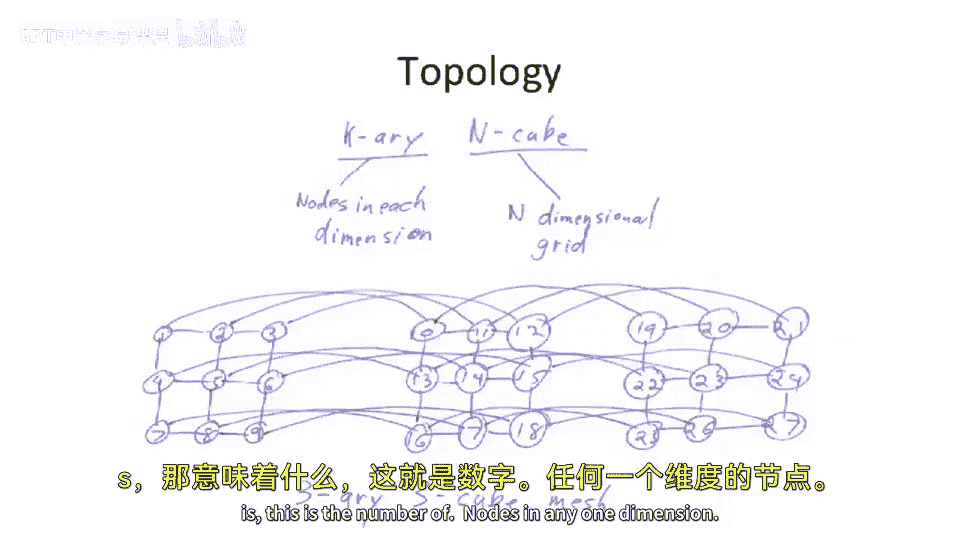
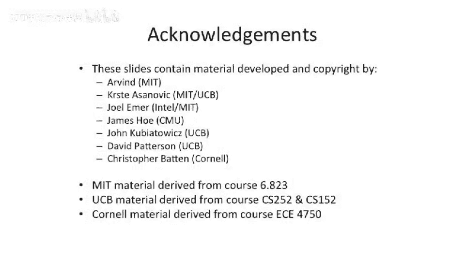

# 099：网络拓扑结构

## 概述
在本节课中，我们将学习计算机体系结构中的网络拓扑结构。我们将从简单的总线结构开始，逐步探讨更复杂的拓扑，如环、网格、超立方体和多级网络，并分析它们的特性、优缺点以及在实际物理空间中的实现挑战。

## 从总线到流水线总线
上一节我们介绍了总线作为一种互连网络。它是一种广播网络，所有节点共享同一通信介质。但总线可能不具备最佳带宽，并可能影响时钟频率和延迟。

为了改进，我们可以考虑流水线总线。它在通信路径上加入寄存器，从而实现近邻通信。例如，节点1可以与节点2通信，同时节点3与节点4通信，这在传统的共享总线上是无法实现的，因为传统总线一次只允许一个实体通信。

## 环状拓扑结构
基于流水线总线的思路，我们可以构建更高级的结构，例如环。环是一种一维环面网络。

关于环的一个关键点是其物理实现。在朴素的环实现中，如果有一千个节点，其中999个节点的连接会很短，但有一个连接会非常长（从环的一端到另一端）。这并不理想。

实际上，人们设计了一些巧妙的方法来“折叠”环面结构到物理空间中以最小化线长。例如，通过重新编号和交错连接节点，可以将一个一维环面折叠到一维空间中，使得所有链路长度相等（尽管是原长度的两倍）。这种交错技巧同样适用于将N维环面折叠到N维空间中。

然而，环状拓扑存在带宽限制。随着节点增加，穿过关键链路（例如环中两个特定节点间的链路）的带宽并不会增加。一个良好网络拓扑的特性是，随着网络上通信实体的增加，其总带宽也应能增加。仅仅加宽或加速链路只能提供有限的帮助。

## 二维与三维拓扑
这促使我们考虑更高维度的拓扑结构，例如二维或三维网格和环面。

*   **二维网格 vs 二维环面**：二维网格是节点在二维平面上的规则排列。二维环面则在网格的基础上增加了“环绕”连接（即最左与最右、最上与最下节点相连）。环绕连接使得路由更高效，平均跳数大约减少一半，因为数据可以朝两个方向绕行。有时，二维环面也被称为带环绕连接的二维网格。

*   **简单路由协议示例——泛洪**：一种简单的路由协议是泛洪。假设某个节点要发送数据，它可以向所有方向发送数据包，收到数据包的节点也继续向所有方向转发。这保证了数据最终能到达接收方，但会导致网络拥塞和高功耗，通常不是理想选择。

## 超立方体拓扑
我们可以进一步扩展到三维或更高维度。例如，三维立方体（或超立方体）结构。超立方体的定义是：网络中每个节点的出度（连接数）等于网络的维度数。

*   **三维超立方体**：每个节点有三个方向的连接。
*   **四维超立方体**：虽然难以在三维空间中直观绘制，但其概念是每个节点有四个方向的连接。高维超立方体的优点是，任意两点间所需的最大跳数（网络直径）较低，从而减少了通信延迟。

构建高维网络面临物理实现的挑战。试图在三维物理空间中构建五维超立方体，会导致一些连接线变得非常长。一个经验法则是，最好尝试将N维网络映射到N维物理空间，映射更高维度会非常困难。尽管高维立方体在理论上能减少路由跳数，但物理实现的复杂性限制了其应用。

## 全连接与间接网络
另一种极端拓扑是全连接网络，即每个节点都直接与其他所有节点相连。这似乎很理想，但考虑在三维空间中实现一个包含1000个节点的全连接网络：每个节点需要999个出站和999个入站连接，这会导致布线极其复杂，难以实现。对于少量节点，全连接交叉开关（或称星型拓扑）是可行的，并能提供很高的带宽。

到目前为止我们讨论的网络都属于**直接网络**，即节点自身集成了路由器功能。

还存在**间接网络**（或多级网络），其中节点本身不进行路由，而是通过外部的多级交换网络进行通信。互联网就是一个例子：计算机通过以太网交换机或路由器进行连接和路由。

在多级网络中，例如Omega网络，有log₂(N)级交换阶段，每级使用2x1交换器。这种网络通常在每个源-目的地对之间只有一条路径，缺乏路径多样性。通过增加额外的中间级（其布线方式与现有级相同），可以引入多条路径，从而能够绕开拥堵或故障链路，提高网络的健壮性。

## 树形与胖树拓扑
树是另一种常见的拓扑结构。然而，简单的树形拓扑在根节点附近容易成为带宽瓶颈。

为了解决这个问题，引入了**胖树**。胖树在树的每一层向上时都加倍链路带宽（或数量），从而确保高层有足够的带宽支持底层所有节点间的通信。当尝试在二维物理空间中实现胖树时，其布局会开始类似于网格，但移除了一些链接。在物理布局中，某些本应通过树结构远程通信的节点可能实际上在物理位置上很近，因此可以建立直接的“捷径”连接。在多芯片系统中，胖树可能是一个有意义的拓扑选择。

## 网格网络的命名法：k-ary n-cube
对于网格类网络，常用 **k-ary n-cube** 来描述。
*   **k** 代表每个维度上的节点数量。
*   **n** 代表网络的维度数。
这种命名法可以描述非严格超立方体的网格形状。

例如，一个 3x3x3 的立方体网格可以描述为 3-ary 3-cube。这类似于一个魔方，每个小块代表一个通信节点。在这个网络中，最坏情况下的路径长度（例如从一个角到对角的角）可能需要遍历6条链路。

## 总结
本节课我们一起学习了计算机互连网络的各种拓扑结构。我们从简单的总线开始，探讨了其局限性，并逐步引入了环、网格、环面、超立方体、全连接、多级网络以及树和胖树等拓扑。我们分析了它们在带宽、延迟、路径多样性以及物理实现复杂度等方面的不同特性。理解这些拓扑结构对于设计高效、可扩展的计算机系统至关重要。