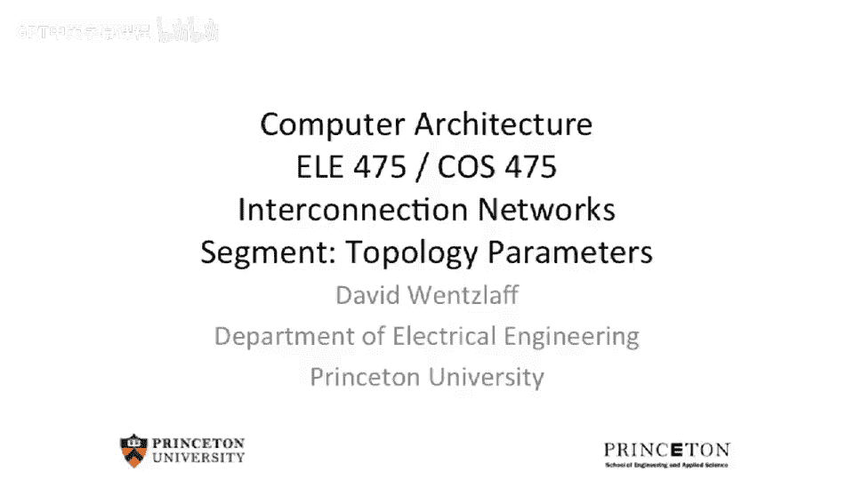
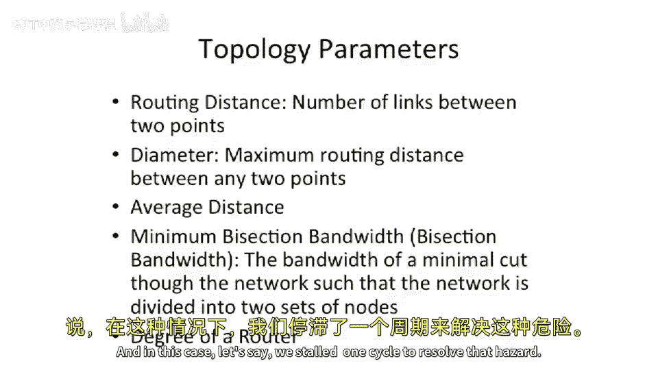
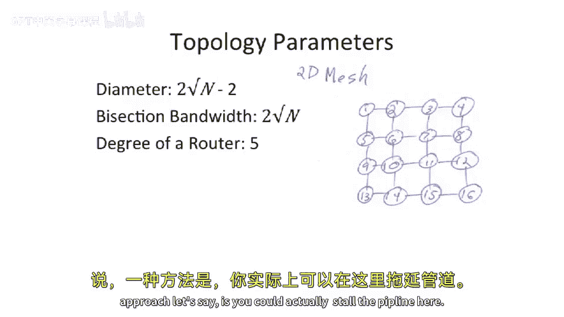
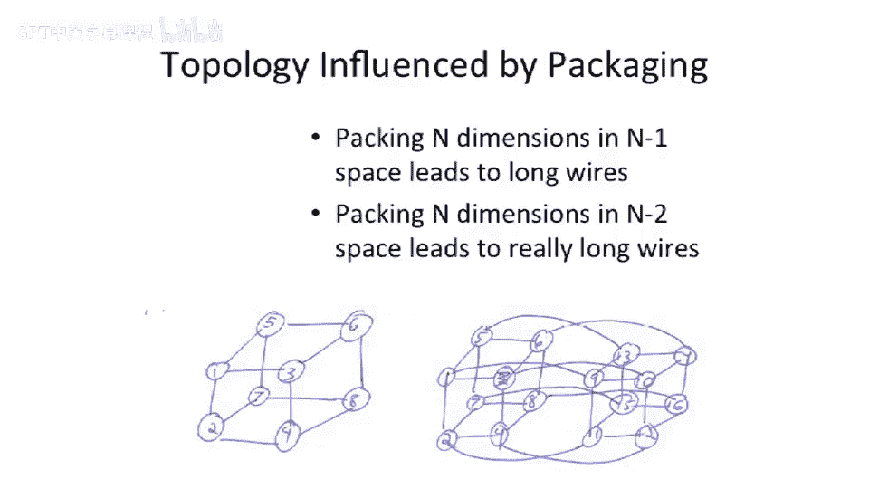
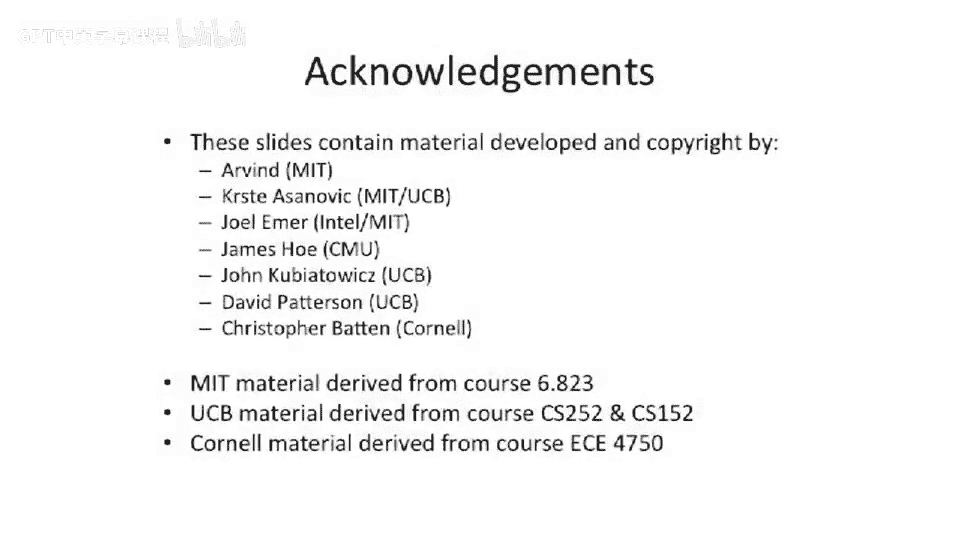

# 100：网络拓扑参数分析

在本节课中，我们将学习如何分析和比较不同网络拓扑结构的关键参数。我们将讨论路由距离、网络直径、平均距离、对分带宽以及路由器度数等概念，并探讨物理布局对网络设计的影响。

## 路由距离与网络直径

上一节我们介绍了不同的网络拓扑结构，本节中我们来看看用于衡量和比较这些网络性能的关键参数。

首先讨论的是**路由距离**。路由距离是指网络中从一个节点到另一个节点所需经过的链路数量，即“跳数”。对于任意给定的两个节点，都存在一个具体的路由距离。

**网络直径**则是一个更宏观的指标，它定义为网络中任意两点之间**最大**的路由距离。这个参数非常重要，因为设计网络时，需要避免构建出那种中间节点通信良好，但边缘节点之间距离过远、延迟过高的“狭长”型网络。

例如，考虑一个网络，其中心有四个高度互连的节点，但外围延伸出一条很长的链。从链的末端到另一端的通信距离，就构成了这个网络的直径。这种不规则网络提醒我们，有时需要增加额外的链路来缩短所有节点间的最大距离。

## 平均距离与对分带宽

接下来，我们看看**平均距离**。其计算方法是：首先计算网络中所有节点对之间的路由距离之和，然后除以节点对的总数（或节点总数）。这个值反映了网络通信的平均延迟水平。

**对分带宽**（有时称为最小对分带宽）是一个有趣且重要的概念。它的定义是：将网络节点**平均**分割成两部分后，连接这两部分之间的**最小**链路总带宽。这里的关键词是“最小”，意味着你必须找到那个能切断最少链路的平分方式。

为了理解这个概念，让我们以一个4维超立方体（16个节点）为例，看看不同的切割方式：

*   **无效切割**：如果切割没有将网络平分为数量相等的两部分，则不能用于计算对分带宽。
*   **非最小切割**：存在一种切割方式，将网络平分为各8个节点的两部分，但切断了6条链路。
*   **最小切割**：存在另一种平分方式，只切断了4条链路。那么，这个网络的**最小对分带宽**就是4条链路的带宽总和。

在更复杂的网络中，找到这个“最小切割”可能并不直观，但它却是评估网络在未知通信模式下，处理一半节点与另一半节点间通信能力的核心指标。

## 路由器度数

我已经多次使用“度数”这个术语，现在正式定义一下。**路由器度数**来源于图论，指的是网络中一个特定节点（路由器）所连接的链路数量。

例如，在一个2D网格中，每个中间路由器通常连接东、西、南、北四个方向的邻居，再加上一个连接本地处理器的端口。因此，**交换机的度数**是5，而如果仅考虑网络内部的连接，**节点的度数**则是4。

## 常见拓扑参数示例

现在，让我们具体分析一下2D网格的参数：

*   **直径**：对于一个N节点的2D网格（假设为√N × √N），其直径（最远两点的距离）公式为：
    `直径 = 2 * (√N - 1)`
    大O表示法下为O(√N)。减去1是因为从起点到终点，在行和列方向上各需要(√N - 1)跳。
*   **对分带宽**：将网格平分为两半，需要切断√N条垂直（或水平）链路。由于链路是双向的，总带宽是单方向的两倍，因此：
    `对分带宽 ∝ 2√N`
*   **路由器度数**：如前所述，中间路由器的度数为5（四个网络方向加一个本地端口）。

## 物理布局与实现的考量

我们之前已经提到，物理布局和封装技术极大地影响着网络设计。

像星型或全连接交叉开关这样的网络虽然性能理想，但很难在三维物理空间中实现。理论上可以将节点布置在球体表面并用自由空间光互连，但这尚未大规模应用。

对于**超立方体**这样的高维网络，我们通常需要将其“折叠”到低维物理空间中。例如，一个3维立方体可以很容易地画在2维平面上（即我们常见的立方体图示）。一个N维超立方体可以布局在N-1维物理空间中。

*   **芯片网络（2D平面）**：在片上网络（NoC）中，晶体管基本排列在2D平面上。虽然可以通过增加导线长度来模拟更高维度，但由于现代工艺中导线延迟相对较大，构建过高维度的网络可能得不偿失。
*   **超级计算机（3D空间）**：在机柜级系统中，我们有真实的3D空间。例如，历史上的Thinking Machines CM-1就成功构建了一个包含数万个节点的超立方体网络。在那个时代，导线速度远快于晶体管速度，因此即使有很长的导线，构建高维网络以减少路由跳数（从而减少慢速路由器的处理次数）也是一个有效的折衷方案。

然而，技术趋势会改变设计权衡，需要根据具体的实现条件来选择最合适的拓扑结构。

## 总结

本节课中我们一起学习了评估和比较网络拓扑的核心参数：
1.  **路由距离**和**网络直径**衡量了网络的通信延迟。
2.  **平均距离**反映了整体延迟水平。
3.  **（最小）对分带宽**评估了网络处理最坏情况通信模式的能力。
4.  **路由器度数**影响了路由器的复杂度和成本。
5.  最终，所有理论设计都受到**物理布局**和**实现技术**（如导线与晶体管速度比）的制约，需要在性能、复杂度和可行性之间做出权衡。