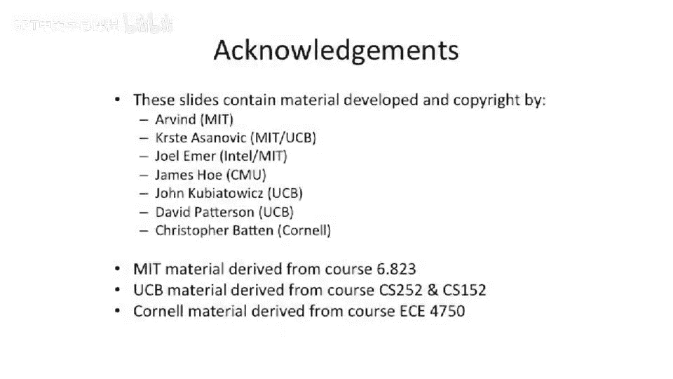

# 101：网络性能分析 🚀

在本节课中，我们将学习如何衡量和分析网络的性能。我们将重点讨论两个核心性能指标：带宽和延迟，并探讨它们之间的关系，以及网络拥塞如何影响这些指标。

---

## 带宽与延迟

上一节我们介绍了网络拓扑的基本参数。本节中，我们来看看衡量网络整体性能的两个核心指标。

**带宽** 是指单位时间内通过网络链路传输的数据量。其单位是比特每秒（bps）或字节每秒（Bps）。公式表示为：
`带宽 = 传输的数据量 / 时间`

**延迟** 是指从发送方到接收方完成一次消息通信所需的时间。其单位是秒（s）。

这两个指标是相互关联的。增加带宽有时能降低延迟，因为更宽或更快的链路可以更快地发送长消息，减少数据分片，从而缩短整体传输时间。同时，更高的带宽也能缓解网络拥塞，降低不同消息争用同一链路的概率。

反过来，延迟也会影响**实际交付的带宽**。例如，在需要往返通信的场景中（如TCP/IP网络），如果往返延迟很高，发送方在收到流控确认前会处于等待状态，这限制了有效的数据发送速率。这种关系可以用**带宽延迟积**来描述：`带宽延迟积 = 带宽 × 延迟`。如果延迟增加，而允许“在途数据量”（窗口大小）不变，那么有效带宽就会下降。

---

## 性能参数示例分析

为了更具体地理解这些参数，让我们分析一个4节点的Omega网络示例。

以下是该网络的简化示意图，包含输入/输出节点和路由器：

在这个网络中，我们假设：
*   链路传输延迟：每个链路需要 **2** 个周期。
*   路由器处理延迟：每个路由器需要 **3** 个周期。
*   从任意源点到任意终点需要经过 **2** 个路由器和 **1** 条链路。
*   一个32字节的数据包被串行化为4个8位的“微片”在网络上传输。

我们可以绘制该数据包传输的流水线时序图：

观察时序图，我们可以分解总延迟 `T` 的构成：
*   **串行化延迟**：在源端将数据包拆分为微片的时间（图中起始的4个周期）。如果提高链路带宽，这个时间会减少。
*   **路由器延迟**：数据包在每个路由器中处理的时间（两个路由器各3个周期）。
*   **信道延迟**：数据在链路上传输的时间（2个周期）。

值得注意的是，在目的端的**反串行化延迟**没有单独出现，因为它与流水线中的串行化过程重叠了。此外，上图展示的是**无负载网络**（无竞争）的理想情况。

---

## 延迟的构成与优化

基于上述分析，我们可以将消息的总延迟公式化，以便思考优化方向。

在无竞争条件下，消息的总延迟 `T` 可表示为：
`T = T_head + T_serialization`
其中，`T_head`（头部延迟）可进一步分解为：
`T_head = H_r * T_r + H_c * T_c`
*   `H_r`：经过的路由器跳数。
*   `T_r`：每跳路由器的处理延迟。
*   `H_c`：经过的链路跳数。
*   `T_c`：每条链路的传输延迟。

以下是基于此公式优化网络延迟的几种思路：

1.  **缩短路径**：设计网络拓扑以减少 `H_r` 和 `H_c`，即让通信需要经过的更少的路由器和链路。
2.  **加速路由器**：提高路由器的时钟频率或优化其内部流水线，以减少 `T_r`。
3.  **加速信道**：提高链路本身的传输速度，以减少 `T_c`。这可能受限于芯片间或板级的信号完整性。
4.  **减少串行化开销**：
    *   使用**更宽的通道**（如将链路从8位加宽到16位），这样每个周期能发送更多数据，从而减少 `T_serialization`。
    *   发送**更短的消息**，或减少协议头等开销。例如，互联网中TCP/IP协议的优化就常致力于压缩头部信息。

---

## 拥塞对性能的影响

最后，我们探讨网络拥塞如何影响性能。在现实网络中，延迟和带宽并非独立。

下图展示了典型网络中，延迟随负载（提供的带宽）增加而变化的关系：

随着网络负载增加，链路上发生数据竞争（拥塞）的概率上升，导致延迟增加。当负载接近网络最大带宽时，延迟会急剧上升（趋于无穷）。

理想情况下，如果网络没有拥塞（如某些全连接的星型拓扑），延迟可以保持为**零负载延迟**，不随带宽增加而改变（图中上方的水平线）。然而，实际网络通常存在路由延迟、流控制等机制，这些都会使性能曲线偏离理想情况，表现为更高的延迟和更低的可用带宽。

---

本节课中我们一起学习了网络性能的核心概念。我们明确了**带宽**和**延迟**的定义及其相互影响，并通过一个Omega网络的例子分解了延迟的构成。最后，我们讨论了网络**拥塞**如何导致延迟随负载增加而恶化，并简要提及了通过优化路径、硬件和协议来提升网络性能的思路。理解这些基础是设计和分析高效计算机系统的关键。