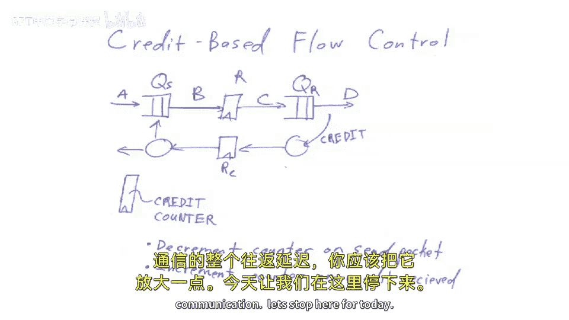

# 102：路由与流控制 🧭

在本节课中，我们将要学习网络中的两个核心概念：**路由协议**和**流控制**。路由协议决定了数据包在网络中从起点到终点的路径选择方式，而流控制则确保数据在网络传输过程中不会因为缓冲区溢出而丢失。理解这两者对于设计高效、可靠的片上网络（NoC）或大型计算机系统网络至关重要。

---

## 路由协议概述

上一节我们介绍了网络拓扑的基本概念，本节中我们来看看数据包如何在网络中寻路。路由协议负责为数据包选择从源节点到目的节点的路径。根据路径选择是否依赖于网络状态，路由协议大致可分为两类。

### 确定性路由与非确定性路由

以下是两种主要的路由协议类别：

1.  **确定性路由协议**：数据包通过网络的路由路径独立于网络的当前状态。无论网络是否拥堵，路径都是预先确定好的。
2.  **自适应路由协议**：这类协议是“智能”网络。它们会观察网络状态（如拥堵情况），并基于此做出路由决策。一个设计良好的自适应路由网络会尝试发现网络中的“热点”（拥堵区域），并让数据包绕开它们。

在自适应路由中，如果网络中任意两点间存在多条路径，路由算法就有更多选择。例如，在一个基本的4x4网格网络中，从左上角到右下角可以有很多条路径：可以先横着走再竖着走，也可以先竖着走再横着走，或者走“之”字形。这种多路径的存在使得自适应路由成为可能。

### 维度顺序路由

让我们深入探讨一种在网格网络中常用的确定性路由算法：**维度顺序路由**。

假设我们有一个4x4的二维网格网络。我们定义X轴方向为水平向右递增，Y轴方向为垂直向上递增。

维度顺序路由的核心思想是**按维度顺序进行路由**。例如，采用 **X先于Y** 的策略。这意味着数据包必须先完全调整好X坐标（即水平移动到目的节点的X坐标），然后再调整Y坐标（垂直移动）。

**公式表示**：
对于一个从源节点 `(Sx, Sy)` 到目的节点 `(Dx, Dy)` 的数据包：
1.  首先，沿X轴方向移动 `Dx - Sx` 步。
2.  然后，沿Y轴方向移动 `Dy - Sy` 步。

这种算法是确定性的，不关心网络流量。但它有一个明显的缺点：如果多个数据流需要共享某条关键链路（例如，从网格左侧到右侧的水平链路），就可能造成拥堵，且算法无法绕行。

维度顺序路由的一个关键优点是**它不会导致网络死锁**。其证明思路大致如下：由于所有数据包都遵循“先获取X方向链路，再获取Y方向链路”的相同顺序，它们永远不会形成一个“先持有Y链路，再请求X链路”的循环依赖。这就避免了类似于哲学家就餐问题中的循环等待条件。

当然，除了维度顺序路由，还有非确定性（如随机路由）和更复杂的自适应路由算法（如“热土豆”路由），后者在遇到拥堵时会随机选择其他方向转发，但这些内容超出了本课范围。

---

## 流控制概述

上一节我们讨论了如何选择路径，本节中我们来看看如何管理路径上的数据流。流控制的核心目标是**确保数据不会在网络传输过程中被丢弃**，并通过反压机制防止发送方压垮接收方。

流控制可以在不同层面实现：

1.  **逐跳流控制**：在相邻的两个网络节点之间进行，确保一个节点不会向下一个节点发送过快。
2.  **端到端流控制**：在通信的起点和终点之间进行，例如TCP协议中的拥塞控制，或者片上网络中用于限制发往内存控制器请求数量的计数器。

### 流控制机制示例

让我们通过一个简单的链路模型来比较几种流控制机制。假设发送方和接收方之间有一个流水线寄存器（代表链路延迟），并且两端都有队列（Q_sender, Q_receiver）。

以下是几种常见的流控制方式：

1.  **即时停顿流控制**：
    *   **原理**：接收方（D）通过一个组合逻辑信号直接“拉停”发送方（A）。当D的队列满时，它发出“停顿”信号，该信号立即反向传播，使上游所有节点停止发送。
    *   **问题**：在高速网络中，“停顿”信号需要穿越长距离的导线，其传播延迟可能超过一个时钟周期，这会严重限制系统时钟频率。

2.  **流水线停顿流控制**：
    *   **改进**：在“停顿”信号的返回路径上也插入流水线寄存器。
    *   **新问题**：停顿信号无法即时生效。当D发出停顿时，已经在管道中“飞行”的数据包（如正在B到C、C到D路上的数据）无法被立即阻止。这可能导致数据在接收端溢出。
    *   **解决方案**：在接收队列前增加**防滑缓冲**。这就像汽车刹车后需要一段滑行距离一样，防滑缓冲提供了额外的空间来容纳那些无法即时停止的“在途数据”。

3.  **基于信用的流控制**：
    *   **原理**：这是一种更优的方案。发送方维护一个**计数器**，其初始值等于接收方队列的空闲槽位数。
    *   **工作流程**：
        1.  发送方每发送一个数据单元，计数器减1。
        2.  接收方每从队列中取出一个数据单元，就向发送方返回一个“信用”。
        3.  发送方收到信用后，计数器加1。
        4.  当计数器为0时，发送方必须停止发送，直到收到新的信用。
    *   **代码描述**：
        ```pseudo
        // 发送方
        credit_counter = RECEIVER_QUEUE_SIZE; // 初始化

        function send_data(data):
            if credit_counter > 0:
                transmit(data);
                credit_counter--;
            else:
                wait(); // 等待信用返回

        function receive_credit():
            credit_counter++;
        ```
    *   **优点**：避免了流水线停顿机制中可能出现的吞吐量抖动或气泡。只要信用计数器和接收队列大小设置正确（需考虑信用的往返延迟），就**永远不会丢失数据**，只会影响瞬时带宽。

---

## 总结 🎯

本节课中我们一起学习了网络通信中的两个基础且重要的部分：

1.  **路由协议**：我们了解了确定性路由（如维度顺序路由）和自适应路由的区别。维度顺序路由简单、无死锁，但缺乏应对拥堵的灵活性。
2.  **流控制**：我们探讨了确保数据可靠传输的机制，从简单的即时停顿，到更实用的流水线停顿（需防滑缓冲），再到高效的基于信用的流控制。信用流控制通过维护一个远程队列空间的计数器，实现了高效、无损的数据流管理。




理解这些机制是设计可扩展、高性能多核芯片或大规模计算系统网络的基础。下一讲，我们将结束对死锁的简要讨论，然后进入构建大型多核系统及其一致性协议的主题。