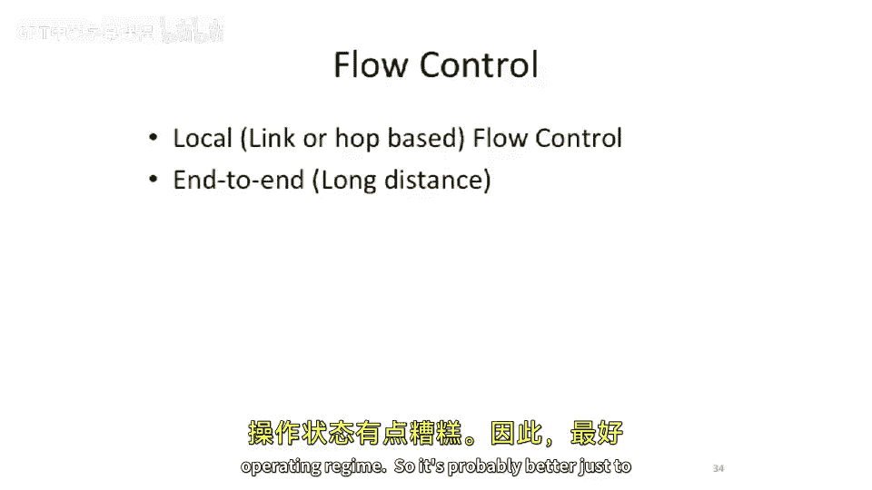

# 103：基于信用的流控制与死锁

在本节课中，我们将完成对互连网络的讨论，重点介绍基于信用的流控制机制，并简要探讨死锁问题。随后，我们将转向更具可扩展性的缓存一致性系统，了解如何将系统规模扩展至数千个节点，并介绍一种适用于此类系统的目录式缓存一致性协议。

## 流控制回顾

上一节我们介绍了互连网络中两个独立节点之间的流控制。我们讨论了基于本地链路或逐跳的流控制，并在课程末尾提及了端到端的流控制。

端到端流控制至关重要。一个典型的例子是：一个核心试图与内存控制器通信，但必须避免溢出内存控制器中的缓冲区。因为一旦溢出，内存事务就会丢失。即使互连网络具备链路级或逐跳的流控制，系统内部（芯片内或多芯片间）仍需要端到端流控制，以防止远端缓冲区被溢出。

理论上，你可以让流量在网络中一直回退，直到核心，通过本地流控制来解决。但出于多种原因，这可能并非良策。首先，深入研究内存协议会发现，当流量回退到网络时，可能迅速引发类似死锁的情况，并导致优先级混乱。其次，更重要的是，回退流量对性能不利。你应尽早阻止流量涌入，因为继续注入数据只会加剧网络拥塞，导致网络延迟急剧上升，使系统进入极差的运行状态。因此，更好的做法是主动退避，避免溢出远端缓冲区。

端到端流控制有多种方案。其中一种较好的方法是：发送数据后等待确认返回，并对确认进行计数。这本质上就是一种基于信用的流控制。

## 链路级流控制方式

我们回顾一下链路级流控制的不同方式。如下图所示，我们有一个队列、另一个队列以及中间的一条链路，该链路可能是流水线的。数据沿此方向发送。当接收方无法接收更多数据时，它会发送一个“暂停”信号。

如果整个芯片都采用这种纯组合逻辑（图中每个小模块仅为组合逻辑），那么关键路径会变得非常长。

因此，可以考虑在此路径上添加寄存器。然而，这样做会带来一个问题：当“暂停”信号返回时，输出端口和这个寄存器可能无法及时响应。

如果“暂停”信号被置位：

数据仍会被发送出去，因为“暂停”信号需要经过一个周期才能被感知。因此，你需要一个缓冲区来暂存这最后一个数据单元。我们称之为“滑行缓冲”。

类似地，如果你在此处有一个触发器，但没有接入这个寄存器，则可能需要多级滑行缓冲。现在，如果接收端的滑行缓冲区数量设置不当：

就会发生数据丢失。例如，协议需要两个缓冲区，但你只设置了一个。当你置位“暂停”信号时，正在链路上传输的数据就会丢失。这显然是不可取的。

## 基于信用的流控制

以上内容引出了我们上次课程末尾讨论的主题：基于信用的流控制。在这种机制下，不再使用“停止”或“开关”式的流控制信号（即“暂停”信号）返回，而是在发送端维护一个计数器。

该计数器用于跟踪接收端有多少可用缓冲区空间（这里不计算寄存器本身，而是指可以备份数据的端点FIFO空间）。初始时，将计数器设置为接收端缓冲区条目数，以实现该链路的满带宽。每发送一个数据字，计数器就递减。当计数器减至0时，停止发送，因为你知道所有可用的缓冲区空间（包括数据往返延迟和信用返回延迟所需的空间）都已被占用。

当接收端从缓冲区或FIFO中读出一个数据字时，它会发回一个“信用”。这个信用会使发送端的计数器递增。

根据具体实现，此处可以有多个触发器。这种机制的核心在于确定信用环路的延迟，并据此设置计数器的大小。

基于信用的流控制还有一个优点：信用计数器的大小可以与实际缓冲区条目数不同。

为什么要这样做？一个原因是，你可以通过减少接收端的缓冲区条目数并相应减小信用计数器，来构建一个带宽较低的链路。由于往返延迟较长，而可用的信用数有限，发送方会在发送一些数据后提前暂停，等待信用返回后再继续发送。这样，虽然无法获得理想的链路带宽，但可以用更少的接收端存储空间来实现。这比简单的开关式流控制要好得多，因为后者在缓冲区数量不足时会直接导致数据丢失，属于设计错误；而前者只是一个性能权衡问题。

## 总结

本节课中，我们一起学习了基于信用的流控制机制。我们了解到，与简单的开关式流控制相比，信用机制通过发送端维护的计数器来精确管理接收端的缓冲区空间，避免了数据丢失，并允许在存储空间和带宽之间进行灵活的权衡。这为构建高效、可靠的互连网络奠定了基础。接下来，我们将探讨更具可扩展性的缓存一致性系统。