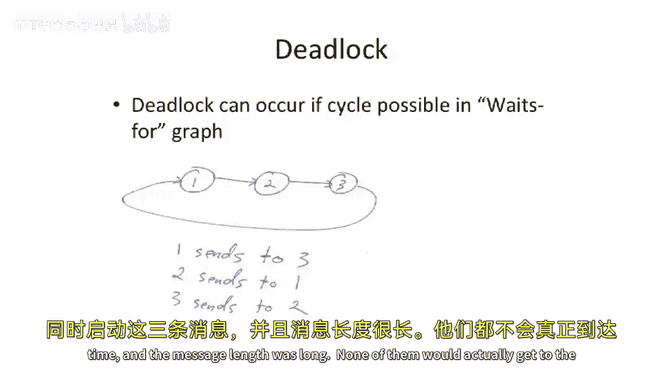
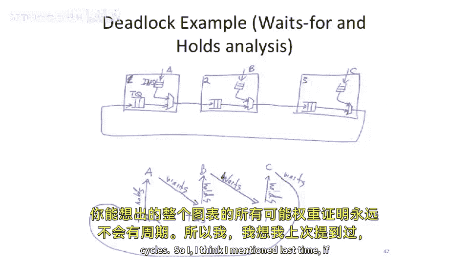
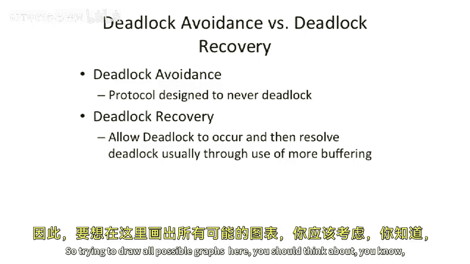

# 104：死锁分析

在本节课中，我们将学习互连网络中的一个核心问题：死锁。我们将探讨死锁是如何发生的，如何通过“等待-持有”图来分析它，以及避免和恢复死锁的不同策略。

上一节我们介绍了互连网络的基本概念，本节中我们来看看网络通信中一个棘手的问题——死锁。

## 死锁场景示例

假设我们有一个单向的1D环网（1D torus），包含三个节点，分别标记为1、2、3。所有链路都按顺时针方向传输数据。

现在，假设三个节点同时发起通信：
*   节点1希望发送消息给节点3。
*   节点2希望发送消息给节点1。
*   节点3希望发送消息给节点2。

我们使用虫孔路由（wormhole routing）。在这种方式下，消息的头部（header）会先进入网络，而尾部（tail）可能尚未注入。

如果这三条长消息同时开始传输，每条消息都需要占用下一跳的链路，但该链路已被前一条消息占用。由于虫孔路由中，已占用的链路在消息传输完成前不会释放，最终所有消息都无法前进，也无法后退，从而形成**死锁**。

## 死锁分析：“等待-持有”图

为了从理论上分析路由协议是否会导致死锁，我们使用一种称为“等待-持有”分析（waits-for and holds analysis）的方法。

以下是分析我们示例场景的步骤：

1.  我们为网络中的每个缓冲区或链路资源（如图中的TQ1, TQ2, TQ3）以及每个通信动作（A, B, C）建立节点。
2.  如果动作A**持有**资源R，我们绘制一条从资源R指向动作A的边。
3.  如果动作A**等待**获取资源R，我们绘制一条从动作A指向资源R的边。

根据之前的例子，我们可以绘制出以下依赖关系：
*   **动作A**（1发往3）**持有** TQ2，并**等待** TQ3。
*   **动作B**（2发往1）**持有** TQ3，并**等待** TQ1。
*   **动作C**（3发往2）**持有** TQ1，并**等待** TQ2。

这样，我们就得到了一个循环：A -> TQ3 -> B -> TQ1 -> C -> TQ2 -> A。在这个“等待-持有”图中存在**环**，就证明该协议可能导致死锁。要解决死锁，必须通过修改协议来“切断”这个环中的至少一条边。

## 无死锁路由协议示例

有些路由协议可以被静态证明是无死锁的。例如，**维度顺序路由**（dimension order routing）结合虫孔路由。

在二维网格中，该协议规定消息必须先完全在X维度上路由，然后再在Y维度上路由（或反之）。由于这个严格的顺序，资源依赖图永远不可能形成环：一个消息永远不会在持有Y维度资源的同时，去等待一个X维度的资源。因此，其“等待-持有”图是无环的。

## 死锁处理策略：避免与恢复

死锁并不一定是必须彻底消灭的敌人。处理死锁主要有两种策略：避免和恢复。

### 死锁避免

死锁避免旨在设计永远不会进入死锁状态的协议，例如前面提到的维度顺序路由。这种方法安全，但可能限制严格且效率不高，例如无法自适应地绕开网络中的拥堵。

### 死锁恢复

死锁恢复则允许协议在理论上可能存在死锁，但在实际发生时进行检测并修复。这种方法可以让通用情况下的协议性能更高、更灵活。

以下是死锁恢复机制的一个例子：

1.  **检测**：在系统中设置一个计时器。如果网络在连续大量周期（例如1000个周期）内没有任何数据包移动，则触发中断，表明可能发生了死锁。
2.  **恢复**：中断触发后，软件可以检查网络状态。一种常见的恢复方法是**虚拟化缓冲区**，即通过软件将争用的缓冲区状态保存到内存中，从而临时增加可用缓冲区资源，打破死锁所需的循环依赖条件。

例如，在MIT的Raw处理器中：
*   存储一致性协议使用了**死锁避免**。
*   消息传递网络则使用了**死锁恢复**。

选择恢复策略需要非常谨慎的设计和验证，必须保证在死锁发生时，系统总有足够的备用资源（如内存）来执行恢复操作，而不会导致新的问题。虽然这有点像“玩火”，但如果能保证死锁极少发生，并且恢复成本可控，这将是一个在性能和可靠性之间取得良好平衡的方案。

---

本节课中我们一起学习了死锁的概念、如何通过“等待-持有”图进行死锁分析，并对比了死锁避免和死锁恢复两种策略的优缺点。理解这些原理对于设计高效可靠的片上网络和多芯片互连系统至关重要。