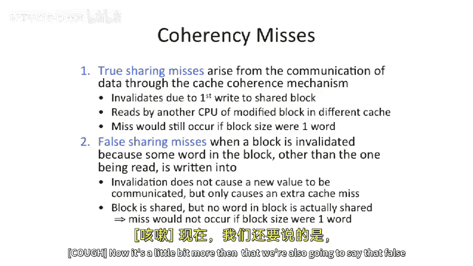
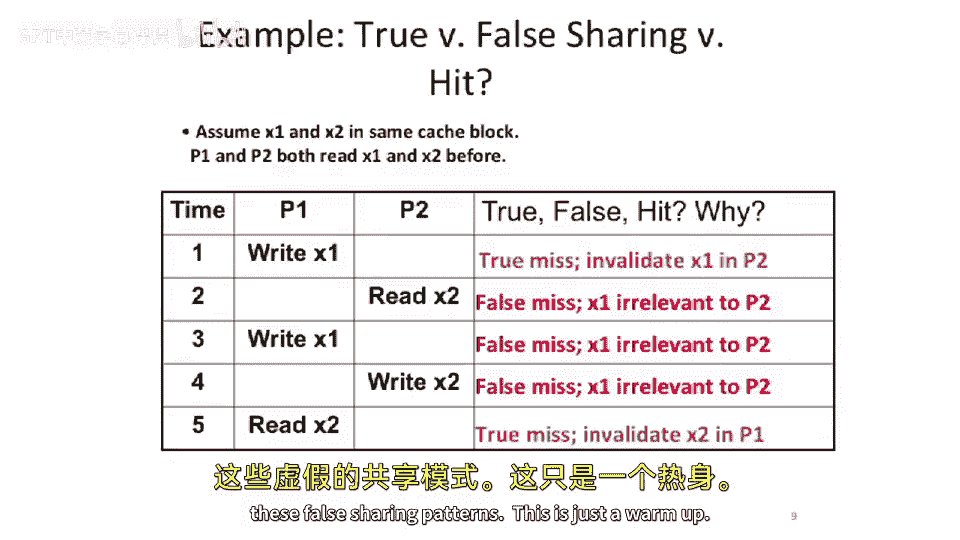
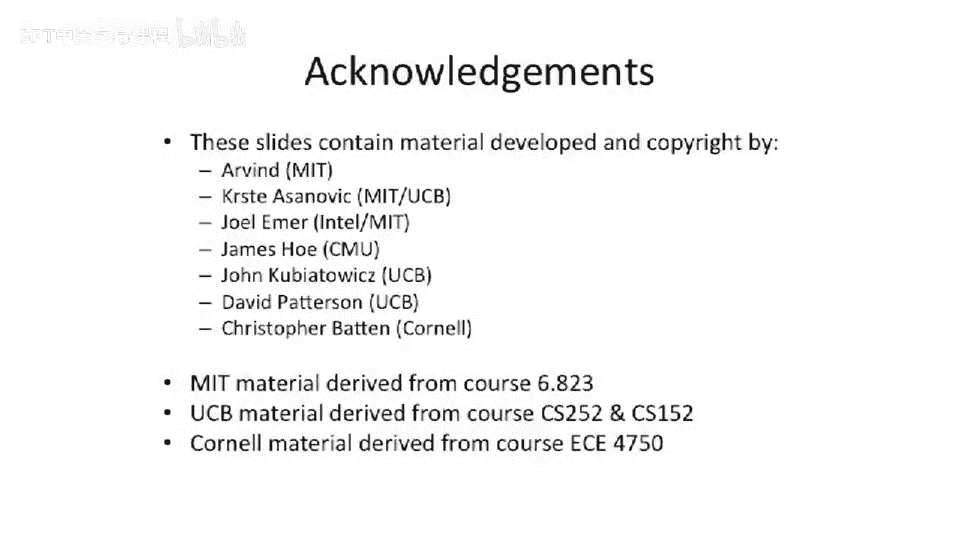

# 105：基于目录的缓存一致性

在本节课中，我们将学习缓存一致性的最后一个主题：基于目录的一致性协议。我们将从回顾缓存失效的“三C”开始，引入一个新的失效类型——一致性失效，并深入探讨其下的两个重要子类：真共享失效与伪共享失效。理解这些概念对于设计可扩展的多核系统至关重要。

## 缓存失效类型回顾

上一节我们介绍了缓存的基本失效类型。现在，我们来回顾并扩展这个概念。

缓存失效通常被归纳为“三C”：
*   **强制性失效**：数据第一次被访问时必然发生的失效。
*   **容量失效**：缓存容量不足，需要替换出旧数据时发生的失效。
*   **冲突失效**：在组相联或直接映射缓存中，由于映射冲突导致的失效。

## 引入一致性失效

本节中，我们将在“三C”的基础上增加第四种失效类型：**一致性失效**。

一致性失效与其他三种失效有本质区别。它并非由本地处理器的访问模式直接引起，而是由**其他处理器核心**的操作（例如写入共享数据）所触发，导致本地缓存中的数据块被无效化或更新。即使在监听协议或对称共享内存多处理器中，来自其他核心的通信流量也可能“驱逐”你缓存中的数据。我们需要关注这种失效。

## 一致性失效的分类：真共享与伪共享

接下来，我们将一致性失效进一步分为两个子类：真共享失效和伪共享失效。

以下是这两种失效的定义与对比：

*   **真共享失效**
    *   **定义**：即使将缓存块大小减小到机器支持的最小单位（例如1字节或1个字），运行相同程序时，**该失效依然会发生**。这是因为处理器之间确实在**共享和通信真实数据**。
    *   **示例**：一个缓存写入某数据后，另一个处理器需要读取该数据，必须将其拉入自己的缓存。这种因实际数据通信引发的失效就是真共享失效。

*   **伪共享失效**
    *   **定义**：如果使用较小的缓存块（如1字节）运行程序不会发生该失效，而使用较大的缓存块时会发生，那么这就是伪共享失效。其根本原因在于**缓存块尺寸过大**，导致两个本不相关的数据项被放置在同一个缓存行中。
    *   **更广泛的含义**：数据在不同缓存间“弹跳”，但触发失效的特定加载/存储序列，在缓存行很小时并不会引起失效。它可能发生在数据为后续共享做准备而移动时，但**触发此次失效的具体操作并非由于实际的数据通信**。

## 实例分析

让我们通过一个具体例子来区分这两种失效。假设初始条件如下：
*   两个数据字 `X1` 和 `X2` 被存储在**同一个缓存行**中。
*   处理器 P1 和 P2 的缓存中都拥有该缓存行的可读副本。

以下是操作序列及其对应的失效类型分析：

1.  **P1 写入 X1**
    *   **操作**：P1 需要获得该缓存行的独占权，因此必须无效化 P2 缓存中的该行。
    *   **分析**：这是**真共享失效**。因为 `X1` 是实际被共享和修改的数据，P2 中的副本必须被移除。

2.  **P2 读取 X2**
    *   **操作**：P2 需要读取 `X2`，但该缓存行已被 P1 独占，因此发生失效，需要从 P1 或内存获取数据。
    *   **分析**：这是**伪共享失效**。P2 想读的是 `X2`，而 P1 修改的是 `X1`，两者并无真正的数据依赖。失效的发生仅仅是因为 `X1` 和 `X2` 位于同一缓存行。

3.  **P1 再次写入 X1**
    *   **分析**：同样是**伪共享失效**。P2 并未触及 `X1`，但因其与 `X2` 同处一行，导致该行状态变化。

4.  **P2 写入 X2**
    *   **分析**：**伪共享失效**。原理同上，`X1` 和 `X2` 的耦合导致了不必要的通信。

5.  **P1 读取 X2**
    *   **分析**：这是**真共享失效**。P2 写入了 `X2`，P1 随后读取它，发生了真实的数据通信。

这个例子表明，**伪共享会引入大量不必要的缓存失效和一致性通信，损害系统性能**。

## 多核扩展性问题

现在，让我们看看在多核环境下，共享失效如何影响系统的可扩展性。

首先，观察一个在线事务处理数据库工作负载。在四处理器系统上运行，并改变缓存大小：
*   随着缓存增大，指令失效、容量失效、冲突失效（冷启动失效）会减少，因为缓存能容纳更多非共享数据。
*   然而，**真共享失效和伪共享失效的数量基本不变**。因为它们取决于数据共享模式和缓存块大小，而非总缓存容量。

接着，在固定缓存容量下，增加处理器核心数量（从1到8）：
*   非共享相关的失效（指令、容量、冲突）保持不变。
*   但是，**真共享和伪共享失效均随核心数增加而上升**。

这引出了一个严峻的问题：当核心数量增加到几十甚至上百个时，系统的性能很可能被**共享和伪共享导致的缓存失效所主导**。这迫使我们必须思考如何设计更具可扩展性的一致性协议，例如本节开头提到的**基于目录的一致性协议**，它就是为了解决大规模多核系统中监听协议带宽和可扩展性不足的问题而提出的。

## 总结

本节课中，我们一起学习了缓存一致性失效的详细分类。我们从经典的“三C”失效模型出发，引入了由多核间通信引发的**一致性失效**，并重点区分了其中的**真共享失效**（源于实际数据通信）和**伪共享失效**（源于过大的缓存行将不相关数据捆绑在一起）。通过实例分析，我们看到了伪共享如何导致不必要的性能开销。最后，我们探讨了在多核扩展场景下，共享失效可能成为性能瓶颈，从而引出了对更高效、可扩展的一致性协议（如基于目录的协议）的需求。理解这些概念是优化并行程序性能和设计下一代多核体系结构的基础。