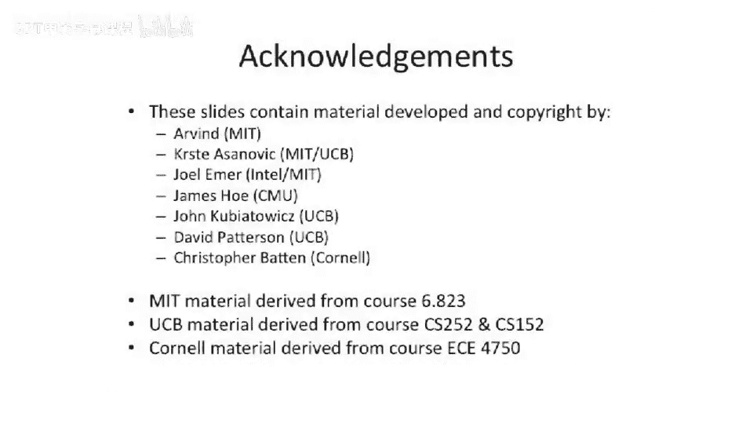

# 106：目录一致性协议入门 🧠

在本节课中，我们将学习目录一致性协议的基本概念。我们将探讨监听式协议面临的挑战，并了解目录协议如何通过将广播通信转变为点对点通信来解决可扩展性问题。最后，我们将讨论非统一内存访问架构以及混合协议设计。

## 监听式协议的挑战

上一节我们介绍了基于总线的监听式协议。本节中我们来看看其性能和可扩展性方面的挑战。

监听式协议的核心挑战在于，随着系统处理器数量的增加，所有处理器都需要通过一个共享介质（如总线）进行通信。每当一个核心发生缓存缺失时，该事务都需要广播到总线上，所有其他核心都必须监听此事务，并与自己的本地缓存进行比对，以执行必要的操作（如使无效或回复数据）。

这种设计带来的问题是总线带宽需求。为了在增加核心数量的同时保持每个核心的缓存缺失率不变，总线的带宽需求将按 **O(N)** 增长，其中 **N** 是处理器数量。当 **N** 较小时（例如8），这可能不是问题。但当 **N** 增长到1000甚至百万级别时，构建一个如此高带宽且能支持原子事务仲裁的总线将变得极其困难。

## 目录协议的核心思想

为了解决上述可扩展性问题，我们引入了目录缓存一致性协议。

目录协议的关键思想是：不再将无效化请求或缓存缺失广播给系统中的所有其他核心，而是与一个称为“目录”的特定位置进行通信。这个目录负责追踪哪些缓存拥有特定缓存行的副本。

以下是其工作原理：
1.  当一个核心发生缓存缺失并需要获取数据时，它会向目录发送请求。
2.  目录检查其记录，确定当前有哪些缓存持有该数据行。
3.  如果只有一个其他核心持有该数据（例如处于只读状态），而请求核心需要独占访问（例如进行写入），那么目录只需向那个特定的核心发送一个无效化消息，而不是向所有 **N** 个处理器广播。

这样，我们就将一个广播系统转变为了一个点对点通信系统。虽然我们需要额外的开销来维护目录信息，但显著降低了对互联网络带宽的需求。

## 目录协议的系统架构

让我们看看目录协议如何融入系统框图。

在一个典型的目录协议系统中：
*   多个 CPU 通过共享内存进行通信。
*   每个 CPU 首先检查自己的缓存。
*   如果缓存缺失，CPU 的缓存控制器会向与该内存地址关联的**目录控制器**发送一条消息。
*   目录控制器为内存中的每一行维护一个**共享者列表**，记录哪些缓存可能拥有该数据的副本。
*   目录根据此列表，仅向相关的缓存发送点对点消息（如无效化请求），并协调数据的传递。

此时的互联网络（如 Omega 网络或 Mesh 网络）仍然是均匀的，所有节点间的通信延迟是固定的，因此这仍是一个**统一内存访问**系统。

## 非统一内存访问架构

我们可以进一步优化架构，将内存和目录分布到各个 CPU 节点上。

在这种设计中，每个 CPU 节点都直接连接着一部分本地内存和一个目录控制器。这样做的好处是：
*   **可扩展性**：增加 CPU 时，也同步增加了内存和目录资源。
*   **局部性优势**：CPU 可以快速访问其本地内存。对于主要被单个核心访问的数据（如程序的栈、指令段），可以分配在其本地内存中，从而获得极低的访问延迟。只有共享数据才需要通过互联网络进行远程访问。

这种某些数据“近”、某些数据“远”的架构被称为**非统一内存访问**架构。现代多路服务器和某些桌面处理器（如采用多芯片模块的 AMD 处理器）都已采用 NUMA 架构。操作系统（如 Linux）可以感知 NUMA 拓扑，并尝试将进程的内存分配在其本地节点上，以优化性能。

需要强调的是：**内存访问延迟不同，并不一定意味着系统是基于目录的一致性 NUMA 系统**。也存在基于监听协议但内存分布不均的系统。通常，文献中提到的 **CC-NUMA** 特指基于目录协议实现的缓存一致性 NUMA 系统。

## 混合协议设计

在实际系统中，经常混合使用不同的协议。一个常见的模式是：在单个多核芯片内部使用基于总线的监听协议，而在连接多个芯片时使用基于目录的协议。

以下是其工作方式：
*   在芯片内部，各个核心通过高速总线互联，并使用监听协议维护一致性。
*   整个芯片对外（例如其末级缓存控制器）作为一个整体，参与到跨芯片的目录协议中。它会响应来自其他芯片目录的请求（如无效化），并在内部转换为总线事务。

这种设计非常普遍。例如，一些现代大型系统（如基于 Intel 至强处理器的 SGI UV 系统）就使用商品化的多核处理器芯片，并通过一个目录一致的 NUMA 互联网络将它们连接起来，在芯片间实现了可扩展的一致性。

## 总结

本节课中我们一起学习了目录一致性协议。我们首先分析了基于总线的监听式协议在可扩展性上面临的带宽挑战。然后，我们引入了目录协议，其核心思想是通过一个中心目录来追踪数据副本的位置，从而将广播通信转变为高效的点对点通信。接着，我们探讨了如何将目录与内存分布到各节点，形成非统一内存访问架构以利用数据局部性。最后，我们了解了在实际系统中，目录协议与监听协议可以混合使用，例如在芯片内使用总线，在芯片间使用目录，以兼顾效率与可扩展性。