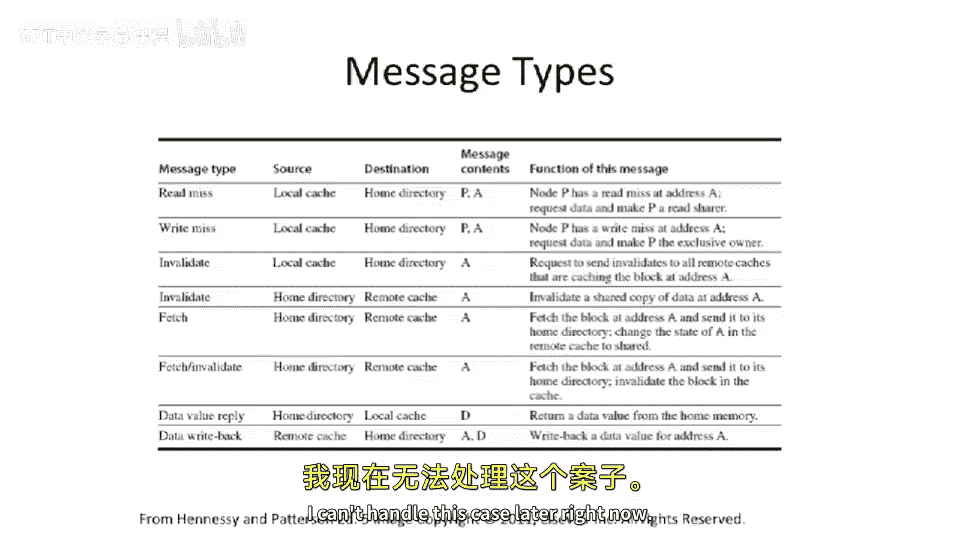

# 107：基于目录的分布式共享内存实现 🧠

在本节课中，我们将学习如何在实际的硬件中实现基于目录的分布式共享内存系统。我们将探讨如何确定数据在系统中的“家”（即目录或主节点），深入分析目录内部的数据结构，并理解缓存与目录之间如何通过消息传递来协同工作，以维护数据的一致性。

## 目录映射策略 🗺️

上一节我们介绍了基于目录的分布式共享内存机器的基本概念，本节中我们来看看如何确定一个内存地址对应的目录在哪里。

你有一个内存地址。通常在这些系统中，映射是基于物理地址进行的，而不是虚拟地址。这是因为此时数据是在多个不同系统之间共享的，地址已经通过了转换后备缓冲器或内存管理单元的转换，成为了物理地址。

为了确定目录（在分布式共享内存机器中有时也称为“主节点”）的位置，即应该访问哪个目录，有多种方法。其中一种更常见的方法是直接使用地址中的某些位。

以下是具体做法：
*   取系统中目录的总数，计算其以2为底的对数。
*   然后从地址中取出对应数量的位，作为主节点编号。

因此，当你发生缓存未命中，并且需要加载该数据时，你会发送一条消息。这条消息的目的地标识符就是计算出的主节点编号。希望你的互连网络知道如何将数据路由到那个目录。

使用地址的高位进行映射有一些好处。正如我们在非统一内存访问架构中讨论过的，操作系统可以控制数据的放置。基于这些高位，你可以决定数据将位于系统中的哪个节点或目录。因此，操作系统可以基于物理地址来分配内存、分配堆栈、分配指令空间，因为操作系统对物理地址的分配拥有绝对控制权。

缺点是，一个目录或主节点可能成为热点。假设突然之间，系统中的所有处理器都试图访问同一页内存（例如一个包含所有系统锁的热页）。如果你查看这些地址，它们都会位于较低的地址区域。即使没有发生伪共享，通常也会尝试将所有数据打包到一个页面或结构中，很难根据地址的非常高阶位进行交错存放。特别是考虑到程序对由操作系统管理的物理地址高阶位几乎没有控制权。如果采用高位映射，所有这些地址都会映射到同一个目录，导致所有消息流量都涌向一个节点。这几乎又变回了一种总线结构。虽然情况稍好，因为我们不一定需要使所有其他位置的数据失效，但目录本身及其带宽开始成为关键瓶颈。

另一方面，你可以尝试用地址的低位来决定使用哪个目录或主节点。这样，你仍然有缓存行内的偏移量，但决定主节点的物理地址位是低位。

这最终会实现非常好的负载均衡。因为根据不同的缓存行，你将（几乎是随机地）选择不同的主节点。同一个缓存行会去往同一个主节点或目录。如果你有稍微不同的缓存行（这很常见，因为很难将所有数据争用在一个缓存行内），流量就会分散到不同的控制器上，从而实现良好的分布。

然而，缺点是操作系统在这里失去了放置控制能力。这是一个需要权衡的棘手问题。有些人甚至构建了可配置的系统。这涉及到更高级的内容，我将在今天讲座的最后一张幻灯片中提及。你可以考虑构建一些系统，根据实际的地址和页表输出，可能做出不同的映射选择。但系统中的所有组件（目录和所有缓存）都必须就映射方式达成一致，这有点棘手。

## 目录内部结构 🔍

现在，我们来看看目录内部有什么。我们添加了这个新的硬件结构。每当我们添加一个新的硬件结构时，我喜欢查看它内部的所有位。

我们添加的这个新硬件结构，对于连接到该目录的特定内存中的每一个缓存行，都有一个条目。因此，纵观整个系统，实际上系统中的每一个内存行都会有一个额外的数据条目。

以下是其朴素实现方式：
*   如果系统中有10TB内存，朴素的方法是为系统中每一个块大小的内存块（缓存块大小）都设置一个目录条目。
*   这些条目通常保存在大表中，一般使用SRAM，也可能尝试放在DRAM中。

目录条目里有什么？目录需要知道缓存行处于什么状态。在我们的基本协议中，我们将查看三种不同的状态：共享、未缓存和独占。

*   一切从**未缓存**状态开始，数据在主存中。
*   当它被读入缓存（只读）时，目录会将其标记为**共享**。
*   当它被读入缓存（读写）时，目录会将其标记为**独占**。

如果处于共享或独占状态，我们需要知道是哪个节点。如果是独占，我们需要唯一地知道哪个节点拥有它，以便在需要使其失效时能够发送消息。如果是共享，我们需要知道所有可能拥有该数据副本的节点列表，以便向它们发送消息。这比必须向系统中的所有节点广播或发送消息要好。

因此，这里会有一个**共享者列表**。在一个朴素的全映射目录中，对于系统中的每个核心或每个缓存，都会有1位。该位为1表示该核心拥有数据的只读副本；为0则表示没有。当其他缓存试图以可写方式获取该数据时，目录将必须使这些设置了1的位的核心的缓存副本失效。

如果是**独占**状态，这里不会设置多个位。因为这基本上意味着该核心拥有可写副本。为了保持数据一致性，我们不希望有多个可写副本。

如果处于**未缓存**状态，我们不需要跟踪任何信息，这些位是无关紧要的。

这里还有另一个状态：**挂起**。这通常实际上会演变成几个子状态。在目录端有不同的方式来跟踪这一点。这些事务需要多个步骤。例如，你想获取数据的可写权限，目录将必须使所有其他副本失效。这无法瞬时完成，但我们希望提供原子性的表象。通常，你实际上会在目录中存储一些子状态，例如表示缓存行当前正在从某种状态转换到另一种状态（例如从U到E），在此期间阻止其他事务对其进行操作。实现方式之一是将状态存储在目录中；另一种方式是使用一个全相联的旁路结构来跟踪所有当前正在变化的缓存行。目录足够智能，知道当其他请求在该行处于变化状态时到达，可以拒绝该请求或告知对方稍后重试。实现方式可以不同，但这会变得相当复杂。我们将在高层次上讨论状态转换，并假设它们以某种方式是原子的。

## 缓存状态转换（MSI协议） 🔄

现在，我们来看看MSI协议如何与此结合。你也可以考虑用MESI或其他协议来实现，但MSI更简单一些，所以我们先看它。此外，在目录协议中，像MESI这样的协议的好处会减弱，因为如果你以独占状态（开始时未修改）拉入数据，而其他人想要获取只读副本，你基本上必须向那个核心发送消息。这在总线上是廉价的，因为它可以看到总线上的事务并进行侦听，从而从E状态降级到共享状态。但现在这变成了实际的工作：目录必须生成消息，并且你必须等待来自拥有独占副本的缓存的响应。因此，在转向这些分布式共享内存协议时，类似MESI的协议就不那么常见了。

这是一张我们之前见过的幻灯片，展示了总线上的MSI协议。当我们转向基于目录一致性的MSI时，情况发生了一些变化。在深入之前，我想指出这里实际上有两个不同的状态机在运行：一个运行在各个处理器的缓存控制器中，另一个运行在目录中。你会看到它们在这里使用了不同的字母表示（S、U、E 对比 M、S、I），我们特意这样标记以避免混淆。这两个状态机通过相互发送消息进行交互。随着消息在目录和缓存之间流动，它们将根据这两个表格经历不同的状态转换。

让我们深入了解一下。这是我们总线侦听MSI协议中相同的修改、共享和无效状态，规则也相同。
*   如果你处于修改状态，可以写入而无需发送任何消息。
*   如果处于共享状态，可以读取数据而无需联系任何人。
*   如果处于无效状态并想对其进行任何操作，可能需要联系某人（在这里是目录），就像之前我们必须在总线上发送事务一样。
*   同样，从S到M或从M到S的转换也需要通信。

可以认为这是相同的状态机在运行，只是以前我们通过总线发送事务，现在我们将把这些事务转换成发送给目录的消息，以及我们从目录接收并必须响应的消息。以前，我们侦听总线上的流量，这导致我们转换到不同的状态（例如，其他处理器试图写入，我们在总线上看到这一点，因此必须将自己转换到无效状态）。现在，我们实际上会从目录控制器收到一条消息。

让我们以一个缓存行在处理器P1中的状态为例，从入口点开始。我们从无效状态开始。

假设我们想获取该行的只读副本，即发生读未命中。处理器1将向目录控制器发送一条读未命中消息。在此期间，它没有可读副本，无法访问数据，实际上仍处于I状态（有时人们会在这里设置一个挂起状态，具体取决于实现方式）。发送读未命中消息后，等待响应。这个响应将包含你需要的数据，并且是一个同步点，表示你可以安全地转换到S状态。

类似地，对于写未命中：如果我们处于无效状态并进行写入，我们将向目录控制器发送写未命中请求。它需要做一些处理，我们可能必须等待一段时间，因为它可能必须使系统中所有其他行的副本失效。然后，当我们得到响应时，我们就获得了数据并可以转换到修改状态。

这些转换弧很简单。我们可以在M状态下由P1进行读取或写入，而无需与任何人通信。

但现在我们这里有一些不同的消息传入：
*   如果我们在共享状态，必须响应一条失效消息。这与总线侦听不同：以前我们看到另一个处理器试图写入，这使我们转换到I；现在目录控制器发送一条消息说“使该行失效”，这将使我们转换到I。注意，这里可能需要回复，因为目录控制器想知道系统中的所有缓存行何时已被失效，这可能需要可变的时间，所以它要等待回复返回。
*   如果我们在修改状态，收到来自目录控制器的失效消息，我们需要写回数据（因为我们有已修改的数据），然后回复。

还剩下中间的两个转换弧：
*   我们在共享状态，并想对该缓存行进行写入。在实际写入之前，我们必须向目录发送消息，说明我们正在进行写未命中，希望获取该数据的可写权限。我们必须等待回复才能转换到M状态，因为我们必须等待目录控制器与所有其他缓存通信，使它们不再拥有只读副本。
*   另一个转换是从修改状态到共享状态。这有点不同，但理念相同：另一个处理器试图进行读取。我们收到一条读未命中消息，不需要使数据失效，但需要写回数据（因为我们拥有最新的副本）。我们将写回数据作为响应，然后转换到共享状态，因为另一个核心也只拥有只读副本。

这里还有两个有趣的转换弧，在我们基础的MSI协议中没有。这些对应的情况是：如果我们的缓存中有数据，但由于冲突未命中或容量未命中而被替换出去，最好去更新目录，告诉目录将来如果其他缓存想要获取该数据，不需要再联系你。
*   如果在修改状态，我们可以写回数据（因为是脏数据）并通知目录我们不再拥有副本，目录可以将其转换到未缓存状态。
*   如果在共享状态，我们可能希望（如果互连有额外带宽）在因被替换而失效时发送一条消息，通知目录将我们从共享者列表中移除。如果共享者列表因此变空，目录可能会将该缓存行从共享状态完全更改为未缓存。

但需要指出，这些并非严格必要。原因是，如果我们构建缓存控制器系统，使得当你在某个缓存行处于无效状态时收到一条消息（例如本应触发这些转换的消息），我们可以直接回复说“我们不再拥有它，我们是无效的”。如果你处于I状态，唯一可能收到的消息就是一条失效消息，而那条消息本就会让你保持在I状态，所以我们可以忽略该消息或像回复正常失效消息一样回复。

## 目录状态转换 🏠

目录的状态转换看起来有些不同。我们有未缓存、共享和独占状态。如前所述，共享意味着系统中可能有多个只读副本；独占意味着系统中只有一个缓存拥有该数据。有趣的是，如果你实际运行的是MESI协议，目录中运行的协议不会改变，因为这里的独占状态在目录看来是相同的。

让我们看看目录中缓存行状态的几个转换。从未缓存状态开始。
*   假设我们收到来自处理器P的读未命中消息。我们应该转换到S状态，给它一个只读副本，回复实际数据，并将P添加到共享者列表中。这样我们就知道，如果有人需要使该行失效，我们需要联系P。
*   现在我们在共享状态，假设有其他处理器发来读未命中。我们将提供数据，并将其添加到共享者列表中，共享者列表会增长。
*   回到未缓存状态，假设突然收到来自处理器P的写未命中。我们提供数据，共享者列表或所有者列表将唯一地添加P，并且我们将其置于独占状态，因为之前是未缓存，不需要联系其他人。

现在看另一个转换。假设处理器P0独占拥有数据，但突然另一个处理器（比如P2）要访问该数据。我们已处于独占状态，但请求者是不同的缓存。这里需要发生的是：我们需要从P0获取数据，P0将写回数据并转换到无效状态。然后我们需要将数据提供给新的处理器P2，并将P2添加到共享者列表（此时是独占所有者）。我们可以转换到这个状态。

再看这两个状态之间的边。首先看从E到U的边：这是写回数据发生的转换。假设你在这里，看到一个数据写回发生。一条相当于缓存端可选弧的消息发送给你。数据是可写的，在某个缓存中是独占的，现在不再可写。最好联系目录，写回数据并清空共享者列表，这样目录就知道此时没有人拥有它的副本。

还有其他几个转换边：
*   我们在共享状态，有多个只读副本，一个缓存发来写未命中消息，需要获取可写权限。现在我们必须经历一个相当长的过程：遍历整个共享者列表，向列表中的所有共享者发送消息，说“使这个副本失效并告诉我何时完成”。我们将在目录处收集所有响应。一旦所有响应返回，我们知道没有其他人拥有只读副本，就可以将数据提供给请求者，并将其添加到共享者或所有者列表。
*   最后一条从E到S的橙色边：如果我们有一条线在某个缓存中是可写的，而另一个缓存现在想读取它。另一个缓存将发送读未命中。拥有独占副本的缓存将从M降级到S。但目录将在这里从E转换到S。我们必须从之前独占拥有它的节点获取最新的数据，因此我们将向该节点发送获取请求。一旦我们获得最新的数据，就可以将其转发给新的读取者，并将该处理器添加到共享者列表。

这些开始变得有点复杂，因为涉及多个状态机的交互。

## 消息类型总结 📨

我们在这里加快一点速度。我包含了教科书中的这张图表，作为示例，快速总结了所有不同的消息类型，以及它们可以从谁发出、发送给谁。有时消息需要传递地址，有时需要传递数据，有时需要传递消息来自哪个节点（以便将其添加到共享者列表）。

但我不打算深入讨论细节。我想说的一点是，这里列出的消息类型不包括确认消息。当你请求某物时，会有回复返回。图表中看到了数据值回复，但那只是实际数据，不包括来自共享者确认失效等的响应。

另一种这里没有绘制的常见消息类型是**否定确认**。如果有一个缓存行正在转换中，目录处于挂起状态，此时收到一个请求，你可能只需要告诉那个缓存“稍后重试，我现在无法处理这个情况”。

---

**本节课总结**：在本节课中，我们一起学习了基于目录的分布式共享内存系统的关键实现细节。我们探讨了如何通过地址位映射来确定数据的主节点，分析了目录内部用于跟踪缓存行状态和共享者列表的数据结构，并详细走查了缓存控制器和目录控制器在MSI协议下的状态转换过程。理解这些交互机制是构建高效、可扩展的共享内存系统的核心。