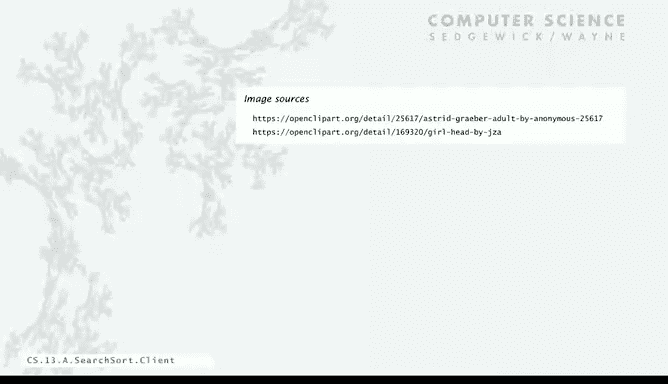
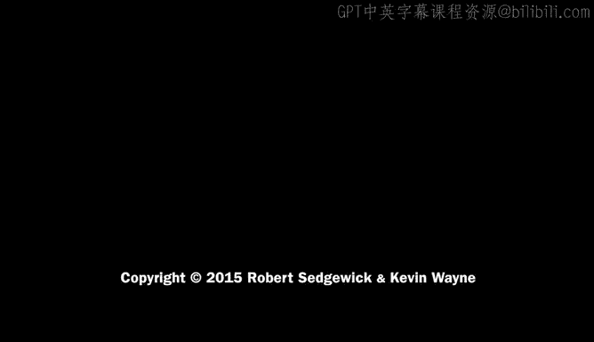

# 001：典型客户端与顺序查找

## 概述
在本节课中，我们将学习一个典型的客户端程序——白名单过滤器，并探讨其核心功能：查找。我们将从最简单的实现方法“顺序查找”开始，分析其性能，并通过数学分析和实证测试来理解其局限性。这为后续学习更高效的算法奠定了基础。

---

## 白名单过滤器：一个典型客户端

我们首先将编程知识和科学分析程序的能力应用于计算领域最重要的应用之一：排序与查找。我们将从一个典型的客户端程序例子开始。

这个程序被称为白名单过滤器。它在应用中经常出现。你可能熟悉黑名单的概念，即一份将被拒绝服务的列表。例如，信用卡透支或垃圾邮件会被拒绝。与之相反的是白名单，即一份将被接受服务的列表。例如，账户状态良好时，交易会通过；你希望接收来自亲友的邮件。

我们将要讨论的白名单过滤器就是一个典型客户端的例子。其核心思想是：你有一个文件，其中包含所有你想接受（白名单）的字符串。然后，我们从标准输入读取字符串（这可能是一个大得多的输入），并只将那些存在于白名单中的字符串写入标准输出。当然，实际应用中可能附带其他信息，我们可以用此来接受邮件或账户交易。

在我们的例子中，我们将省略这些关联的操作或消息内容（例如邮件正文）。以下是一个例子：假设我只想接受来自这些邮箱地址的邮件：Alice、Bob、Carl 和 Dave。现在，标准输入是我收到的邮件流。如果我收到来自 Bob 的邮件，它在白名单中，我会检查并通过，将其写入标准输出（这代表进一步处理）。来自 Carl 的邮件同理。来自 Marvin 的垃圾邮件不在白名单中，因此我们忽略它。白名单过滤器的目的就是将这些不良邮件排除在处理列表之外。后续还有来自 Bob 的邮件（通过检查）、更多垃圾邮件（被过滤）、来自 Dave 的邮件（通过）以及来自 Eve 的邮件（被过滤）等等。这就是过滤掉我们想拒绝的内容，或筛选出我们想接受的内容的整体思路。

我们希望编写一个具有此功能的 Java 程序，并且白名单和交易列表都可能非常庞大。

以下是客户端代码的大致结构。我们需要一个查找方法，这将是本讲的重点。这个方法接收一个字符串（称为键）和一个数组作为输入，并告诉我们这个键是否在数组中。

假设我们已经有了这个方法（其实现将在本讲稍后讨论），以下是主程序的样子。它引用一个包含白名单的文件作为参数。我们使用标准 I/O 库中的 `readAllStrings` 方法，从标准输入读取所有字符串并放入一个名为 `words` 的数组中，这就是白名单。

只要标准输入不为空，我们就读取一个键，然后调用我们的查找方法，检查该键是否在 `words` 列表中。该方法的接口约定是：如果键不在数组中，则返回 -1；如果在，则返回其在数组中的索引。因此，我们只需检查返回值是否不等于 -1，如果是，则意味着键存在，此时我们将其打印回标准输出。这就是我们的客户端程序。

例如，如果 `white4.txt` 是我们的白名单文件，`test.txt` 是包含示例邮件列表的文件，我们调用程序 `WhiteFilter` 并以 `white4.txt` 作为参数，然后通过管道将 `test.txt` 的内容输入到标准输入，那么只有那些在白名单中的邮件会被打印出来。

这就是程序的基本设置。我们现在的目标是编写这个查找程序，以实现上述行为，特别是在白名单和标准输入列表都非常庞大的情况下。

---

## 顺序查找：第一次尝试

我们的第一次尝试是一个简单的、作为参照的实现，称为顺序查找。其核心思想是：你有一个包含白名单的数组，然后你遍历数组，查看是否有与查找字符串匹配的项。如果找到匹配项，则返回其索引；如果没有找到，则返回 -1。这满足了白名单过滤器所需的功能。

其代码相当简单：遍历整个数组，检查数组元素是否等于键。如果是，则返回其索引；如果遍历完都没找到，则返回 -1。

假设我们有一个包含 15 个单词（名字）的数组，我们想查找 `Oscar` 是否在其中。我们只需遍历数组寻找 `Oscar`。这可能是某人在编程马拉松中想出的代码。

首先要注意的是，这段代码在找到 `Oscar` 时并没有停止，甚至可能根本找不到。这提醒我们回顾 Java 中的基本操作。思考一下为什么它没有在 `Oscar` 处停止。稍作思考，你会发现使用 `==` 操作符实际上比较的是字符串的引用，而不是字符串的内容。它检查的是这两个引用是否指向完全相同的字符序列。而我们想要的是检查它们所指向的字符串是否逐个字符相等。因此，我们需要使用 `compareTo` 方法。

好的，没问题。现在让我们修复它，使用 `a[i].compareTo(key) == 0`，当且仅当字符串逐个字符匹配时，`compareTo` 会返回 0。这样修改后，代码就能正常工作，找到 `Oscar` 并返回索引 10。

---

## 性能分析：数学模型与实证测试

在将程序投入大规模生产环境之前，我们有能力测试其性能。我们想做两件事：进行粗略的数学分析，然后进行一些实证测试，并希望这两个模型能相互印证，然后我们再据此继续推进。

让我们为顺序查找的性能建立一个简单的数学模型。假设我们的白名单长度为 `N`，并且对于某个常数 `C`，我们有 `C * N` 笔交易（例如，交易数量是白名单大小的 10 倍或 100 倍。不同应用场景可能不同，但这能给我们一个指示）。我们还假设字符串长度与 `N` 相比不算太长，真正庞大的是名字的数量。

以下是快速分析：首先，如果键在白名单中，平均情况下，你需要遍历大约一半的列表才能找到它。其次，如果键不在白名单中（即查找失败），平均情况下，你需要遍历整个列表。因此，每次查找平均需要检查 `N` 个字符串或 `N/2` 个字符串。

如果你有常数乘以 `N` 笔交易，并且每次查找要么检查 `N` 个字符串，要么检查 `N/2` 个字符串，那么运行时间的预期增长阶数将与 `N^2` 成正比，即它是二次的。因此，根据数学模型，对于随机字符串，我们应预期运行时间是二次的。

让我们用实证测试来验证这一点。首先，我们需要一个输入生成器。这是一个简短的程序，用于从给定字母表中生成给定长度的随机字符串。这将使我们能够在多种不同情况下灵活地测试程序。

它有一个 `randomString` 方法，接收长度作为第一个参数，字母表（构成字符串的字符集）作为第二个参数。我们将创建一个指定长度的字符数组，然后遍历该数组，为每个位置从字母表中随机选取一个字符。完成后，我们从这个字符数组创建一个新的字符串并返回。这是一个返回随机字符串的简单方法。

然后，我们的驱动程序将从命令行获取所需字符串的数量，长度作为第二个参数，字母表作为第三个参数，然后生成指定数量的、来自给定字母表的、指定长度的字符串。

这是一个相当简单的程序。以下是我们能做的事情示例：我们可以要求生成 10 个长度为 3、来自字母表 `ABC` 的字符串。这在客户不多但交易很多的情况下可能有用。排序和查找算法的性能可能因重复项的数量而异，在这个例子中，出现重复项的可能性很高。

或者，如果我们取 8 位数字，字母表为 0 到 9，那么出现重复项的可能性就小得多。

在另一个我们稍后会看到的应用中，我们可能有一个非常长的字符串，字母表为 `ACTG`。我们用它来测试基因组学算法，那里可能只有一个长字符串。所有这些情况都可以用这个生成器覆盖。

---

## 顺序查找的测试客户端

现在，让我们看看顺序查找程序的测试客户端是什么样的。我们将匹配数学模型中的假设，即对一个长度为 `N` 的白名单进行 `10N` 次查找。

首先，我们有之前讨论过的查找例程。以下是这个测试的主程序：同样，我们从标准输入读取白名单，其长度为 `N`。现在，我们使用 `System.currentTimeMillis() / 1000` 来跟踪时间（单位秒）。我们也可以使用之前开发的 `Stopwatch` 类。

然后，对于 `i` 从 0 到 `10 * N`（即我们将在这个循环中进行 `10 * N` 次操作），我们将从白名单中随机选取一个单词。我们知道查找会成功，因此不会有输出。这对于运行这样的大型实证测试是有利的，因为没有输出干扰。

我们执行查找（虽然知道会成功，不打印结果，但确实执行了搜索）。在完成 `10 * N` 次查找后，我们再次检查时间。我们想要打印出完成这个过程所需的秒数。

有了这个测试客户端，我们现在可以使用生成器对大型文件运行测试。例如，这个生成器生成 10,000 个长度为 10、全部由小写字符组成的单词（为了适应幻灯片，我将字母表 `a` 到 `z` 缩写为 `a-z`）。

在这种情况下，如果我们运行测试，我们生成 10,000 个 10 字母单词，并打印出在该 10,000 个单词的列表中进行 100,000 次查找所需的时间，结果是 3 秒。

现在，我们可以使用这个测试客户端进行我们在课程第一部分学习性能时接触过的“翻倍测试”。

---

## 翻倍测试结果与分析

再次强调，白名单大小为 `N`，交易数量为 `10N`。我只需改变文件大小（即 `N`）：
*   当 `N = 10,000` 时，耗时 3 秒。
*   当 `N = 20,000` 时，耗时 9 秒。同时记录每秒处理交易数作为衡量指标。
*   当 `N = 40,000` 时，耗时 35 秒。
*   当 `N = 80,000` 时，耗时 149 秒。这确实需要相当长的时间，并且每秒处理交易数急剧下降。

如果某人想拥有百万客户，那么这将需要 38,000 秒，即超过 10 小时，仅仅为了完成这个白名单过滤任务。更糟糕的是，处理速度下降到每秒仅 34 笔交易，并且还在下降。

这显然不够理想。如果我们更仔细地观察翻倍测试的含义：这个时间比值（当前运行时间除以前一次运行时间）告诉我们运行时间增长阶数的指数。如果运行时间与 `N^b` 成正比，那么翻倍测试中，这个比值的以 2 为底的对数就是指数 `b`。

在我们的测试中，比值约为 4（例如 35/9 ≈ 3.89， 149/35 ≈ 4.26），`log₂(4) = 2`。这验证了数学模型，我们非常有信心该程序的运行时间与白名单大小的平方成正比。这种增长方式无法扩展，对于大规模业务来说效果不佳。

因此，我们必须寻找比顺序查找更好的方法来解决这个问题。

---

## 总结
本节课中，我们一起学习了一个典型的客户端应用——白名单过滤器，并实现了其核心的查找功能。我们首先采用了最简单的顺序查找算法，并通过数学分析预测其运行时间与数据规模的平方成正比。随后，我们构建了输入生成器和测试客户端进行实证测试，翻倍测试的结果（时间比值约等于4）有力地证实了其二次方的增长阶数。这揭示了顺序查找在处理大规模数据时的根本性局限，为我们后续探索更高效的查找与排序算法提供了明确的动机和方向。