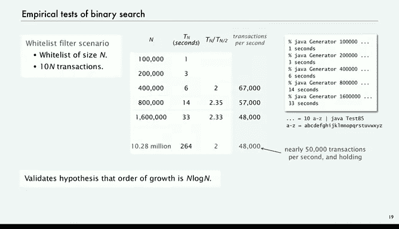

# 002：二分查找


## 概述
在本节课中，我们将要学习一种名为“二分查找”的经典算法。这是一种在已排序数组中高效查找特定元素的方法。我们将了解其工作原理、实现细节，并通过数学分析和实验验证其性能。

## 二分查找的原理
上一节我们介绍了顺序查找，本节中我们来看看一种更高效的方法——二分查找。其核心思想非常直观：首先，将待查找的数组按顺序排列（排序方法将在本讲座第二部分讨论）。如果数组已排序，我们就可以通过检查中间元素来缩小查找范围。

具体步骤如下：
1.  检查数组中间位置的元素。
2.  如果该元素正好是我们要找的键，则返回其索引，查找成功。
3.  如果中间元素比目标键大，则目标键只可能存在于数组索引较小的前半部分。
4.  如果中间元素比目标键小，则目标键只可能存在于数组索引较大的后半部分。
5.  在缩小后的范围内重复上述过程，直到找到目标键或确定其不存在。

例如，在一个已排序的名字列表中查找“Oscar”。我们先检查中间的名字“Eve”，发现“Oscar”更大，于是可以排除前半部分，只在后半部分查找。在后半部分的中间找到“Peggy”，发现“Oscar”更小，于是可以排除这部分的上半区。如此反复，最终找到“Oscar”或确认其不存在。

## 算法实现细节
为了精确地定义查找区间，我们使用一种类似数学区间的表示法。`A[low, high)` 表示从索引 `low` 开始，到 `high` 结束（但不包括 `high` 本身）的子数组。在Java中，这对应于 `A[low]` 到 `A[high-1]`。

中间索引 `mid` 的计算公式为：
`mid = low + (high - low) / 2`
这样计算可以避免整数溢出，并得到当前查找区间的中间位置。

比较之后，新的查找区间将排除中间元素 `mid`：
*   如果键小于 `A[mid]`，则在左半部分 `A[low, mid)` 中继续查找。
*   如果键大于 `A[mid]`，则在右半部分 `A[mid+1, high)` 中继续查找。

这种区间定义使得递归实现时的边界条件处理更为清晰。

## Java代码实现
以下是二分查找的Java递归实现代码：

```java
public static int binarySearch(int key, int[] a) {
    return rank(key, a, 0, a.length);
}

private static int rank(int key, int[] a, int low, int high) {
    if (high <= low) return -1; // 查找失败，区间为空
    int mid = low + (high - low) / 2;
    int cmp = Integer.compare(key, a[mid]);
    if (cmp < 0) {
        return rank(key, a, low, mid);      // 在左半部分查找
    } else if (cmp > 0) {
        return rank(key, a, mid + 1, high); // 在右半部分查找
    } else {
        return mid;                         // 查找成功
    }
}
```

代码解析：
*   `binarySearch` 是公开方法，初始化递归调用，查找整个数组 `a[0, a.length)`。
*   `rank` 是私有递归方法。参数 `low` 和 `high` 定义了当前查找的区间 `a[low, high)`。
*   基线条件：如果 `high <= low`，说明区间内没有元素，查找失败，返回 `-1`。
*   计算中间索引 `mid` 并与目标键比较。
*   根据比较结果，在相应的子区间内递归调用 `rank` 方法，或直接返回找到的索引。

理解这段代码需要仔细推敲边界条件，例如空区间和单元素区间的情况。通过练习，你会发现这是一个逻辑清晰且强大的算法。

## 递归执行过程
让我们通过查找“Oscar”的例子来跟踪递归过程。假设数组长度为16（索引0到15）。

以下是递归调用的步骤：
1.  初始调用：`rank(“Oscar”, a, 0, 16)`。计算 `mid=7`，比较发现“Oscar” > “Eve”。
2.  递归调用：`rank(“Oscar”, a, 8, 16)`。计算 `mid=12`，比较发现“Oscar” < “Peggy”。
3.  递归调用：`rank(“Oscar”, a, 8, 12)`。计算 `mid=10`，比较发现“Oscar” > “Mallory”。
4.  递归调用：`rank(“Oscar”, a, 11, 12)`。此时区间内只有一个元素 `a[11]`，计算 `mid=11`，比较发现相等。
5.  返回索引 `11`，并沿着递归调用链逐层返回，最终 `binarySearch` 方法返回结果 `11`。

## 性能的数学分析
为了分析二分查找的性能，我们建立一个简化的数学模型。假设数组大小 `N` 是 `2^n - 1`（例如 1, 3, 7, 15, 31...）。这样，每次将区间对半分时，子区间的大小都能保持为 `2^(k) - 1` 的形式。

分析过程如下：
*   第一次调用，数组大小为 `2^n - 1`，比较一次。
*   第二次调用，子数组大小约为 `2^(n-1) - 1`，再比较一次。
*   以此类推，直到第 `n` 次调用时，子数组大小变为 `1`。
*   因此，一次不成功的查找（搜索失败）总共需要进行大约 `n` 次比较。

由于 `N = 2^n - 1`，所以 `n ≈ log₂(N)`。这意味着**二分查找的比较次数与 `log₂(N)` 成正比**。更深入的分析表明，对于成功的查找，平均比较次数也大致为 `log₂(N)`。这个结论即使当 `N` 不是 `2^n - 1` 时也基本成立。

## 实验验证
理论需要实践检验。我们像测试顺序查找一样，对二分查找进行大规模实验。

以下是实验结果：
*   对于10万个键的列表，查找耗时约1秒。
*   对于20万个键，耗时约3秒（比例接近2，而非顺序查找的4）。
*   对于40万个键，耗时约6秒。
*   对于160万个键，耗时仅约30秒（顺序查找需要数小时）。
*   对于1000万个键，也只需几分钟即可完成。

实验数据强有力地验证了我们的数学模型：**每次查找的成本约为 `log₂(N)`**。这使得二分查找能够处理海量数据，性能远超市之前学习的顺序查找。




## 总结
本节课中我们一起学习了二分查找算法。我们了解了它通过在已排序数组中不断折半来快速定位目标元素的核心思想。我们详细分析了其递归实现代码、执行过程，并通过数学推导和实验验证，证明了其时间复杂度为 `O(log N)`，这相比顺序查找的 `O(N)` 是一个巨大的效率提升。然而，二分查找的前提是数组必须有序，这引出了下一个重要问题：如何高效地对数组进行排序？这将是我们在后续课程中要探讨的主题。