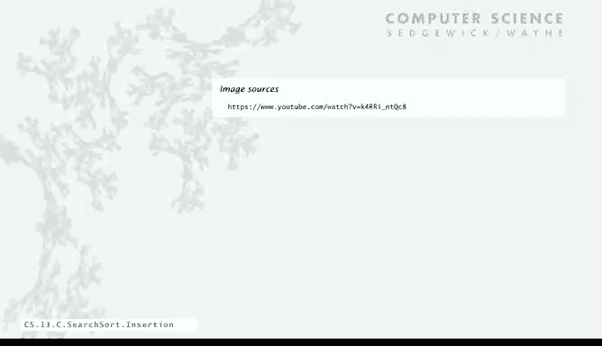

# 003：插入排序 🧩


在本节课中，我们将要学习一种基础的排序算法——插入排序。排序是计算机科学中的一个核心问题，它对于实现高效的二分查找至关重要。我们将从插入排序的原理开始，分析其实现方式，并通过实验测试其性能，最后探讨算法可扩展性的重要性。

## 排序问题概述

为了使二分查找有效，我们需要能够对白名单中的项目进行排序。因此，我们首先来看一种实现排序的方法。

排序是一个非常基础的问题：如何重新排列 n 个项目，使它们按升序排列？在我们的例子中，白名单中的名字存储在一个数组中，我们需要在数组内重新排列它们，使其以排序后的顺序出现。这正是二分查找有效运行所需要的。

排序是一个具有众多应用的基础问题，不仅限于二分查找。它被用于统计学、数据库、数据压缩、生物信息学、计算机图形学、科学计算等领域。事实上，据估计，即使在今天，所有计算机上花费的大量计算周期都用于排序。

## 插入排序算法原理

我们首先要看的排序方法称为插入排序。以下是它的工作原理。

我们依次考虑数组中的每一个项目。通过交换，将每个项目“冒泡”到数组中它正确的位置。这个过程被称为插入排序。我们遍历数组，每个项目会与它上方比它大的项目交换，直到到达其正确位置。你可以将其想象为它比那些项目“轻”，所以会上浮。

在每一步，当前项目（例如 Carol）上方的所有元素都已经是有序的，一旦我们完成这个上浮过程，当前项目也就位了，而其下方的元素则未被触及。这个方法并不是冒泡排序（我们不再教授冒泡排序，因为它比插入排序更慢）。在本讲座中，我们肯定会看到更好的方法。

让我们看一下插入排序的示例。以下是一个跟踪过程：当我们处理 Alice 时，Wendy 向下移动为 Alice 腾出空间，Dave 和 Walter 也是如此。Carlos 到来时，Dave、Walter 和 Wendy 向下移动为 Carlos 腾出空间。然后是 Carol，Aaron 上浮，依此类推。在每一个时刻，我们已经考虑过的数组部分是有序的，而其他部分未被触及。当 Bob 到来时，它几乎一路冒泡到开头。最后，Victor 只向上移动了几个位置。这就是插入排序的操作过程。

## 插入排序的Java实现

现在，我们来看看插入排序的 Java 实现。

我们使用一个循环，`i` 从 1 到 n。然后，我们处理索引小于 `i` 的元素。我们设置 `j = i`，只要 `j` 不为 0，我们就递减它。在循环中，我们将当前元素与索引低一位的元素进行比较，如果后者更大，我们就交换它们。交换操作使用一个交换数组中 `a[j-1]` 和 `a[j]` 的方法。如果我们到达一个点，当前元素比索引低一位的元素大，那么我们就完成了，它找到了自己的位置。

以下是实现代码：

```java
public class Insertion {
    public static void sort(Comparable[] a) {
        int n = a.length;
        for (int i = 1; i < n; i++) {
            for (int j = i; j > 0 && less(a[j], a[j-1]); j--) {
                exch(a, j, j-1);
            }
        }
    }

    private static boolean less(Comparable v, Comparable w) {
        return v.compareTo(w) < 0;
    }

    private static void exch(Comparable[] a, int i, int j) {
        Comparable swap = a[i];
        a[i] = a[j];
        a[j] = swap;
    }
}
```

交换方法是我们最早学习的计算技巧之一。

测试客户端只是从标准输入读取所有字符串，放入数组，使用此方法排序，然后打印出来。如果我们对包含 16 个元素的数组使用它，它会将它们按排序顺序排列。

## 性能测试与可扩展性

现在，我们再次进行实证测试。我们可以建立数学模型，但让我们像之前一样进行实证测试。

我们取一个长度为 n 的数组，包含 10 个字符的字符串（使用我们的生成器）。如果我们测试 20,000 个元素，需要 1 秒；40,000 个元素，需要 4 秒。继续测试，对于 320,000 个元素，速度变得相当慢。排序一百万个名字大约需要 4 小时（考虑到当今计算机速度很快，4 小时也算很长了）。我们的假设是，其增长阶约为 **n²**，测试结果证实了这一点。

考虑冒泡过程：对于 n 个元素中的每一个，它平均需要移动大约数组长度的一半。因此，对于每个元素，移动大约 n/2 个位置，总操作次数接近 **n²/4**，即 **O(n²)**。这意味着它无法很好地扩展。

如果你的公司业务增长到需要处理一千万个名字，使用插入排序将需要 10 天。这听起来是个糟糕的主意，因此我们需要比插入排序更好的排序方法。

这就引出了摩尔定律的概念。我想更仔细地谈谈可扩展的算法。

自 70 年代以来，自从我们有了集成电路，英特尔的创始人戈登·摩尔就提出了这个观点：大约每两年，集成电路中的晶体管数量会翻一番。这意味着我们每两年会获得两倍的内存（因为内存是用集成电路实现的），处理器速度每两年也会翻一番。这些是非常重要的影响。

在我的职业生涯中，我注意到这意味着：如果你买了一台新电脑，写一个程序访问电脑中的每一个字，无论它做什么，都需要几秒钟。我使用的第一台电脑只有几万个字的内存，每秒可以执行一万条指令（我稍后会谈到这种电脑）。访问那台电脑中的每一个字需要几秒钟。后来我们有了百万、千万级的内存，现在你有数十亿字的内存，但每秒也能执行数十亿条指令。因此，访问电脑中的每一个字仍然需要几秒钟，无论是什么类型的电脑，大致如此。

这对我们在计算机上运行的程序意味着什么？这就是可扩展性的概念。你需要的是一个当问题规模翻倍时，运行时间也大致翻倍的算法。

其理念是，当你得到一台新电脑时，你可以处理两倍大的问题，所以你的算法最好至少能在这个规模上管理它。例如，如果增长阶是 **O(n)**，问题规模翻倍，运行时间也翻倍。**O(n log n)** 也接近如此。但对于 **O(n²)** 则不然。根据我们的翻倍测试，如果运行时间是二次的，那么当问题规模翻倍时，运行时间会增加四倍。对于 **O(n³)** 则更糟。

关键在于，如果你正在解决当前的问题，并且得到了一台更快的电脑，那么你可以在更短的时间内完成它。但至少，如果你接手一个更大的问题，你可以在解决之前较小问题所花的时间内解决它，这才是真正的进步。这要求你拥有一个可扩展的算法。

如果你有一个二次方或更糟的、不可扩展的算法，那么你仍然可以在更短的时间内解决当前的问题（毕竟你的电脑快了一倍）。但是，如果你因为拥有更多内存而接手一个更大的问题，解决它将花费你两倍的时间，这立即会导致挫败感。

因此，如果你想跟上摩尔定律的步伐，就必须拥有可扩展的算法。这在排序以及众多其他应用中都会出现。所以，我们正在寻找的是一个可扩展的排序算法，其运行时间与 **n log n** 成正比，而不是像插入排序那样的二次方时间。

## 总结




本节课中，我们一起学习了插入排序算法。我们了解了其基本工作原理：通过依次将每个元素“冒泡”到已排序部分的正确位置来实现排序。我们查看了其 Java 代码实现，并通过实验验证了其性能增长阶为 **O(n²)**，这意味着它对于大规模数据不可扩展。最后，我们讨论了算法可扩展性的重要性，并指出为了跟上硬件发展的步伐（摩尔定律），我们需要寻找运行时间为 **O(n log n)** 的更高效排序算法。