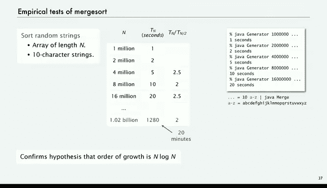
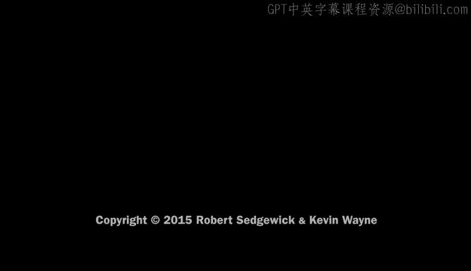

# 004：归并排序 🧩


在本节课中，我们将要学习一种名为“归并排序”的快速排序算法。我们将了解其工作原理、实现细节，并通过数学分析和实证测试来验证其效率。

归并排序是一种非常经典且高效的排序方法。它的核心思想是“分而治之”：将一个大问题分解成小问题，分别解决，再将结果合并。接下来，我们将详细探讨其实现步骤。

## 算法原理与实现 🧠

归并排序的基本步骤如下：首先，将需要排序的数组分成两半。然后，递归地对每一半进行排序。最后，将两个已排序的子数组合并成一个完整的有序数组。这个算法由计算机科学先驱约翰·冯·诺依曼发明，至今仍是高效排序的基石。

上一节我们介绍了归并排序的基本概念，本节中我们来看看其核心操作——“合并”是如何实现的。

### 合并操作

合并两个已排序的子数组是归并排序的关键步骤。原地合并一个数组中的两个子数组较为复杂，因此我们通常使用一个辅助数组来简化操作。

以下是合并操作的实现思路：
1.  创建一个与待排序数组大小相同的辅助数组 `aux`。
2.  使用两个指针 `i` 和 `j`，分别指向两个待合并子数组的起始位置。
3.  比较 `a[i]` 和 `a[j]`，将较小的元素放入辅助数组，并移动相应的指针。
4.  重复步骤3，直到其中一个子数组的所有元素都被处理完。
5.  将另一个子数组剩余的所有元素直接复制到辅助数组的末尾。
6.  最后，将辅助数组中已合并的结果复制回原数组。

这个过程确保了合并后的数组是有序的。虽然它需要额外的空间，但使算法逻辑变得清晰。

### 归并排序的递归实现

有了合并操作，归并排序的递归实现就非常直观了。以下是其核心递归函数：

```java
private static void sort(Comparable[] a, int low, int high) {
    if (high - low <= 1) return; // 基本情况：子数组长度为0或1
    int mid = low + (high - low) / 2;
    sort(a, low, mid);   // 递归排序左半部分
    sort(a, mid, high);  // 递归排序右半部分
    merge(a, low, mid, high); // 合并两个已排序的子数组
}
```

这个函数完美体现了“分治”思想：将数组一分为二，分别排序，再合并结果。

## 算法动态演示与效率分析 📊

为了更直观地理解归并排序，让我们通过一个例子来跟踪其执行过程。假设我们要对数组 `[Alice, Bob, Eve, Frank, Dave, Walter, ...]` 进行排序。

1.  首先，算法会递归地将数组不断对半分割，直到每个子数组只剩下一个元素（一个元素本身可视为已排序）。
2.  然后，开始回溯合并过程。将相邻的单元素数组合并成有序的双元素数组。
3.  继续向上合并，将有序的双元素数组合并成有序的四元素数组，依此类推。
4.  最终，两个大的有序子数组合并成完整的有序数组。

这个过程就像构建一棵二叉树，从叶子节点（单个元素）开始，层层向上合并。

### 数学分析：为什么是 N log N？

归并排序的时间复杂度分析非常优美。我们假设数组长度 `N` 是 2 的幂（`N = 2^n`）。

*   **层级**：算法共有 `log₂ N`（即 `n`）层递归。
*   **每层工作量**：在每一层，我们需要合并所有该层的子数组。每一层的合并操作总共需要访问大约 `2N` 次数组元素（`N` 次从原数组到辅助数组，`N` 次复制回来）。
*   **总工作量**：将层数乘以每层的工作量，得到总时间成本约为 **2N log₂ N**。

因此，归并排序的时间复杂度为 **O(N log N)**。这个结论即使当 `N` 不是 2 的幂时也成立。

### 实证测试验证

理论需要实践的检验。使用与插入排序相同的测试模型对归并排序进行性能测试，结果如下：
*   排序100万个元素仅需约1秒。
*   排序200万个元素约需2秒。
*   排序1600万个元素约需20秒。

这些数据与 `N log N` 的增长模型高度吻合，证实了归并排序是一种可扩展的高效算法。这意味着，即使公司业务和数据量不断增长（遵循摩尔定律），归并排序也能应对自如。

## 总结与展望 🎯

本节课中我们一起学习了归并排序算法。我们了解到：
1.  **核心思想**：采用“分治”策略，递归地将数组分半排序后合并。
2.  **关键操作**：合并两个有序子数组，通常借助辅助数组实现。
3.  **算法效率**：时间复杂度为 **O(N log N)**，远快于插入排序的 O(N²)，是一种可扩展的算法。
4.  **实际意义**：它解决了爱丽丝和鲍勃面临的大规模数据排序问题，是实用且高效的解决方案。





虽然归并排序需要额外的存储空间，并且存在常数因子更优的其他排序算法（如快速排序），但就其清晰的概念和稳定的 `N log N` 性能而言，它无疑是计算机科学中一个里程碑式的算法，完美满足了我们对可扩展性的需求。