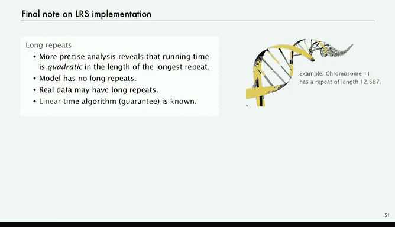

# 005：05_02_07_最长重复子串

在本节课中，我们将学习如何利用排序算法解决一个更具挑战性的问题：**最长重复子串问题**。我们将从暴力解法开始，逐步介绍一种基于后缀排序的高效算法，并探讨其在实际应用中的性能表现和注意事项。

---

## 概述：最长重复子串问题

我们有一个可能非常长的字符串（例如，包含数百万或数十亿个字符）。我们的目标是找出在这个字符串中**至少出现两次**的**最长子串**。这个问题在多个领域都有应用，例如基因组学、密码学和音乐分析。

---

## 热身：最长公共前缀问题

在解决主问题之前，我们先看一个更简单的问题：**最长公共前缀**。

给定两个字符串，我们需要找到它们**开头部分**最长的公共子串。我们称之为 `LCP`。

解决方法很简单：逐个字符比较，直到找到第一个不匹配的字符。

以下是其代码实现：

```java
public static String lcp(String s, String t) {
    int n = Math.min(s.length(), t.length());
    for (int i = 0; i < n; i++) {
        if (s.charAt(i) != t.charAt(i)) {
            return s.substring(0, i);
        }
    }
    return s.substring(0, n);
}
```

这个方法接收两个字符串作为参数，并返回它们的最长公共前缀字符串。我们将用它作为解决最长重复子串问题的辅助方法。

---

## 暴力解法

理解了基础问题后，我们来看解决最长重复子串问题的第一种方法：**暴力解法**。这种方法虽然简单，但有助于我们理解问题，并可用于验证更复杂算法的正确性。

以下是暴力解法的思路：

1.  输入一个字符串，目标是返回其最长的重复子串。
2.  获取字符串长度 `n`。
3.  对于字符串中的每一个位置 `i`，与它之后的每一个位置 `j` 进行比较。
4.  计算从位置 `i` 开始的子串和从位置 `j` 开始的子串的**最长公共前缀**。
5.  如果这个公共前缀的长度比之前记录的最长长度还要长，就更新记录。

以下是该方法的伪代码表示：

```java
public static String lrsBrute(String s) {
    int n = s.length();
    String lrs = "";
    for (int i = 0; i < n; i++) {
        for (int j = i + 1; j < n; j++) {
            String x = lcp(s.substring(i, n), s.substring(j, n));
            if (x.length() > lrs.length()) {
                lrs = x;
            }
        }
    }
    return lrs;
}
```

**性能分析**：该方法包含嵌套的 `for` 循环，大约会进行 `n²/2` 次 `lcp` 调用。而每次 `lcp` 调用所需的时间与公共前缀的长度成正比。因此，该算法的时间复杂度是**平方级别**的，无法处理像基因组数据那样包含数百万字符的大规模字符串。

我们需要一个能够**高效扩展**的算法。

---

## 高效算法：后缀排序法

幸运的是，几十年前人们就发现了一种利用排序的高效解决方案，其核心思想是**后缀排序**。

### 算法步骤

1.  **生成后缀数组**：首先，我们生成原字符串的所有**后缀字符串**。对于一个长度为 `n` 的字符串，有 `n` 个后缀，分别是从每个位置开始直到字符串末尾的子串。
2.  **排序后缀**：将这些后缀字符串当作普通字符串进行排序。
3.  **比较相邻后缀**：排序后，具有**长公共前缀**的后缀会**相邻排列**。因此，我们只需要计算排序后数组中**相邻后缀**之间的最长公共前缀即可。
4.  **找出最长的公共前缀**：遍历排序后的数组，计算每对相邻后缀的 `LCP`，并记录下最长的一个。这个最长的 `LCP` 就是原字符串的**最长重复子串**。

### 算法原理

为什么只需要比较相邻后缀？因为如果两个后缀有很长的公共前缀，那么在字典序排序中，它们必然会紧挨在一起。不相邻的后缀，其公共前缀不可能比相邻的更长。

### Java 实现

以下是该算法的 Java 实现示例：

```java
public static String lrs(String s) {
    int n = s.length();
    // 1. 创建后缀数组
    String[] suffixes = new String[n];
    for (int i = 0; i < n; i++) {
        suffixes[i] = s.substring(i, n);
    }
    // 2. 排序后缀数组
    Arrays.sort(suffixes);
    // 3. 查找相邻后缀的最长公共前缀
    String lrs = "";
    for (int i = 0; i < n - 1; i++) {
        String x = lcp(suffixes[i], suffixes[i + 1]);
        if (x.length() > lrs.length()) {
            lrs = x;
        }
    }
    return lrs;
}
```

### 性能优势

这个方法只需要 `n` 次 `substring` 调用来构建后缀数组，以及 `n` 次 `lcp` 调用来比较相邻后缀。其时间复杂度主要取决于排序步骤，使用高效的排序算法（如归并排序）可以达到 **O(n log n)** 的复杂度，这使其能够处理大规模数据。

---

## 实践中的挑战与教训

上一节我们介绍了高效的后缀排序算法，但在实际应用中，实现细节可能导致问题。

### 子字符串的内存表示

在 Java 中，`substring` 方法的实现在历史上发生过重要变化：
*   **2012年之前**：`substring` 通过**引用**原字符串来创建，只存储起始索引和长度，不复制字符。这种方式**空间和时间效率都很高**（常数级别）。
*   **2012年之后**：为了优化内存回收（例如，从一个大网页字符串中截取一小段后，希望释放原大字符串的内存），`substring` 改为**复制字符**到新字符串中。这导致创建子串需要**线性的时间和空间**。

这个变化使得我们上面“高效”的算法在遇到超长字符串时，可能因为内存不足而崩溃。

### 解决方案

解决方案是**不依赖系统默认的 `substring`**，而是自己实现一个类似旧版本的、常数时间和空间的“子串视图”类，并为其实现 `compareTo` 方法以支持排序。这样就能保证算法的高效性。

**核心教训**：要**信任算法本身**，而不是特定系统或语言在某个时期的实现。优秀的算法思想是持久的。

---

## 算法扩展与总结



即使使用优化后的后缀排序法，`lcp` 函数的运行时间在最坏情况下（存在非常长的重复子串时）仍可能与重复子串长度的平方成正比。因此，研究人员开发了更复杂的算法（如后缀树、后缀数组的线性时间构造算法），即使在存在长重复的情况下也能保证**线性时间复杂度**。

### 本节课总结

在本节课中，我们一起学习了：
1.  **最长重复子串问题**的定义及其在多个领域的重要性。
2.  解决该问题的**暴力解法**及其局限性（平方级复杂度，无法扩展）。
3.  基于**后缀排序**的**高效算法**（O(n log n) 复杂度），其核心是排序后仅需比较相邻后缀。
4.  在实际编程中，由于系统库实现的变化（如 Java 的 `substring`），可能需要对算法进行底层优化以保持其高效性。
5.  理解算法性能需要进行**科学分析**，包括建立数学模型和进行实证测试，这对于计算机科学至关重要。


通过掌握排序和搜索这些基础工具，我们能够解决许多像最长重复子串这样看似复杂的问题，这正是算法研究的魅力所在。