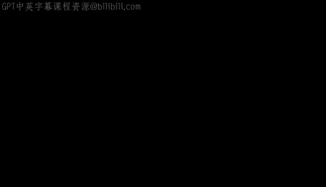
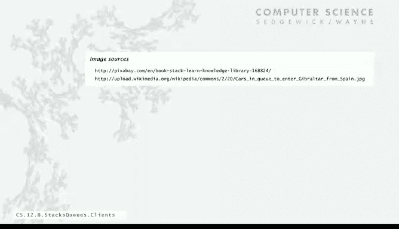
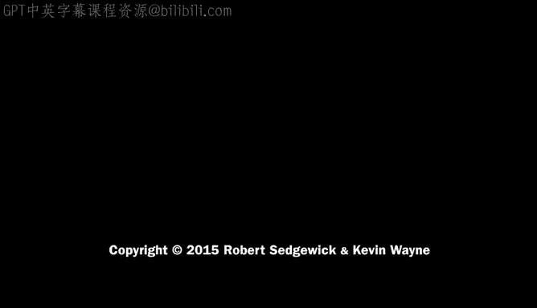

# 007：客户端代码示例



在本节课中，我们将学习如何使用栈和队列这两种抽象数据类型。我们将通过具体的客户端代码示例，了解它们在实际编程中的应用，包括读取标准输入、表达式求值以及图形编程等场景。

## 概述

在讨论具体实现之前，我们先来看一些客户端代码，以便理解这些数据类型的实用性。栈和队列是两种不同的资源分配策略，它们在计算机科学和现实世界中都有广泛的应用。

## 队列的应用

队列遵循“先进先出”的原则，适用于需要按顺序处理任务的场景。以下是队列的一些典型应用：
*   **资源分配**：例如，车辆排队等待上桥，或者计算机系统中的共享资源。
*   **数据传输**：标准输入和标准输出就是使用队列抽象的例子，确保数据按照提交的顺序被读取。
*   **模拟**：在各种现实世界的模拟中，队列用于实现“先到先服务”的规则。

上一节我们介绍了队列的基本概念，本节中我们来看看一个具体的队列客户端示例。

### 读取所有字符串到数组

一个常见的任务是读取标准输入中的所有字符串，并将它们存入一个数组。挑战在于，在Java中，创建数组时必须知道其大小，但我们无法在读取完所有输入之前知道有多少个字符串。

使用字符串队列可以轻松解决这个问题。以下是实现思路：

1.  创建一个字符串队列。
2.  当标准输入不为空时，读取每个字符串并将其入队。
3.  读取完成后，队列的大小 `n` 就是字符串的数量。
4.  创建一个大小为 `n` 的数组。
5.  将队列中的字符串按顺序出队，并存入数组。
6.  返回该数组。

以下是该过程的伪代码表示：
```java
Queue<String> q = new Queue<String>();
while (!StdIn.isEmpty()) {
    String item = StdIn.readString();
    q.enqueue(item);
}
int n = q.size();
String[] words = new String[n];
for (int i = 0; i < n; i++) {
    words[i] = q.dequeue();
}
return words;
```
这段代码的优点是，无论输入多少字符串，代码都无需修改即可工作，这体现了抽象数据类型的重要性。

## 栈的应用

栈遵循“后进先出”的原则。以下是栈的一些应用场景：
*   **现实世界**：如一摞书，你总是把新书放在最上面，也总是先拿最上面的书。
*   **编程语言**：函数调用（包括递归调用）隐式地使用了栈。返回地址总是最近一次调用的地址。
*   **网页浏览**：浏览器使用栈来记录访问历史。当你点击链接时，新页面被“压入”栈；点击后退按钮时，则从栈中“弹出”最近访问的页面。

接下来，我们来看一个使用栈进行表达式求值的经典示例。

### 后缀表达式求值

我们通常使用中缀表达式书写算术式，例如 `(1 + ((2 + 3) * (4 * 5)))`，并使用括号来明确运算顺序。

后缀表达式（又称逆波兰表示法）将运算符写在操作数之后，例如上述表达式可写为 `1 2 3 + 4 5 * * +`。后缀表达式的优点是完全不需要括号。

使用栈可以非常简单地求值后缀表达式，算法如下：

1.  从左到右扫描表达式。
2.  如果遇到操作数（值），将其压入栈。
3.  如果遇到运算符，则从栈中弹出所需数量的操作数（对于二元运算符是两个），执行运算，并将结果压回栈中。
4.  扫描结束后，栈中剩下的唯一元素就是表达式的结果。

以表达式 `1 2 3 + 4 5 * * +` 为例，其求值过程如下：

*   读入 `1`, `2`, `3`：压入栈。栈：`[1, 2, 3]`（底部为左）。
*   读入 `+`：弹出 `3` 和 `2`，计算 `2 + 3 = 5`，将 `5` 压入栈。栈：`[1, 5]`。
*   读入 `4`, `5`：压入栈。栈：`[1, 5, 4, 5]`。
*   读入 `*`：弹出 `5` 和 `4`，计算 `4 * 5 = 20`，将 `20` 压入栈。栈：`[1, 5, 20]`。
*   读入 `*`：弹出 `20` 和 `5`，计算 `5 * 20 = 100`，将 `100` 压入栈。栈：`[1, 100]`。
*   读入 `+`：弹出 `100` 和 `1`，计算 `1 + 100 = 101`，将 `101` 压入栈。栈：`[101]`。
*   结束，结果为 `101`。

以下是该算法的简化代码框架：
```java
Stack<Double> vals = new Stack<Double>();
while (!StdIn.isEmpty()) {
    String s = StdIn.readString();
    if (s.equals("+")) {
        vals.push(vals.pop() + vals.pop());
    } else if (s.equals("*")) {
        vals.push(vals.pop() * vals.pop());
    } // ... 处理其他运算符
    else {
        vals.push(Double.parseDouble(s));
    }
}
StdOut.println(vals.pop());
```
这个简单的程序可以轻松扩展以支持更多运算符，是一种非常自然的计算范式。

## 关于参数化类型和包装类的说明

在使用泛型数据类型（如 `Stack<Item>`）时，有一个技术细节需要注意：**类型参数不能是基本数据类型**（如 `int`, `double`）。

Java为每个基本数据类型提供了对应的**包装类**（如 `Integer`, `Double`）。包装类是对象，因此可以用作泛型类型。

在客户端代码中，Java会自动在基本类型和其包装类之间进行转换（自动装箱和拆箱），这使得代码非常简洁。例如：
```java
Stack<Integer> stack = new Stack<Integer>();
stack.push(17); // 自动将 int 17 装箱为 Integer
int x = stack.pop(); // 自动将 Integer 拆箱为 int
```

## 栈的更多应用

除了表达式求值，栈还在许多其他重要领域发挥着核心作用。

### PostScript 语言

PostScript 是一种基于栈的页面描述语言，由 Adobe 公司在 80 年代开发。它将“海龟绘图”与栈模型结合，形成了一种强大的图形编程语言。

在 PostScript 中，文字值被隐式压入栈，命令则从栈中弹出参数执行操作。例如，绘制一个正方形的代码片段如下：
```
100 100 moveto
100 300 lineto
300 300 lineto
300 100 lineto
closepath
stroke
```
这段代码将坐标压入栈，`moveto` 和 `lineto` 命令从栈中获取坐标来移动或画线。PostScript 彻底改变了桌面出版领域。

### Java 虚拟机

Java 编译器将你的代码转换为一种更简单的、由 Java 虚拟机执行的代码。JVM 本质上就是一个**栈机器**。许多编程语言和虚拟机都基于栈模型。

栈操作具有常数时间复杂度，并且栈的大小在程序内没有限制，这使得基于栈的模型（如 PostScript）极其简单、强大且可移植，能够运行在各种机器上。

## 总结





本节课中我们一起学习了栈和队列的客户端代码应用。我们看到了队列如何用于按顺序处理数据流，以及栈如何用于表达式求值、管理函数调用、实现浏览器历史记录，甚至构成 PostScript 图形语言和 Java 虚拟机的基础。这些例子展示了简单的抽象数据类型如何成为解决复杂问题的强大工具。接下来，我们将深入探讨这些数据类型的实现细节。