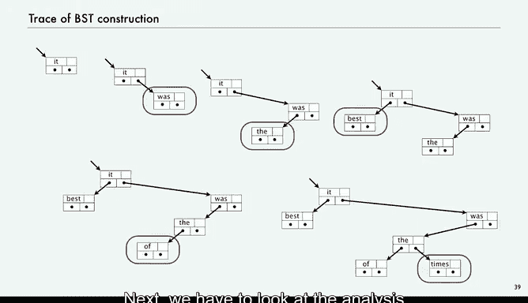

# 014：实现


在本节课中，我们将学习如何实现一个抽象数据类型。我们将遵循实现抽象数据类型的标准方法，查看构造函数中的实例变量、客户端代码以及方法。

首先，回顾一下我们的目标。我们有一个关联存储机制的理想化模型，目标是创建一个抽象数据类型，允许我们编写使用和操作符号表的Java程序。这是我们早期阐述的该抽象数据类型的API。

此外，我们还有性能规范。只有满足这些规范的实现，我们才认为它是一个符号表。运行时间的增长阶数在最坏情况下应为对数级别。如果集合非空，内存使用量应与集合大小成线性关系。代码中不应存在对集合大小的任何限制。这就是我们现在要着手应对的挑战。

## 数据结构选择与实例变量

我们已经选择了使用二叉搜索树作为数据结构。那么，构造函数中的实例变量是什么样的呢？

实际上，只有一个实例变量，那就是根节点 `root`。

我们需要一个私有类来构建二叉搜索树。这个类包含字段：键 `key`、值 `value`，以及指向左子树和右子树的引用。它还有一个小的构造函数来初始化键和值。这就是全部：一个实例变量，以及一个描述节点数据类型的私有类。

## 测试客户端

测试客户端我们已经看过，就是之前讨论的频率计数器测试客户端。它用于测试我们所有的代码，我们期望它能执行频率计数，并实际按排序顺序打印出键。之前的例子中，我们再次根据频率计数对它们进行了排序，但这是我们期望从符号表中看到的行为。

## 方法实现

以下是方法的实现：

*   **`isEmpty`**：检查二叉搜索树是否为空。如果根节点为 `null`，则树为空。
    ```java
    public boolean isEmpty() {
        return root == null;
    }
    ```

*   **`put`**：这是讨论BST数据结构时看过的代码，下一张幻灯片会再次看到。
*   **`get`**：同上。
*   **`contains`**：我们只需获取键并查看其关联值是否为 `null`。我们的约定允许我们用一行代码实现 `contains`。
    ```java
    public boolean contains(Key key) {
        return get(key) != null;
    }
    ```

*   **`Iterable`**：我们也讨论过这个方法，下一张幻灯片会再次总结。

这些就是数据类型实现的四个组成部分。

## 完整代码概览

这是完整的代码，它刚好能放在一张幻灯片上。这是实例变量、嵌套类和方法。这些是API中的公共方法，每个方法都由一个递归的辅助方法支持，这些辅助方法是客户端不可见的私有方法。最后是我们的测试客户端。

这就是使用二叉搜索树实现符号表的完整代码。

## 操作示例追踪

这是一个快速追踪，展示它对我们的示例做了什么。我们有“it”，然后“was”到来。这里不显示频率，只关注键。然后“best”小于“was”，所以它被添加到“was”的左侧。“of”大于“it”但小于“was”，以此类推。你可以看到二叉搜索树通过新节点在底部添加而逐渐构建起来。

接下来，我们必须进行分析，尝试理解其性能，并确认我们是否达到了设定的性能规范。




## 总结


本节课中，我们一起学习了如何实现一个基于二叉搜索树的符号表抽象数据类型。我们回顾了目标与API，明确了性能规范。接着，我们逐步构建了实现：选择了BST作为数据结构，定义了唯一的实例变量`root`和描述节点的私有嵌套类。我们查看了测试客户端，并详细实现了`isEmpty`、`put`、`get`、`contains`和`keys`等方法，其中核心的插入和查找操作依赖于递归的辅助函数。最后，我们通过一个简单的例子追踪了BST的构建过程，并指出下一步需要进行性能分析以验证实现是否满足对数时间复杂度和线性空间复杂度的要求。